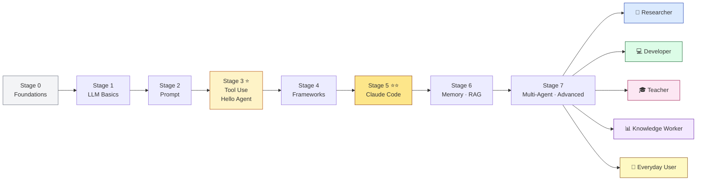
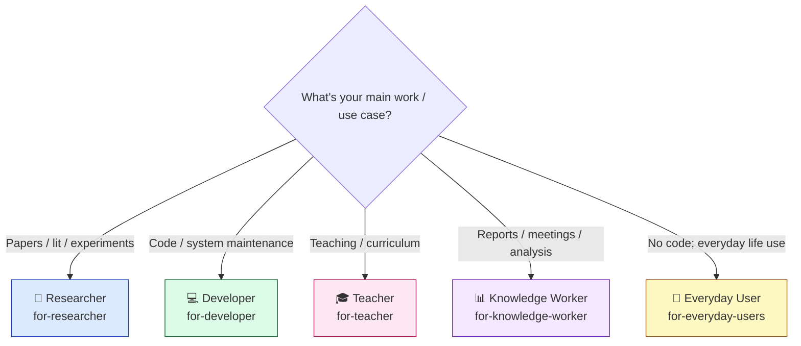

# awesome-agentic-ai-zh

[](LICENSE)
[](CONTRIBUTORS.md)
[](README.en.md) [](README.md)

> **English companion. The zh-TW [README.md](README.md) is canonical** — content is curated in zh-TW first; this page mirrors it for English readers.

A learning roadmap for agentic AI — **from LLM fundamentals to building multi-agent systems**. Structured 7-stage path: from "what is an LLM, how do tokens work" all the way to multi-agent orchestration and local deployment. Each stage has must-run demos, required reading, and curated projects.

---

## 🎯 Why this exists

If you want to learn AI applications or grow from basics into multi-agent systems — **the most common problem isn't lack of resources, it's not knowing where to start**. Awesome lists in English and Chinese have hundreds of repos but no path; people learning Claude Code, LangGraph, or RAG end up scattered across communities, using different terms, recommending different starter projects.

So we curated **134 high-quality projects** into a "from zero to advanced multi-agent" learning roadmap, organized as **7 stages**. Each stage tells you exactly **what to learn, which Hello-X demos to run, which projects to study, and what self-check to pass before advancing**.

After the main path, you go from "**LLM user**" to "**agent system builder**" — capable of designing multi-agent collaboration, writing your own MCP server, and shipping real agent systems.

---

## 📋 Table of Contents

- [🎯 Why this exists](#-why-this-exists)
- [📚 Quick Start](#-quick-start)
- [🗺️ The 7-Stage Learning Map](#️-the-7-stage-learning-map)
- [💡 How to Learn](#-how-to-learn)
- [📚 Related Resources](#-related-resources)
- [🤝 Contributing](#-contributing)
- [🙏 Acknowledgments](#-acknowledgments)
- [🎓 Citation](#-citation)
- [License](#license)

---

## 📚 Quick Start

### Read online
- **[GitHub README (you're here)](README.en.md)** — main entry point
- **[7-Stage Learning Map](#️-the-7-stage-learning-map)** — where to start

### Local clone
```bash
git clone https://github.com/WenyuChiou/awesome-agentic-ai-zh.git
cd awesome-agentic-ai-zh
# Start with stages/00-foundations.en.md
```

### ✨ What you get

- 📖 **Fully free** — MIT-licensed, all content open
- 🗺️ **Structured path** — 7 stages, clear "where am I, what's next"
- 🛠️ **Must-run Hello-X demos** — 1-5 mini projects per stage; reading-only doesn't count
- 🎯 **145+ curated projects** — each with star rating, audience, what it teaches, how to run (incl. local LLM runners: Ollama, llama.cpp, LocalAI, MLX)
- 🌏 **Bilingual** — zh-TW canonical, English mirror
- 🎓 **Beyond frameworks: Claude Code ecosystem** — MCP / Skills / Plugins / SDK full stack
- 🔬 **5 specialized branches** — researcher / developer / teacher / knowledge worker / **everyday user**
- ⏱️ **Honest time estimate** — 14-19 weeks minimum, 5-6 months realistic (5-8 hr/week part-time)

---

## 🗺️ The 7-Stage Learning Map


<details>
<summary>Interactive version (Mermaid, screen-reader friendly)</summary>



</details>

| Stage | Topic | Key Content | Time |
|---|---|---|---|
| **0** | [Foundations](stages/00-foundations.en.md) | Python · CLI · git · API · JSON | 1-2 wks |
| **1** | [LLM Basics](stages/01-llm-basics.en.md) | tokens · API · model comparison | 1 wk |
| **2** | [Prompt Engineering](stages/02-prompt-engineering.en.md) | system prompts · few-shot · CoT | 1-2 wks |
| **3** ⭐ | [Tool Use & Hello Agent](stages/03-tool-use-and-hello-agent.en.md) | function calling · ReAct · 5 Hello-X | 2-3 wks |
| **4** | [Agent Frameworks](stages/04-agent-frameworks.en.md) | LangGraph · AutoGen · CrewAI · Smolagents | 2-3 wks |
| **5** ⭐⭐ | [Claude Code Ecosystem](stages/05-claude-code-ecosystem.en.md) | MCP · Skills · Plugins · Marketplace | 3-4 wks |
| **6** | [Memory · RAG · Advanced](stages/06-memory-rag.en.md) | vector DB · long-term memory · contextual retrieval | 2 wks |
| **7** | [Multi-Agent · Advanced](stages/07-multi-agent-production.en.md) | multi-agent orchestration · eval · observability · advanced SDK | 2-4 wks |

> **Total time**: minimum **14-19 weeks**, realistic **5-6 months** (5-8 hr/week part-time)

> 💡 **Want a concrete cross-stage example?** [Build Your First AI Agent in 7 Steps](walkthroughs/build-first-agent-in-7-steps.en.md) — same Paper Summary Bot traced from Stage 1 through Stage 7, ~350 lines of executable code

After the main path, pick one of 5 specialized branches. **Not sure which?**



> 💡 **The Everyday User branch can be read directly without walking the main path** — it's for people who want to use AI without writing code.

| Branch | Best for | Topics |
|---|---|---|
| 🔬 [Researcher](branches/for-researcher.en.md) | Grad students, postdocs, PIs | Lit triage · paper writing · multi-agent review |
| 💻 [Developer](branches/for-developer.en.md) | Software engineers | Cursor · Aider · CLI delegation · code review |
| 🎓 [Teacher](branches/for-teacher.en.md) 🚧 | Teachers, instructors | Lesson planning · slides · student feedback *(thinnest section, contributions welcome)* |
| 📊 [Knowledge Worker](branches/for-knowledge-worker.en.md) | Consultants, PMs, analysts | Email · meeting notes · report automation |
| 👥 [Everyday User](branches/for-everyday-users.en.md) | ChatGPT / Claude.ai users | Daily writing · learning · privacy · CLI agent intro |

---

## 💡 How to Learn

Welcome — future agent system builder. Some guidance before you start.

This roadmap balances concepts with hands-on work, helping you **transform from an LLM user into an agent system builder**. It assumes **basic Python**. Before starting:

- **Basic Python** — written functions, used APIs, can read JSON
- **Basic git** — clone, commit, push
- **Motivation to learn** — agents are the fastest-changing area in AI 2025+, and require sustained effort

If anything's missing, do Stage 0; if not, **start at Stage 1**.

The main path has 4 parts:

- **Part 1 (Stages 0-2): Foundations & LLM Basics** — Python / git / API, what's an LLM, prompt design
- **Part 2 (Stages 3-4): Build Your Agent** — from tool use to agents, learn the major frameworks
- **Part 3 (Stage 5): Claude Code Ecosystem** — MCP / Skills / Plugins, the heart of the path
- **Part 4 (Stages 6-7): Advanced Integration** — memory / RAG / multi-agent collaboration

After the main path (14-19 weeks), pick a branch.

The most important advice: **don't skip Hello-X demos**. Each stage's Hello-X is "you can't learn this without doing it" — skim past it and you'll get stuck later.

Ready? [Start at Stage 0](stages/00-foundations.en.md).

---

## 📚 Related Resources

This repo doesn't try to replace flat awesome lists. Use them when you already know what to look for:

- [**hesreallyhim/awesome-claude-code**](https://github.com/hesreallyhim/awesome-claude-code) — broad Claude Code resources catalog (currently restructuring)
- [**wong2/awesome-mcp-servers**](https://github.com/wong2/awesome-mcp-servers) — flat MCP server catalog
- [**punkpeye/awesome-mcp-servers**](https://github.com/punkpeye/awesome-mcp-servers) — alternative MCP list
- [**travisvn/awesome-claude-skills**](https://github.com/travisvn/awesome-claude-skills) — Claude Skills catalog
- [**modelcontextprotocol/servers**](https://github.com/modelcontextprotocol/servers) — official MCP reference servers

For Chinese-speaking community:
- [**datawhalechina/hello-agents**](https://github.com/datawhalechina/hello-agents) — Datawhale systematic agent tutorial (zh-CN)
- [**WangRongsheng/awesome-LLM-resources**](https://github.com/WangRongsheng/awesome-LLM-resources) — comprehensive zh-CN LLM resources (8k+ stars)
- [**AiHubCN/Awesome-Chinese-LLM**](https://github.com/AiHubCN/Awesome-Chinese-LLM) — open-source Chinese LLM catalog

---

## 🤝 Contributing

This is an open community welcoming all contributions:

- 🐛 **Bug reports** — wrong content, broken links, stale info → open Issue
- 💡 **Suggestions** — missing stage / new project to add → open Issue to discuss
- 📝 **Improvements** — refine existing stage content, fix typos → direct PR
- ✍️ **Add a project** — 1-3 new projects per stage with "why this teaches that stage" rationale
- 🌏 **Translations** — improve the English companion or translate to other languages
- 🌱 **Become a Stage / Branch maintainer** — long-term review of a specific area, see [CONTRIBUTORS.md](CONTRIBUTORS.md)

PR process and style rules: [CONTRIBUTING.md](CONTRIBUTING.md) + [resources/style-guide.en.md](resources/style-guide.en.md).

> Internal phase rollout progress and launch checklist: [`.github/launch-checklist.md`](.github/launch-checklist.md) (maintainer-facing internal doc).

---

## 🙏 Acknowledgments

### Inspiration

- [**Datawhale Hello-Agents**](https://github.com/datawhalechina/hello-agents) — model for systematic agent tutorial structure; inspired our chapter + progress design
- [**Datawhale community**](https://github.com/datawhalechina) — landmark Chinese ML learning community; multiple anchor projects come from them

### Counterpart awesome lists

- `wong2/awesome-mcp-servers`, `punkpeye/awesome-mcp-servers`, `hesreallyhim/awesome-claude-code` — solid flat catalogs; this repo's differentiation is "structured path"

### Personal

- [@WenyuChiou](https://github.com/WenyuChiou) — Maintainer

---

## 🎓 Citation

If this learning roadmap helps your study or work, please cite:

```bibtex
@misc{awesome_agentic_ai_zh_2026,
  title  = {awesome-agentic-ai-zh: A Structured Learning Roadmap for Agentic AI},
  author = {Chiou, Wenyu},
  year   = {2026},
  url    = {https://github.com/WenyuChiou/awesome-agentic-ai-zh},
  note   = {7-stage learning path from prerequisites to advanced multi-agent systems, with curated projects + hello-X demos. Bilingual (zh-TW / English).}
}
```

---

## License

MIT. Maintained by [@WenyuChiou](https://github.com/WenyuChiou).

<div align="center">
  <p>⭐ If this repo helps you, please give it a Star — it matters for ongoing iteration</p>
</div>
