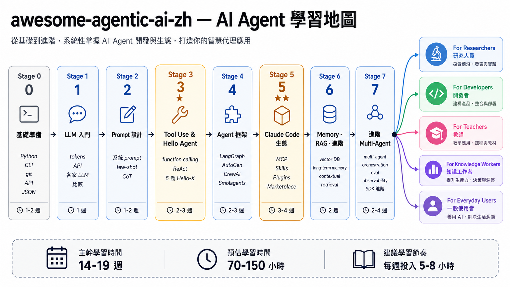

<div align="right">
  <strong>繁體中文</strong> | <a href="./README.zh-Hans.md">简体中文</a> | <a href="./README.en.md">English</a>
</div>

<div align="center" markdown="1">


# awesome-agentic-ai-zh

### 🤖 AI Agent 學習地圖 — 從基本 LLM 概念到自己打造多 agent 系統

<p><em><b>學習路線圖 + 240+ 資源 curation + 簡單 illustrative 案例</b><br/>結構化 8 階段、從「LLM 是什麼、token 怎麼算」走到 multi-agent 編排、Computer Use / Browser Use / Sandbox</em></p>

[](LICENSE)
[](README.md)
[](README.zh-Hans.md)
[](README.en.md)


[](https://wenyuchiou.github.io/awesome-agentic-ai-zh/)

</div>

---

## 🎯 專案介紹

**本 repo 角色定位**：**學習路線圖 + 240+ 資源 curation + 簡單 illustrative 案例**——三件事為核心、幫想學 AI / AI agent 的人從「不知道從哪開始」走到「能設計多 agent 系統」。

具體做法：

| 核心 | 做什麼 | 規模 |
|---|---|---|
| **學習路線圖** | 把網路散落的高品質專案、教材、必修閱讀，按**從零開始、循序漸進**整理成 **8 個階段**（含 Stage 5 + Stage 8 兩個共用 hub）+ 2 條學習路線 + 5 條延伸路徑 | 8 stages、2 tracks |
| **資源 curation** | 每階段精選 **240+** 個 project（含星等、適合誰、教什麼、怎麼跑），加上中文 AI 生態(DeepSeek / Zhipu / Kimi 等)MCP / Skill 完整 catalog | 240+ projects、65 MCP/Skill |
| **簡單 illustrative 案例** | 每階段附 1-5 個**基礎練習**（70-150 行 starter + dual-path Ollama/Anthropic SDK 對照 + mock-based test） | 23 個練習 folder |

走完整條路線，你會從「**LLM 使用者**」進階到「**agent 系統建構者**」——能看懂 framework 在做什麼、能設計多 agent 協作、能寫自己的 MCP server。

> 📖 **關於中英文混用**：本專案保留 AI Agent 領域常見英文術語（Prompt Engineering / Context Engineering / Harness / MCP / Skills / RAG 等），因為官方文件、paper、GitHub repo 與 API 文件多以英文為主。每個重要概念會提供 **中文理解名 + 英文正式術語 + 一句白話定位**，讓讀者能先理解概念，再對接英文生態。完整對照見 [`resources/glossary.md`](resources/glossary.md)。

---

## 📋 目錄

- [🎯 專案介紹](#-專案介紹)
- [📚 快速開始](#-快速開始)
  - [線上閱讀](#線上閱讀)
  - [本地下載](#本地下載)
  - [✨ 你會收穫什麼？](#-你會收穫什麼)
- [🗺️ 學習地圖（兩條學習路徑）](#️-學習地圖兩條學習路徑)
- [💡 如何學習](#-如何學習)
- [📚 相關資源](#-相關資源)
- [🤝 如何貢獻](#-如何貢獻)
- [🙏 致謝](#-致謝)
- [🎓 引用](#-引用)
- [☕ 支持這個專案](#-支持這個專案)
- [License](#license)

---

## 📚 快速開始

### 🚀 第一次接觸 AI agent / 沒寫過 code？

先看 **[`resources/setup-guide.md`](resources/setup-guide.md)** — 30-45 分鐘從零帶你申請 API key、裝好 Python、跑出第一個 LLM hello-world。

### 線上閱讀
- **[學習地圖（兩條學習路徑）](#️-學習地圖兩條學習路徑)** — 看完這節決定走 Track A 還 Track B
- **[Stage 0 基礎準備](stages/00-foundations.md)** — 已經會 Python / git / API 的人可以直接跳 Stage 1

### 本地下載
```bash
git clone https://github.com/WenyuChiou/awesome-agentic-ai-zh.git
cd awesome-agentic-ai-zh
# 從 stages/00-foundations.md 開始
```

### ✨ 你會收穫什麼？

- 📖 **完全免費** — MIT 授權，所有內容開放共學
- 🗺️ **兩條學習路徑** — Track A（CLI Power User）給「想 USE 現成 CLI agent」的人；Track B（Agent Builder）給「想 BUILD 自己 agent」的人。共用 Stage 0-2 基礎
- 🛠️ **基礎動手練習** — 每階段附 1-5 個 illustrative 練習（題目 + dual-path SDK 對照 + success criteria）。定位是**基礎入門 + 路線確認**——chapter-length 深度練習見對應 stage 的 hello-agents / Anthropic Cookbook callout
- 🎯 **精選 240+ 個 projects** — 每個都附星等推薦、適合誰、教什麼、怎麼跑（含本地 LLM 執行：Ollama、llama.cpp、LocalAI、MLX）
- 🌏 **三語完整維護** — 繁中(canonical)/ 簡中 / English,三版皆完整維護、英文非薄翻譯
- 🎓 **不只「框架」、還有「Claude Code 生態」** — MCP / Skills / Plugins / SDK 完整堆疊
- 🔬 **5 條依使用者分流的延伸路線** — 研究員 / 開發者 / 老師 / 知識工作者 / **日常使用者**
- ⏱️ **預估時程寫清楚** — Track A 8-10 週 / Track B 主幹最少 16-22 週、現實 5-7 個月（每週 5-8 hr）

---

## 🗺️ 學習地圖（兩條學習路徑）



走完 **Stage 0-2（共用基礎）** 之後，依你的目的選一條學習路徑：

- **Track A — CLI Power User**：你想**用**現成的 CLI agent（Claude Code、Codex、OpenCode、Gemini CLI 等）把工作做順、效率拉高，不打算自己從零寫 agent。3 個 sub-stage（A1-A3）。
- **Track B — Agent Builder**：你想**從零打造**自己的 agent——學 framework、寫 ReAct、設計 multi-agent。Stage 3-8 是主路線。

兩條學習路徑**不互斥**——多數人是先走 A 把 CLI 用起來，再回到 B 學內部運作；或反過來也行。Stage 5（Claude Code 生態）兩條路徑都會用到。

### 共用基礎（Stage 0-2）

| Stage | 主題 | 關鍵內容 | 預估時程 |
|---|---|---|---|
| **0** | [基礎準備（Foundations）](stages/00-foundations.md) | Python · CLI · git · API · JSON | 1-2 週 |
| **1** | [LLM 基礎（LLM Basics）](stages/01-llm-basics.md) | token · API · 各家 LLM 比較 · 本地 LLM | 1 週 |
| **2** | [Prompt 設計（Prompt Engineering）](stages/02-prompt-engineering.md) | 系統 prompt · few-shot · CoT | 1-2 週 |

### Track A — CLI Power User（想用 CLI 把事情做完）

| Stage | 主題 | 關鍵內容 | 預估時程 |
|---|---|---|---|
| **A1** | [選一個 CLI Agent，開始用它做事（CLI Agent Intro & Selection）](tracks/cli/A1-cli-intro.md) | 7 主流 CLI 比較 · 安裝 · 第一次跑 | 1 週 |
| **A2** | [建立可重複使用的 CLI 工作流程（CLI Workflow Patterns）](tracks/cli/A2-cli-workflow.md) | CLAUDE.md · slash command · 多步驟拆解 | 1-2 週 |
| **A3** | [把 CLI Agent 接進真實工作流程（Integration & Production）](tracks/cli/A3-cli-production.md) | MCP 接 CLI · CI 自動化 · cost / observability | 1-2 週 |
| **+5** | [Stage 5 — Claude Code 生態](stages/05-claude-code-ecosystem.md)（**共用 hub**） | MCP · Skills · Plugins · Subagents、Track A 必看 5.1-5.4 / 選讀 5.5-5.7 | 1-2 週（Track A 視角）|
| **+8** | [Stage 8 — Agent Interfaces](stages/08-agent-interfaces.md)（**共用 hub**）| Computer Use · Browser Use · Code Sandbox、Track A 視角看 Track A 怎麼用 | 1-2 週（Track A 視角）|

> **Track A 預估總時程**：含 Stage 0-2（共用基礎）+ A1-A3 + **Stage 5 + Stage 8（兩個共用 hub）= 約 8-10 週**。核心參考：[`resources/cli-agents-guide.md`](resources/cli-agents-guide.md)。

### Track B — Agent Builder（從零打造 agent）

| Stage | 主題 | 關鍵內容 | 預估時程 |
|---|---|---|---|
| **3** ⭐ | [工具使用與第一個 Agent（Tool Use & Hello Agent）](stages/03-tool-use-and-hello-agent.md) | function calling · ReAct · 5 個動手練習 | 2-3 週 |
| **4** | [Agent 框架（Agent Frameworks）](stages/04-agent-frameworks.md) | LangGraph · AutoGen · CrewAI · Smolagents | 2-3 週 |
| **5** ⭐⭐ | [Claude Code 生態系（Claude Code Ecosystem）](stages/05-claude-code-ecosystem.md)（**共用 hub**、Track A 也學）| MCP · Skills · Plugins · Subagents | 3-4 週（Track B 視角）|
| **6** | [上下文管理（Context Engineering）：RAG 與 Memory](stages/06-memory-rag.md) | vector DB · long-term memory · contextual retrieval | 2 週 |
| **7** | [多 Agent 系統與穩定運作（Multi-Agent & Production）](stages/07-multi-agent-production.md) | multi-agent orchestration · eval · observability · SDK 進階 | 2-4 週 |
| **7.5** | [進階 Agentic Workflow 概念（Advanced Agentic Concepts）](stages/07.5-advanced-agentic-concepts.md)（reading map）| 工作邊界 · PAR loop · agent-as-judge · 12 個進階概念 + reading list | 1 週（不寫 code）|
| **8** ⭐⭐ | [Agent 操作介面（Agent Interfaces）](stages/08-agent-interfaces.md)（**共用 hub**、Track A 也學）| Computer Use · Browser Use · Code Sandbox、2024-2026 frontier | 2-3 週（Track B 視角）|

> **Track B 預估總時程**：主幹最少 **16-22 週**、現實 **5-7 個月**（每週 5-8 hr 兼職）

> **兩個共用 hub（Track A + Track B 都會用到）**：
> - **Stage 5** = Claude Code 生態（MCP / Skills / Plugins / Subagents）—— Track A 學 MCP 接 CLI、Track B 學 agent runtime 結構
> - **Stage 8** = Agent Interfaces（Computer Use / Browser / Sandbox、2024-2026 frontier）—— Track A 學「**怎麼用**」委派任務、Track B 學「**怎麼 build**」embed 進 agent
>
> 兩個 hub 出現在兩條 track 內、視角不同、學的深度也不同（內文有 Track A / Track B 分視角段）。

> 💡 **想看跨 stage 的完整範例？** [7 步打造你的第一個 AI Agent](walkthroughs/build-first-agent-in-7-steps.md) — 同一個 Paper Summary Bot 從 Stage 1 一路寫到 Stage 7，~350 行真實程式碼（**Track B 適用**）

走完主幹後，依你的身分挑一條延伸路線繼續走。**不確定挑哪條？**


> 💡 **「日常使用者」這條路線不必走完主幹就能直接讀**——是給「想用 AI、但不一定要寫 code」的人。

| 路線 | 適合誰 | 主題 |
|---|---|---|
| 🔬 [研究人員](branches/for-researcher.md) | 研究生、博後、PI | 文獻整理 · paper 寫作 · multi-agent review |
| 💻 [開發者](branches/for-developer.md) | 軟體工程師 | Cursor · Aider · CLI delegation · code review |
| 🎓 [教師](branches/for-teacher.md) | 老師、講師 | 備課 · 投影片 · 學生 feedback · 隱私 / 倫理 · prompt 範本 |
| 📊 [知識工作者](branches/for-knowledge-worker.md) | 顧問、PM、分析師 | Email · 會議紀錄 · report 自動化 |
| 👥 [日常使用者](branches/for-everyday-users.md) | ChatGPT / Claude.ai 使用者 | 寫信 · 學習 · 隱私場景 · CLI agent 入門 |

---

## 💡 如何學習

這份路線圖兼顧概念與實作，目標是帶你**從 LLM 使用者一路走到 agent 系統建構者**。適合**有基本 Python 能力**的開發者、研究生、自學者。動手之前，先確認你有：

- **基本 Python** — 寫過 function、用過 API、看得懂 JSON
- **基本 git** — clone、commit、push
- **想學的動機** — agent 是 2024-2026 變化最快的領域，需要持續投入（2026 仍每月推新 model / 新 framework）

上面有缺的就從 Stage 0 補齊；都會了就**直接跳 Stage 1**。

主幹分 5 部分：

- **Part 1（Stage 0-2）：基礎與 LLM 入門** — Python / git / API、什麼是 LLM、怎麼設計 prompt
- **Part 2（Stage 3-4）：建構你的 Agent** — 從 tool use 進化到 agent，學主流 framework
- **Part 3（Stage 5） 共用 hub** — Claude Code 生態系（MCP / Skills / Plugins / Subagents、Track A + B 都會用到）
- **Part 4（Stage 6-7）：進階整合** — memory / RAG / multi-agent 協作 / harness engineering
- **Part 5（Stage 8） 共用 hub** — Agent Interfaces（Computer Use / Browser Use / Code Sandbox、2024-2026 frontier、Track A + B 都會用到）

> 🔭 **三層概念進化**：**prompt engineering**（Stage 2、單一 prompt 怎麼寫）→ **context engineering**（Stage 3 之後、怎麼動態組 system prompt + memory + retrieved chunks + tool schema）→ **harness engineering**（Stage 7、agent loop / eval / observability / deploy 整套包成 production system）。3 個術語對應 3 個 phase、不必另外找資源。詳見 [`stages/02-prompt-engineering.md#-進階context-engineering不是-prompt-engineering-了`](stages/02-prompt-engineering.md) 跟 [`stages/07-multi-agent-production.md`](stages/07-multi-agent-production.md) 必修閱讀 5+6。

走完主幹（14-19 週）後，依你的身分（研究員 / 開發者 / 老師 / 知識工作者 / 日常使用者）挑一條延伸路線繼續走。

最重要的一句話：**不要跳過 動手練習**。每個 stage 的 動手練習都是「不動手就學不會」的東西，光讀過去後面會卡住。

> 🎓 **動手練習怎麼用才對**：每個練習 folder 裡的 `starter.py` 是**完整解答**、不是 TODO skeleton。如果你 clone 下來直接 `cat starter.py` + `python test.py` pass、會誤以為「我學會了」、其實沒寫一行 code。**正確學習法**：`mv starter.py starter_reference.py`、看 signature 不看 body、自己重寫、卡住才回去對照。完整方法論 + 每個 stage 的時間預算 + 卡住處理流程看 [`docs/HOW_TO_USE.md`](docs/HOW_TO_USE.md)。

準備好了嗎？[從 Stage 0 開始](stages/00-foundations.md)。

---

## 📚 相關資源

完整的相關資源（用語說明 + 常用 MCP / Skill highlight + awesome lists + 中文社群）抽到 **[RESOURCES.md](RESOURCES.md)** 避免主頁過長。

直接看常用入口、依**情境**分組：

### 🚀 入門 / 環境設定

| 你的狀況 | 去哪 | 內容 |
|---|---|---|
| 完全沒寫過 code、第一次接觸 AI agent | [`resources/setup-guide.md`](resources/setup-guide.md) | 30-45 分鐘從零裝好（API key、Python、第一個 hello-world） |
| 不知道挑哪個 LLM provider | [`resources/setup-guide.md` A](resources/setup-guide.md#a--申請第一個-api-key約-10-分鐘) | Anthropic / OpenAI / DeepSeek / Kimi / NVIDIA NIM 對照 |
| 同主題 awesome list / 中文社群 | [`RESOURCES.md` 同主題清單](RESOURCES.md#同主題的清單型-awesome-lists) | 5-10 分鐘逛一輪 |

### 📖 概念 / 用語

| 你的狀況 | 去哪 | 內容 |
|---|---|---|
| 不懂某個詞（LLM / agent / RAG / token / MCP / Skill / 向量資料庫…） | [`resources/glossary.md`](resources/glossary.md) | 30+ 詞、每個 30-80 字 + 哪 stage 講細的 |
| 想搞懂 agent 為什麼有的在 terminal、有的在 Telegram、有的在 Jetson | [`resources/agent-paradigms.md`](resources/agent-paradigms.md) | 5 種 agent 型態 mental model + Hermes / OpenClaw 例子 |
| MCP / Skills / Plugins 用語對照 | [`RESOURCES.md` 三個核心用語](RESOURCES.md#三個核心用語mcp--skills--plugins) | 1 頁速查表 |
| 想找帶證書的線上 AI agent 課（英文 + 中文） | [`resources/courses.md`](resources/courses.md) | 10 門 credible、會發證書的課，分 tier；含「完成證書 ≠ 學歷」誠實 caveat |

### 🛠 動手實作

| 你的狀況 | 去哪 | 內容 |
|---|---|---|
| 想動手寫 Skill / MCP server / 接 Word / Zotero / 本機 LLM | [`resources/cookbook.md`](resources/cookbook.md) | 6 個 step-by-step recipe、每個 30-50 分鐘 |
| 想用 subagent 但不知該派誰、怎麼派、派什麼工作 | [`resources/subagent-cookbook.md`](resources/subagent-cookbook.md) | 15 個複製貼上即用的 dispatch recipe |
| 自己寫 subagent / 組合多個 / debug 跑壞的（進階）| [`resources/subagent-advanced.md`](resources/subagent-advanced.md) | description 寫法 4 個 bug + composition 3 pattern + debug 5 切點 |
| 卡在 tool calling（LLM 不呼叫 / schema 寫不好 / ReAct loop 跑不停） | [`examples/stage-5/tool-calling-tutor/`](examples/stage-5/tool-calling-tutor/) | 可裝進 Claude Code 的 skill、4-symptom diagnostic |
| 動手練習怎麼正確使用（主動 vs 被動模式） | [`docs/HOW_TO_USE.md`](docs/HOW_TO_USE.md) | 5-10 分鐘讀完、配合每個 stage 用 |

### 🔌 接日常工具 / 找 MCP server

| 你的狀況 | 去哪 | 規模 |
|---|---|---|
| 接 Notion / Obsidian / Excel / GitHub 等工具 | [`RESOURCES.md` 接日常工具](RESOURCES.md#接日常工具常用-mcp-server--skill) | 7-8 個 highlight |
| 完整 MCP server / Skill 目錄（含星等、分類） | [`resources/mcp-skills-catalog.md`](resources/mcp-skills-catalog.md) | 65+ 條、16 大分類 |

### 🔬 研究 / production 級

| 你的狀況 | 去哪 | 內容 |
|---|---|---|
| 研究 workflow + multi-LLM delegation skill | [`RESOURCES.md` 研究工作流](RESOURCES.md#研究工作流本-repo-維護者出品) | 本 repo 維護者出品的 Claude Code 研究 skill 對 |
| CLI agent 7 家對照 + production 搭配 | [`resources/cli-agents-guide.md`](resources/cli-agents-guide.md) | Track A 的核心參考、148 行 |
| Schema 設計規則（tool calling 必看） | [`resources/schema-design-cheatsheet.md`](resources/schema-design-cheatsheet.md) | 5 條黃金規則 + 5 個 anti-pattern |

---

## 🤝 如何貢獻

這個 repo 是一個 AI 學習文件，如果你也有蒐集很好的資源，也歡迎貢獻：

- 🐛 **回報 Bug** — 內容錯誤、連結失效、過時資訊 → 開 Issue
- 💡 **提建議** — 缺什麼 stage、該加哪個 project → 開 Issue 討論
- 📝 **完善內容** — 改進現有 stage 內容、修 typo → 直接 PR
- ✍️ **新增 project** — 在某個 stage 加 1-3 個 project，並附上「為什麼這個 project 適合放這個 stage」的說明
- 🌏 **翻譯** — 補英文 companion 沒翻到的段落，或翻成其他語言
- 🌱 **擔任 Stage / Branch maintainer** — 長期 review 特定領域，詳見 [CONTRIBUTORS.md](CONTRIBUTORS.md)

PR 流程跟 style 規範請看 [CONTRIBUTING.md](CONTRIBUTING.md) 跟 [resources/style-guide.md](resources/style-guide.md)。

> 📅 **想看最近 ship 了什麼** → [`CHANGELOG.md`](CHANGELOG.md)（最近 14 天）。
> Maintainer 內部進度與 launch checklist 放在 [`.github/launch-checklist.md`](.github/launch-checklist.md)（內部文件）。

---

## 💬 顧問 / 聯絡

公開學習版（MIT），歡迎自由取用。

目前以顧問為主：團隊或公司若需 **prompt review / audit** 或 **AI agent workflow 諮詢**，歡迎來信（博士生、時間有限）：📧 [wenyuchiou12@gmail.com](mailto:wenyuchiou12@gmail.com)

---

## 🙏 致謝

### Inspiration

- [**Datawhale Hello-Agents**](https://github.com/datawhalechina/hello-agents) — 中文圈最完整的 chapter-length agent 教材，本 repo 的「章節 + 進度」結構受這份啟發；每個 stage / 練習 folder 都有 📚 callout 點過去深度章節。特別感謝。
- [**Datawhale 社群**](https://github.com/datawhalechina) — 中文 ML 共學社群的標竿，本 repo 多個 anchor project 來自這裡
- [**liyupi/ai-guide**](https://github.com/liyupi/ai-guide) — 中文圈最大「AI 資源大全」，跟 Vibe Coding 教學齊全（涵蓋 Agent Skills / RAG / MCP / A2A / Harness Engineering）。本 repo 是「結構化路線」、ai-guide 是「廣度資源庫」，互為補充

### 其他相關專案

同主題、不同切入角度的清單，搜資源時可以一起用：

- [`wong2/awesome-mcp-servers`](https://github.com/wong2/awesome-mcp-servers) — MCP server 清單，按分類整理
- [`punkpeye/awesome-mcp-servers`](https://github.com/punkpeye/awesome-mcp-servers) — 另一份 MCP server 清單
- [`hesreallyhim/awesome-claude-code`](https://github.com/hesreallyhim/awesome-claude-code) — Claude Code 相關工具與 plugin 清單

這些是純清單形式（看到再挑），本 repo 的不同點是有「**從 Stage 0 一路走到 production 的學習順序**」。

### 貢獻者

[](https://github.com/WenyuChiou/awesome-agentic-ai-zh/graphs/contributors)

新貢獻者會自動出現在上方。完整列表 → [GitHub Contributors](https://github.com/WenyuChiou/awesome-agentic-ai-zh/graphs/contributors)。

### 個人

- [@WenyuChiou](https://github.com/WenyuChiou) — Maintainer

---

## 🎓 引用

如果這個學習地圖對你的學習或工作有幫助，歡迎引用：

```bibtex
@misc{awesome_agentic_ai_zh_2026,
  title = {awesome-agentic-ai-zh: A Structured Learning Roadmap for Agentic AI},
  author = {Chiou, Wenyu},
  year = {2026},
  url = {https://github.com/WenyuChiou/awesome-agentic-ai-zh},
  note = {8-stage learning path from prerequisites to Agent Interfaces (Computer Use / Browser Use / Sandbox), with curated projects + hello-X demos. Bilingual (zh-TW / English).}
}
```

---

## 📈 Star History

[](https://star-history.com/#WenyuChiou/awesome-agentic-ai-zh&Date)

---

## ☕ 支持這個專案

這份學習地圖是免費、開源（MIT）。如果它對你有幫助，除了給個 ⭐ Star，也歡迎請作者喝杯咖啡、支持它持續更新：

<a href="https://www.buymeacoffee.com/wenyuchiou" target="_blank" rel="noopener noreferrer"></a>

或直接點 repo 右上角的 **❤ Sponsor** 按鈕。（GitHub Sponsors 審核中，通過後會一併加上。）

---

## License

MIT。Maintained by [@WenyuChiou](https://github.com/WenyuChiou)。

<div align="center">
  <p>⭐ 如果這個 repo 對你有幫助，歡迎給個 Star — 這對作者繼續更新是很大的鼓勵</p>
</div>
