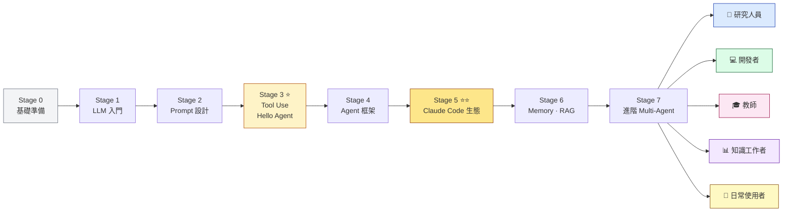
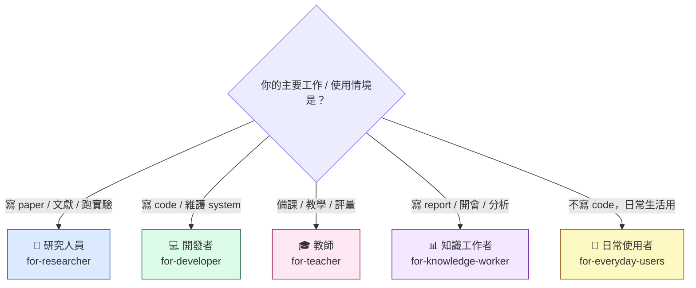

<div align="right">
  <a href="./README.en.md">English</a> | <strong>繁體中文</strong>
</div>

<div align="center">

# awesome-agentic-ai-zh

### 🤖 AI Agent 學習地圖 — 從基本 LLM 概念到自己打造多 agent 系統

<p><em>結構化 7 階段學習路徑，從「LLM 是什麼、token 怎麼算」一路到 multi-agent 編排、本地部署，<br/>每階段都有必跑 demo、必修閱讀、精選 project</em></p>

[](LICENSE)
[](CONTRIBUTORS.md)


[](README.md)

</div>

---

## 🎯 專案介紹

這個專案是為**想學習 AI 或 AI agent 的人**設計的。

依照一份**從零開始、循序漸進**的 AI agent 學習地圖，把網路上散落各處的高品質專案、教材、Hello-X demo、必修閱讀蒐集起來，整理成 **7 個階段** 的結構化學習路線——每階段都會清楚指出**該學什麼、必跑哪些 demo、推薦哪幾個 project、進入下一階段前該檢查什麼**。

走完整條路線，你會從「**LLM 使用者**」進階成「**agent 系統建構者**」——能讀懂 framework 在做什麼、能設計多 agent 協作、能寫自己的 MCP server。

---

## 📋 目錄

- [🎯 專案介紹](#-專案介紹)
- [📚 快速開始](#-快速開始)
  - [線上閱讀](#線上閱讀)
  - [本地下載](#本地下載)
  - [✨ 你會收穫什麼？](#-你會收穫什麼)
- [🗺️ 7 階段學習地圖](#️-7-階段學習地圖)
- [💡 如何學習](#-如何學習)
- [📚 相關資源](#-相關資源)
- [🤝 如何貢獻](#-如何貢獻)
- [🙏 致謝](#-致謝)
- [🎓 引用](#-引用)
- [License](#license)

---

## 📚 快速開始

### 線上閱讀
- **[GitHub README（你正在看）](README.md)** — 主入口、整體導航
- **[7-stage 學習地圖](#7-階段學習地圖)** — 從哪開始學

### 本地下載
```bash
git clone https://github.com/WenyuChiou/awesome-agentic-ai-zh.git
cd awesome-agentic-ai-zh
# 從 stages/00-foundations.md 開始
```

### ✨ 你會收穫什麼？

- 📖 **完全免費** — MIT 授權，所有內容開放共學
- 🗺️ **結構化路徑** — 7 階段、明確「我目前在哪、下一步學什麼」
- 🛠️ **必跑 Hello-X demos** — 每階段都有 1-5 個必跑 mini project，光看不練不算學會
- 🎯 **精選 145+ 個 projects** — 每個都附星等推薦、適合誰、教什麼、怎麼跑（含本地 LLM 執行：Ollama、llama.cpp、LocalAI、MLX）
- 🌏 **中文 / 英文雙語** — 繁中為主、英文版完整對照
- 🎓 **不只「框架」、還有「Claude Code 生態」** — MCP / Skills / Plugins / SDK 完整堆疊
- 🔬 **5 條進階分支** — 研究員 / 開發者 / 老師 / 知識工作者 / **日常使用者** path
- ⏱️ **誠實時程** — 主幹最少 14-19 週、現實 5-6 個月（每週 5-8 hr）

---

## 🗺️ 7 階段學習地圖


<details>
<summary>互動式版本（Mermaid，screen reader 友善）</summary>



</details>

| Stage | 主題 | 關鍵內容 | 時程 |
|---|---|---|---|
| **0** | [基礎準備](stages/00-foundations.md) | Python · CLI · git · API · JSON | 1-2 週 |
| **1** | [LLM 入門](stages/01-llm-basics.md) | token · API · 各家 LLM 比較 | 1 週 |
| **2** | [Prompt 設計](stages/02-prompt-engineering.md) | 系統 prompt · few-shot · CoT | 1-2 週 |
| **3** ⭐ | [Tool Use & Hello Agent](stages/03-tool-use-and-hello-agent.md) | function calling · ReAct · 5 個 Hello-X | 2-3 週 |
| **4** | [Agent 框架](stages/04-agent-frameworks.md) | LangGraph · AutoGen · CrewAI · Smolagents | 2-3 週 |
| **5** ⭐⭐ | [Claude Code 生態](stages/05-claude-code-ecosystem.md) | MCP · Skills · Plugins · Marketplace | 3-4 週 |
| **6** | [Memory · RAG · 進階](stages/06-memory-rag.md) | vector DB · long-term memory · contextual retrieval | 2 週 |
| **7** | [進階 Multi-Agent](stages/07-multi-agent-production.md) | multi-agent orchestration · eval · observability · SDK 進階 | 2-4 週 |

> **總時程**：主幹最少 **14-19 週**、現實 **5-6 個月**（每週 5-8 hr 兼職）

> 💡 **想看跨 stage 完整範例？** [7 步打造你的第一個 AI Agent](walkthroughs/build-first-agent-in-7-steps.md) — 同一個 Paper Summary Bot 從 Stage 1 一路寫到 Stage 7，~350 行真實程式碼

走完主幹後從 5 條 specialized branch 選一條繼續。**不確定走哪條？**



> 💡 **日常使用者 branch 不用走完主幹也能直接看**——是給「想用 AI 但不一定寫 code」的人。

| Branch | 適合誰 | 主題 |
|---|---|---|
| 🔬 [研究人員](branches/for-researcher.md) | 研究生、博後、PI | 文獻整理 · paper 寫作 · multi-agent review |
| 💻 [開發者](branches/for-developer.md) | 軟體工程師 | Cursor · Aider · CLI delegation · code review |
| 🎓 [教師](branches/for-teacher.md) 🚧 | 老師、講師 | 備課 · 投影片 · 學生 feedback *（目前最薄、歡迎貢獻）* |
| 📊 [知識工作者](branches/for-knowledge-worker.md) | 顧問、PM、分析師 | Email · 會議紀錄 · report 自動化 |
| 👥 [日常使用者](branches/for-everyday-users.md) | ChatGPT / Claude.ai 使用者 | 寫信 · 學習 · 隱私場景 · CLI agent 入門 |

---

## 💡 如何學習

歡迎你 — 未來的 AI agent 系統建構者。在開始這條路之前，給你一些指引。

本路線圖兼顧概念與實作，要協助你**從一個 LLM 使用者，蛻變成一個 agent 系統建構者**。內容適合**有基本 Python 能力**的開發者、研究生、自學者。在開始之前，希望你具備：

- **基本 Python** — 寫過 function、用過 API、看得懂 JSON
- **基本 git** — clone、commit、push
- **想學的動機** — agent 是 2025+ 最快變化的領域，需要持續投入

如果上面有缺、Stage 0 補齊；如果上面都已會，**直接從 Stage 1 開始**。

主幹結構分 4 部分：

- **Part 1（Stage 0-2）：基礎與 LLM 入門** — Python / git / API、什麼是 LLM、怎麼設計 prompt
- **Part 2（Stage 3-4）：建構你的 Agent** — 從 tool use 進化到 agent，學主流 framework
- **Part 3（Stage 5）：Claude Code 生態系** — MCP / Skills / Plugins，這是整個路線的核心
- **Part 4（Stage 6-7）：進階整合** — memory / RAG / multi-agent 協作

走完主幹（14-19 週）後，從 4 個 specialized branch 選一個走。

最重要的一條建議：**不要跳過 Hello-X demos**。每個 stage 的 hello-X 都是「不動手就學不會」的東西，光讀就跳過你會在後面卡住。

準備好了嗎？[從 Stage 0 開始](stages/00-foundations.md)。

---

## 📚 相關資源

這個 repo **不取代**平鋪型 awesome 清單，已知道在找什麼時用這些更直接：

- [**hesreallyhim/awesome-claude-code**](https://github.com/hesreallyhim/awesome-claude-code) — Claude Code 廣泛資源 catalog（重整中）
- [**wong2/awesome-mcp-servers**](https://github.com/wong2/awesome-mcp-servers) — 平鋪 MCP server 清單
- [**punkpeye/awesome-mcp-servers**](https://github.com/punkpeye/awesome-mcp-servers) — 另一個 MCP 清單
- [**travisvn/awesome-claude-skills**](https://github.com/travisvn/awesome-claude-skills) — Claude Skills catalog
- [**modelcontextprotocol/servers**](https://github.com/modelcontextprotocol/servers) — 官方 MCP reference servers

中文社群必看：
- [**datawhalechina/hello-agents**](https://github.com/datawhalechina/hello-agents) — Datawhale 系統性 agent 教學（zh-CN）
- [**WangRongsheng/awesome-LLM-resources**](https://github.com/WangRongsheng/awesome-LLM-resources) — 完整的中文 LLM 資源整理（8k+ stars）
- [**AiHubCN/Awesome-Chinese-LLM**](https://github.com/AiHubCN/Awesome-Chinese-LLM) — 中文開源大模型整理

---

## 🤝 如何貢獻

這是個開放社群、歡迎各種貢獻：

- 🐛 **回報 Bug** — 內容錯誤、連結失效、過時資訊 → 開 Issue
- 💡 **提建議** — 缺什麼 stage / 該加什麼 project → 開 Issue 討論
- 📝 **完善內容** — 改進現有 stage 內容、修 typo → 直接 PR
- ✍️ **新增 project** — 對某 stage 加 1-3 個新 project，附「為什麼這 project 教那個 stage」的說明
- 🌏 **翻譯** — 補英文 companion 沒翻好的地方，或將內容翻成其他語言
- 🌱 **擔任 Stage / Branch maintainer** — 長期 review 特定領域，見 [CONTRIBUTORS.md](CONTRIBUTORS.md)

PR 流程跟 style 規範見 [CONTRIBUTING.md](CONTRIBUTING.md) + [resources/style-guide.md](resources/style-guide.md)。

> Repo 內部的 phase rollout 進度跟 launch checklist 見 [`.github/launch-checklist.md`](.github/launch-checklist.md)（給 maintainer 參考的內部文件）。

---

## 🙏 致謝

### Inspiration

- [**Datawhale Hello-Agents**](https://github.com/datawhalechina/hello-agents) — 教學式系統性 agent tutorial 的範本，啟發本 repo 的 章節 + 進度 結構
- [**Datawhale 整個社群**](https://github.com/datawhalechina) — 中文 ML 共學社群的標竿，多個 anchor projects 來自他們

### 對位的 awesome lists

- `wong2/awesome-mcp-servers`、`punkpeye/awesome-mcp-servers`、`hesreallyhim/awesome-claude-code` — 平鋪式 catalog 的好對手；本 repo 的差異化是「結構化路徑」

### 個人

- [@WenyuChiou](https://github.com/WenyuChiou) — Maintainer

---

## 🎓 引用

如果這個學習地圖對你的學習或工作有幫助，歡迎引用：

```bibtex
@misc{awesome_agentic_ai_zh_2026,
  title  = {awesome-agentic-ai-zh: A Structured Learning Roadmap for Agentic AI},
  author = {Chiou, Wenyu},
  year   = {2026},
  url    = {https://github.com/WenyuChiou/awesome-agentic-ai-zh},
  note   = {7-stage learning path from prerequisites to advanced multi-agent systems, with curated projects + hello-X demos. Bilingual (zh-TW / English).}
}
```

---

## License

MIT。Maintained by [@WenyuChiou](https://github.com/WenyuChiou)。

<div align="center">
  <p>⭐ 如果這個 repo 對你有幫助，歡迎給個 Star — 這對作者繼續迭代很重要</p>
</div>
