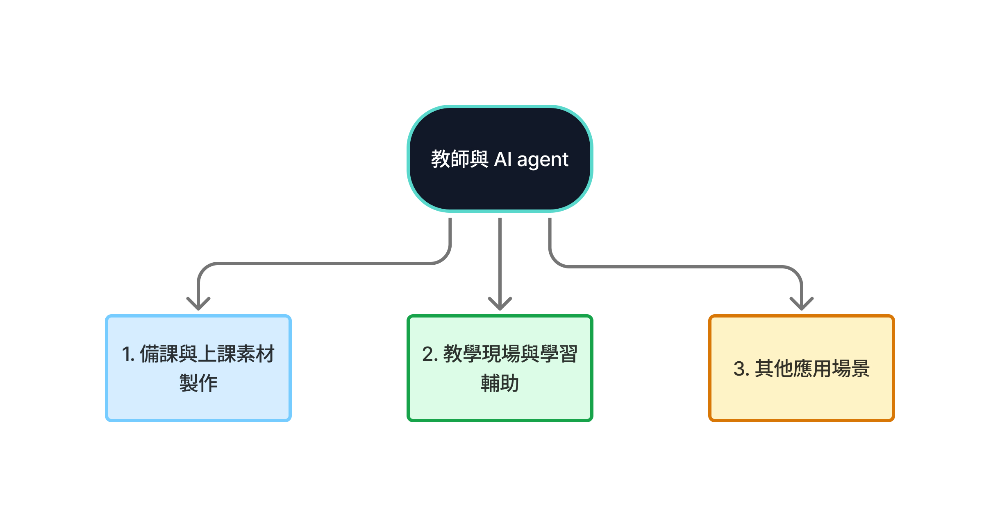
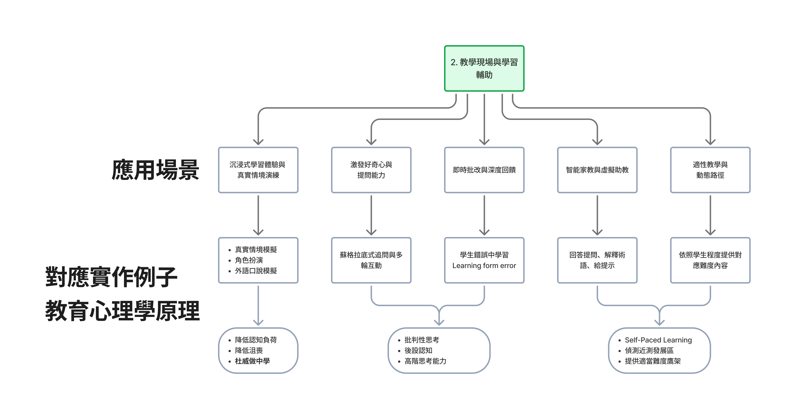

# For Teachers — Specialized Branch

> [繁體中文](./for-teacher.md) | [简体中文](./for-teacher.zh-CN.md) | **English**


> [← Back to main path README](../README.en.md) · Continue here after **Track A's A3** or **Track B's Stage 7**. Apply agentic AI to teaching workflows.

## Use Cases

Teacher-facing AI use cases can first be read as three branches: **lesson prep and class material creation**, **classroom and learning support**, and **other use cases**. This grouping follows common AI in Education discussions around administration, instruction, and learning, while also reflecting recent work on generative AI for material creation, feedback, and interactive support (Chen et al., 2020; Mittal et al., 2024). Start with teacher oversight and boundaries, then choose the branch that best matches your teaching need.



### What Teachers Should Watch For When Using AI

AI can prepare and assist, but it should not replace teacher judgment. Recent AI in Education and generative AI for education research also emphasizes clear learning goals, safety boundaries, and human review when teachers design AI agents (Chen et al., 2020; Mittal et al., 2024).

- **Keep teacher judgment in the loop**: when student data, grades, or teaching decisions are involved, teachers remain responsible for final review.
- **Avoid giving answers too quickly**: if students interact with an AI agent, design the flow as Socratic dialogue so students explain their reasoning across multiple turns.
- **Align with learning goals**: use prompts, skills, or fixed workflows to constrain the agent's role and task, so student interaction stays tied to the lesson.
- **Rewrite student questions when needed**: for younger students, such as elementary or middle-school learners, rewrite unclear questions before sending them to the agent.

### Lesson Prep and Class Material Creation

These workflows help teachers prepare materials. The output should still be revised, selected, and checked by the teacher.

- **Lesson plan generation**: turn curriculum standards, unit goals, and student levels into lesson outlines, time allocation, activity design, discussion prompts, and supplementary guides.
- **Quiz / rubric creation**: generate multiple-choice, short-answer, essay questions, answer keys, and scoring criteria from texts, textbook sections, or academic articles.
- **Slide deck preparation, curriculum mapping, and multimedia visualization**: turn textbook chapters or teacher notes into slide outlines, handout structures, weekly sequences, prerequisite knowledge, assessment checkpoints, images, 3D objects, video scripts, GIFs, or classroom presentation assets.
- **Student feedback synthesis and analysis**: summarize student answers, assignments, or class responses to identify common misconceptions, remediation needs, and next-step practice.
- **Multilingual material translation and adaptation**: rewrite or translate material for different languages, and generate text-to-speech assets when useful.
- **Materials for interactive games, activities, and virtual simulation scenarios**: prepare educational games, rhymes, task cards, role cards, scenario text, or simulation backgrounds; for actual interaction or activity design, see the next section on classroom and learning support.

### Classroom and Learning Support



These workflows help students understand, practice, and interact. AI acts more like a teaching assistant or activity support tool. Note that a single lesson does not need to include every element; choose the moments where an AI agent design actually fits the learning activity.

- **Immersive learning and realistic scenario practice**: use realistic simulation, role-play, or speaking practice so students can rehearse in near-authentic contexts while lowering cognitive load and hesitation.
- **Curiosity and questioning support**: use Socratic follow-up questions and multi-turn interaction to help students ask clearer questions, explain their reasoning, and develop critical thinking and metacognition.
- **Instant grading and deeper feedback**: help students learn from mistakes by pointing out errors, explaining why they happen, and suggesting revisions instead of only giving a score or answer.
- **Intelligent tutoring and virtual teaching assistants**: answer questions, explain terminology, and provide hints so students receive appropriate support in and beyond class.
- **Adaptive teaching and dynamic paths**: provide difficulty-matched content based on student level, infer the zone of proximal development from learning performance, and offer suitable scaffolding or remediation materials.

### Other Use Cases

These use cases may not happen directly inside a lesson, but they shape teacher work, student support, and education-system operations.

- **Special education support**: use speech-to-text, text-to-speech, and related tools to help students with different needs participate in class.
- **Parent-teacher communication and family learning**: summarize student progress and suggest home-based follow-up activities.
- **Administration and academic integrity**: summarize learning traces, generate reports, or support plagiarism and cheating-risk checks.
- **Career and skill-development guidance**: support career exploration, training-plan design, and weak-spot practice recommendations.
- **Teacher professional development**: summarize teaching methods, education-technology trends, and research insights.
- **Advanced research and business analysis**: support literature review, market-trend analysis, or business-plan drafting.
- **Privacy-preserving synthetic data**: generate anonymized synthetic data for research or system testing without directly exposing personal data.

### References

- Chen, L., Chen, P., & Lin, Z. (2020). [Artificial Intelligence in Education: A Review](https://doi.org/10.1109/ACCESS.2020.2988510). *IEEE Access*, 8, 75264-75278.
- Mittal, U., Sai, S., Chamola, V., & Sangwan, D. (2024). [A Comprehensive Review on Generative AI for Education](https://doi.org/10.1109/ACCESS.2024.3468368). *IEEE Access*, 12, 142733-142759.

## Curated Projects

### Teaching Workflow Skills

(Most are not yet skill-marketplace packaged. This branch has the most room for community contribution — see CONTRIBUTING.md.)

### Useful Building Blocks

#### [obra/superpowers](https://github.com/obra/superpowers) ⭐⭐⭐⭐
General writing / brainstorming skills. Adaptable for lesson prep.

#### [Claude Code](https://github.com/anthropics/claude-code) (with custom CLAUDE.md) ⭐⭐⭐⭐⭐
★ 120k+ — A good place for teachers to start. Use Claude.ai (web) for low-barrier exploration; upgrade to Claude Code when a workflow becomes repeatable.

### Teaching Course Materials (for teachers preparing classes)

#### [huggingface/agents-course](https://github.com/huggingface/agents-course) ⭐⭐⭐⭐

| Field | Value |
|---|---|
| Stars | ★ 28k+ |
| License | Apache-2.0 |

**What it teaches**: Hugging Face's official agents curriculum — notebooks, exercises, certifications. A ready-made **AI agent teaching artifact**.

**Best for**: Teachers running an "AI agents intro" workshop or class who want existing materials to teach from or adapt.

**Notes**: This teaches *how to build agents* — it's not an "AI tutor for students" tool.

---

#### [datawhalechina/llm-universe](https://github.com/datawhalechina/llm-universe) ⭐⭐⭐⭐ (Chinese)

| Field | Value |
|---|---|
| Language | Chinese (zh-CN) |
| Stars | ★ 13k+ |
| License | NOASSERTION |

**What it teaches**: Datawhale's Chinese-language LLM application development course — RAG, agents, chapter exercises. A ready-made template for Chinese-speaking teachers preparing class material.

**Best for**: Chinese-language teachers wanting a ready LLM curriculum to adapt to their students' level.

**Notes**: Same caveat as `huggingface/agents-course` — it's "teach students to build LLM apps," not "AI assistant for the teacher."

---

### Prompt Libraries

#### [f/awesome-chatgpt-prompts](https://github.com/f/awesome-chatgpt-prompts) ⭐⭐⭐⭐

| Field | Value |
|---|---|
| Stars | ★ 161k+ |
| License | NOASSERTION (CC0 / public-domain-style, but no SPDX) |

**What it teaches**: Community-maintained prompt megacatalog — "act as X" templates covering hundreds of roles (teacher, interviewer, stand-up comedian, debater, ...). Teachers can use it as "prompt writing examples" to show students, or borrow specific prompts for in-class demos.

**Best for**: Teachers introducing "prompt engineering" who want concrete examples of different writing styles to compare.

**Notes**: Quality varies — treat as a sourcebook to pick from, not "use everything as-is."

---

### Reading Material

#### [The Effortless Academic — Beginner Guides](https://effortlessacademic.com/claude-code-and-cowork-for-academics-beginner-guide-part-1/)
Multi-part guide for academics adopting Claude Code, applicable to teachers.

## Workflows To Build

These are templates — adapt to your subject:

- **Lesson plan generator**: Prompt with curriculum + topic → outline → slides → assessment
- **Rubric creation**: Sample student work + learning objective → rubric draft
- **Personalized feedback**: Student submission + rubric → individualized written feedback (with human review)
- **Scenario simulation activity**: learning goal + role setup → dialogue script → class practice → reflection questions
- **Remediation material generator**: common errors + student level → short practice → hints → extension challenge

### 3 Copy-Paste Prompt Templates

**1. Lesson outline generator** (paste into Claude.ai):
```
You are a [SUBJECT] teacher. I'm preparing a [DURATION]-minute class for
[GRADE] students on the topic "[TOPIC]". Prior knowledge: [SUMMARY].
Produce:
1. Learning goals (3-4 bullets, use Bloom's taxonomy verbs)
2. Class outline with time allocation
3. 1 in-class activity / discussion prompt
4. 1 follow-up assessment item
Don't introduce content outside the topic I gave.
```

**2. Rubric draft**:
```
I have a [ASSIGNMENT TYPE] for [GRADE] students on [TOPIC].
Learning objectives: [2-3 bullets].
Produce a 4-level rubric (Excellent / Proficient / Developing / Needs work)
with one paragraph per level across 4 dimensions:
content depth / organization / argumentation or calculation / clarity.
Make descriptions concrete and observable, not vague terms like "high quality".
```

**3. Student feedback synthesis**:
```
Below are [N] student submission excerpts:
[PASTE TEXT]

Please:
1. Summarize 3 common strengths across this batch
2. Summarize 3 common weaknesses
3. For the most common weakness, suggest 1-2 things to reinforce next class
Don't write per-student feedback — I'll do that myself.
```

## Privacy + Ethics (Important)

Teachers using LLMs are different from regular users — **student data is involved**. Hard rules:

- **Don't put student PII into public LLMs** (names, IDs, contact info, grades). Anonymize first ("Student A / B / C")
- **AI assistance ≠ AI grading**: drafting feedback / rubrics with LLM is fine, but **final grades require human judgment** — LLMs aren't reliable on complex evaluation yet
- **Disclose to students**: if class material is AI-assisted, disclose it (similar to declaring AI tool use in papers). Teaching integrity matters
- **Fact-check**: LLMs hallucinate citations, scholar names, research data. Domain content **must be verified** before class
- **Student work copyright**: don't bulk-upload student writing to third-party services for analysis — risks FERPA / GDPR violations

If your school / institution has an AI policy, **that takes priority** over this guide.

## Tier Recommendations for Teachers

Most teachers should stay at **Tier 0 (browser chat)** or **Tier 1 (Claude Desktop)**:

- **Tier 0**: Claude.ai web chat — copy/paste prompts, no install
  - Good for: occasional lesson prep, one-off tasks, item generation, writing emails
  - Example: copy the lesson-outline prompt above, fill in topic, run
- **Tier 1**: Claude Desktop / [NotebookLM](https://notebooklm.google.com/) — file uploads, conversation history
  - Good for: grading / organizing a semester's data, course mapping, bulk-importing reading list PDFs and querying them
  - Example: upload your full course reading list to NotebookLM; query throughout the semester
- **Tier 2+ (CLI / SDK)**: only if you're **automating a recurring flow**
  - Example: every week 30 student submissions → auto-generated draft feedback
  - Non-coder teachers: **ask the school IT or a student RA** to set up; you only use the output

> Once you're at Tier 2+, follow [Track A — CLI Power User](../tracks/cli/A1-cli-intro.en.md).

## Other Branches Also Apply

Many teachers are also researchers / knowledge workers. These branches overlap:

- **Also doing research** (lit review, paper writing, references) → [Researcher branch](./for-researcher.en.md)
- **Reports / meeting notes / cross-tool integration** (Notion, Excel, email) → [Knowledge Worker branch](./for-knowledge-worker.en.md)
- **Connect AI to Notion / Obsidian / Lark / etc.** → [`resources/mcp-skills-catalog.en.md`](../resources/mcp-skills-catalog.en.md)

## Community Note

This branch is the smallest curated section currently. Contributions especially welcome:

- Lesson plan generation skills
- Subject-specific prompt libraries (literature teacher's prompts, math teacher's prompts, language teacher's prompts...)
- Teacher-specific MCP servers (gradebook integrations, LMS connections like Canvas / Moodle / Google Classroom)
- **Subject + grade-level case studies** (e.g., "I used AI to teach middle-school math for a semester — here's my workflow")

See [CONTRIBUTING.md](../CONTRIBUTING.md).
