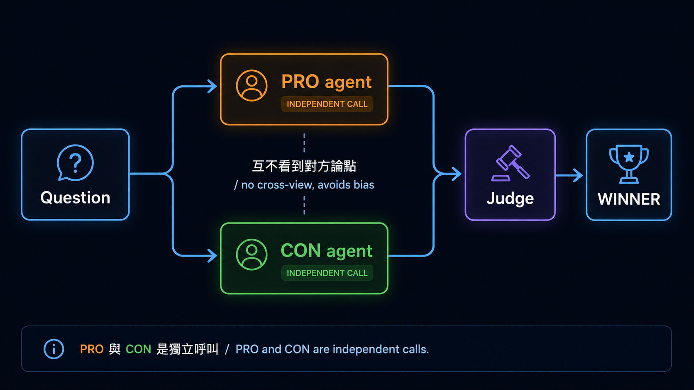

<div align="right">
  <strong>繁體中文</strong> | <a href="./README.zh-Hans.md">简体中文</a> | <a href="./README.en.md">English</a>
</div>

# 練習 1：Multi-Agent 辯論

對應 [Stage 7 — Multi-Agent & Production](../../../stages/07-multi-agent-production.md) 練習 1。
> 🎓 **學習模式**：這份 `starter.py` 是**完整解答**、不是 TODO skeleton。建議用**主動模式**——`mv starter.py starter_reference.py`、看 signature 不看 body、自己重寫一份 `starter.py`、跑 `python test.py` 驗證；卡 20 分鐘再回去對照 reference。完整方法論看 [`docs/HOW_TO_USE.md`](../../../docs/HOW_TO_USE.md)。

> 📚 **想要 chapter-length 深入版？** 本 folder 的 starter 是 illustrative 版、聚焦核心 pattern + 兩條 SDK path，不是 production-grade tutorial。深度教材推薦：
> - [`datawhalechina/hello-agents`](https://github.com/datawhalechina/hello-agents) ⭐ 中文圈最完整、章節式 + 16 種 production 能力。**本練習對應 hello-agents 的 multi-agent collaboration / debate 章節**
> - [Anthropic — Building Effective Agents debate](https://www.anthropic.com/engineering/building-effective-agents) + [Microsoft AutoGen multi-agent docs](https://microsoft.github.io/autogen/)
> - 完整 references 見 [Stage 7 精選 Projects](../../../stages/07-multi-agent-production.md#-精選-projects範本--sdk--工具-collection)


## 任務

3 個 agent（PRO + CON + Judge）對同問題辯論：



PRO 跟 CON **獨立** call、互不看到對方論點（避免 bias propagation）；Judge 看完兩邊再裁決。

## 為什麼這個 pattern 重要

- **降低 single-LLM bias**：單一 LLM 給的答案常帶 stance、不主動指出反面
- **強化 reasoning**：兩個 LLM 強迫 articulate 各自立場、reasoning trace 更清楚
- **可解釋性**：production 高風險決策（policy / 醫療 / 法律 review）有 audit trail
- **錯誤偵測**：兩 agent 互不同意時、可能就是答案有歧義 / model 不確定

## 怎麼跑

### Path A（默認、本機免費）

```bash
pip install -r requirements.txt
ollama pull qwen2.5:3b
ollama serve
python starter.py
```

預算：**$0**。3 個 LLM call × CPU ≈ 15-45 秒。

### Path B（Anthropic）

```bash
pip install -r requirements.txt
export ANTHROPIC_API_KEY=sk-ant-...
python starter_anthropic.py
```

預算：每次 ≈ **$0.003**（3 LLM call × short prompt × claude-haiku-4-5）。

## 不花錢驗證程式邏輯

```bash
python test.py # 3 個 test、mock 3 LLM call、驗 judge 看到 pro+con
python test_anthropic.py
```

## 重要設計細節

```python
# pro / con 用同一個 model、不同 system prompt
pro = llm_call(system="argue PRO position", user=question)
con = llm_call(system="argue CON position", user=question)

# judge 看「question + pro + con」做裁決
judge = llm_call(
    system="neutral judge, output WINNER=PRO or WINNER=CON",
    user=f"Question: {question}\n\nPRO: {pro}\n\nCON: {con}",
)
```

**Key**：pro / con **獨立 call**——不要把 pro 結果丟給 con。如果 con 看到 pro、會傾向反駁 pro 而非獨立思考、bias 反而加強。

## Production-grade 變形

- **N-way debate**：3+ agent 各持不同立場（e.g. "engineer / PM / customer view"）
- **Iterative debate**：pro 跟 con 互看 N 輪、看誰先放棄
- **Different models**：pro 用 Claude、con 用 GPT、judge 用 Gemini——cross-model debate 找盲點
- **Self-consistency check**：跑 3 次 debate、看 judge 結果穩定度

## 兩個 path 觀察重點

| 觀察項 | Anthropic Claude | Ollama qwen2.5:3b |
|---|---|---|
| pro / con 持立場 | 穩 | 偶爾兩邊都講「平衡 view」、立場不堅定 |
| judge 給明確 WINNER | 穩 | 偶爾不給 WINNER= 格式 |
| reasoning 質量 | 高 | 中 |
| 成本 | $0.003 | $0 |

## 常見坑

- **PRO 跟 CON 用同一個 system prompt**：模型答案會同質、debate 意義消失
- **Judge 看 pro/con 順序固定**：可能 bias 第一個（recency / primacy effect）。production 可以隨機 shuffle
- **沒 structured judge output**：不寫 `WINNER=PRO or CON` 格式、後續 parsing 困難
- **太短 prompt**：pro / con 各只給 1 句、judge 沒材料

## 延伸

- **接 [LangGraph](https://langchain-ai.github.io/langgraph/)**：pro/con 變 parallel node、judge 變 join node
- **接 [AutoGen](https://github.com/microsoft/autogen)**：AutoGen 對 multi-agent debate 有專門支援
- **加 confidence**：judge 多 output confidence 0-1、low confidence 才把 case escalate 給人
- **接 eval（練習 2）**：跑 debate 在 50 個 case、跟 single-agent baseline 比準確率
