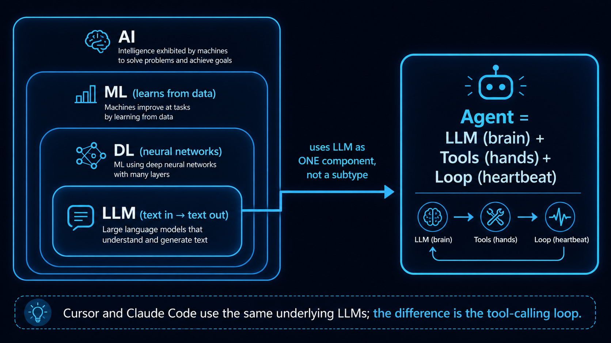

# Stage 3 — Tool Use & Hello Agent ⭐

> [繁體中文](./03-tool-use-and-hello-agent.md) | [简体中文](./03-tool-use-and-hello-agent.zh-Hans.md) | **English**

⏱️ **Estimated Time**: 2-3 weeks (approx. 10-20 hours)

> 💡 Terminology-heavy (agent / tool use / function calling / ReAct / structured output) → See [`resources/glossary.md` 2](../resources/glossary.en.md#2-agents--tool-use).
> 🗺️ **Before choosing Track A (CLI Power User) or Track B (Agent Builder)**, read [`resources/agent-paradigms.md`](../resources/agent-paradigms.md) — a panoramic view of 5 agent archetypes to help you choose your path.

> 📋 **Chapter Structure**: [Opening Framing: The relationship between AI/LLM/Agent] → Learning Objectives → Prerequisites → Required Reading → [Optional · Concept Map] → Hands-on Exercises → Reflection (Concepts + Routing) → Curated Projects → Self-Check
> 🔑 **Key Terms**: See [`resources/glossary.md` 2](../resources/glossary.en.md#2-agents--tool-use)

## 🤖 Before We Start: AI / LLM / Agent — How Do They Differ?

> **This section is for "opening framing" (a top-down pedagogy)**: First, build the mental hierarchy in the learner's mind, then move on to Learning Objectives and Exercises. This section provides only **brief explanations + comparisons**. In-depth introductory materials are already canonical references in both English and Chinese (see resources below). **This is not a rewrite of hello-agents Ch1.**

### A Hierarchy Diagram to Establish Understanding



→ **An "Agent" is not a "more advanced model than an LLM," nor is it a branch under the LLM classification tree**. An agent is a **cross-layer abstract system** that uses an LLM as one of its components. Cursor / Claude Code / Hermes Agent all use the same LLMs internally (Claude / GPT / Gemini)—the difference is how they wrap the LLM in a tool-calling loop.

### Three-Line Comparison (The Quickest Version)

| Term | What It Is | What You Give It, What It Returns | Example |
|---|---|---|---|
| **AI** | The entire field of study | Too abstract to be "used" directly | ML, DL, LLM, RL are all subfields of AI |
| **LLM** | A single model that maps text to text | Give a prompt → Get text back | GPT-5, Claude, Llama 3, Qwen |
| **Agent** | A **system** of LLM + tools + loop | Give a task → It completes it in multiple steps | Cursor, Claude Code, Hermes Agent |

**One sentence**: An LLM is like a brain that understands and generates text; an Agent connects that brain to tools, workflow, and feedback loops so it can finish multi-step tasks as a system.

### The 3 **Minimum Necessary** Components of an Agent (This is the core difference between an agent and an LLM)

| Component | Role | Where to Learn |
|---|---|---|
| 🧠 **LLM** (brain) | Reasoning / Decision-making / Natural language | Already learned in Stage 1 |
| 🔧 **Tools** (hands) | Acting on the world (calling APIs, running code, looking up data) | **This stage** |
| 🔁 **Loop** (heartbeat) | Think → Act → Observe → Think again (ReAct) | **Exercise 3 of this stage** |

→ **These 3 together are the minimum definition of an agent**. Without tools / loop, it's just "LLM + your own retry logic," not an agent.

### Classic Agent Paradigms (Thinking Patterns)

After learning the 3 minimum components, the next layer is "**how the LLM thinks**." Chapter 4 of hello-agents, "Building Classic Agent Paradigms," is all about this. A brief comparison:

| Paradigm | What It Is | Where to Learn |
|---|---|---|
| **CoT** (Chain-of-Thought) | The LLM writes out its reasoning process before giving the answer, not just the conclusion—it's a **prompting technique**, not an agent architecture | **Stage 2** Learning Objectives + Hands-on Exercises (Reasoning Task CoT) |
| **ReAct** (Reasoning + Acting) | Applying CoT within a Loop: Thought → Action (call tool) → Observation (see result) → Thought... It's the **most common implementation of the Loop component** | **Exercise 3 of this stage** + [ReAct paper (Yao 2022)](https://arxiv.org/abs/2210.03629) |
| **Reflection** | After a run, the LLM critiques its own work and re-answers based on feedback | **Reflection of this stage** (concept + routing) |
| **Planning** (Task Decomposition) | Breaking a large task into sub-tasks, which can be assigned to multiple agents | **Stage 4** What is a multi-agent framework |

→ These paradigms are all variations of "**LLM self-guidance**," built on top of the 3 components (LLM + Tools + Loop). **"What is an agent" is explained by the 3 components; "How an agent thinks" requires these 4 paradigms for a complete picture.**

> 💡 **Extended Components** (infrastructure that makes agents stronger, but **not a criterion for "is it an agent?"**):
> - **Memory / RAG** (agent can remember things across conversations) → Taught completely in **Stage 6**
> - **Reflection / self-critique** (agent looks at its own answer, finds problems, and goes back to fix them) → Basic version in **Reflection of this stage** (concept + paper routing); advanced version with persistent memory in **Stage 6 Reflexion with Memory**
> - **Production harness** (telemetry / safety / retry / orchestration) → **Stage 5 5.6**
>
> These are all advanced patterns—Stage 3 teaches the minimum viable agent, and later stages teach how to make it stronger.

### 📚 In-Depth Introductory Resources (English / Video-first)

**🇺🇸 English**:
1. [**Andrej Karpathy — "Intro to Large Language Models"**](https://www.youtube.com/watch?v=zjkBMFhNj_g) ⭐⭐⭐ (1hr) — A visual intro to LLMs from scratch (ex-OpenAI / ex-Tesla AI Director, the most valued LLM intro video in the English-speaking world).
2. [**Andrej Karpathy — "Let's build GPT from scratch"**](https://www.youtube.com/watch?v=kCc8FmEb1nY) ⭐⭐ (2hr) — For those who want to see inside an LLM down to the code level.
3. [**3Blue1Brown — "But what is a Transformer?"**](https://www.youtube.com/watch?v=wjZofJX0v4M) ⭐⭐⭐ — A visual explanation of LLMs, the most recommended visual tutorial in the English-speaking world.
4. [**Lilian Weng — "LLM Powered Autonomous Agents"**](https://lilianweng.github.io/posts/2023-06-23-agent/) ⭐⭐⭐ — The canonical 1-page agent anatomy (Planning / Memory / Tool use / Action), the most cited agent dissection in the English-speaking world.
5. [**Anthropic — "Building Effective Agents"**](https://www.anthropic.com/research/building-effective-agents) ⭐ — Anthropic's perspective: when to use an agent, and when a workflow is enough.
6. [**Chip Huyen — "Agents"**](https://huyenchip.com/2025/01/07/agents.html) — A practitioner's perspective, a full chapter's worth of depth.

**🀄 Chinese**:
1. [**Hung-yi Lee — Introduction to Generative AI (Spring 2024 NTU Course)**](https://speech.ee.ntu.edu.tw/~hylee/genai/2024-spring.php) ⭐⭐⭐ — The highest quality academic-level introduction to AI / LLM / agents in the Chinese-speaking world. Each episode is 30-60 minutes, taught at National Taiwan University, with official page including slides + YouTube links. Covers both LLM and agent concepts. The latest integrated version can be found at [**GenAI-ML 2025 Fall**](https://speech.ee.ntu.edu.tw/~hylee/GenAI-ML/2025-fall.php), and the main YouTube channel is [**@HungyiLeeNTU**](https://www.youtube.com/@HungyiLeeNTU).
2. [**datawhalechina/hello-agents** Ch1 "First Look at Agents"](https://github.com/datawhalechina/hello-agents) ⭐ — The most complete text-based introduction to agents in Chinese.
3. [**datawhalechina/hello-agents** Ch2 "The History of Agent Development"](https://github.com/datawhalechina/hello-agents) — The evolutionary path from BabyAGI → AutoGPT → Claude Code.
4. [**3Blue1Brown Chinese Dubbed Version**](https://www.youtube.com/@3Blue1BrownCN) — Visual explanations of LLM / Transformer (in Chinese).

**Optional / Advanced Reading**:
- [**Simon Willison — "I think 'agent' may finally have a widely enough agreed upon definition"**](https://simonwillison.net/2025/Sep/18/agents/) — A working definition: "an agent runs tools in a loop to achieve a goal," including debates over different definitions from OpenAI and others (**for those with a foundational understanding**).
- [**DeepLearning.AI Short Courses**](https://www.deeplearning.ai/short-courses/): "AI Agents in LangGraph" / "Multi AI Agent Systems with crewAI" / "Functions, Tools and Agents with LangChain" (**Most APIs are from 2023-2024**, focus on the concepts and cross-reference the official latest docs for code).
- [**liyupi/ai-guide**](https://github.com/liyupi/ai-guide) — The largest AI resource **aggregator** repo in the Chinese-speaking world (not original educational material, suitable for broad exploration).

> 📌 **Resource List Limit Rule**: This section is a router, not a tutorial. The main list has a combined limit of **10 items** (6 English + 4 Chinese). To add a new resource, **one must be removed first**. The optional reading section does not count towards the main list limit.

> 💡 **Recommended Learning Path**: First, watch 1-2 videos (English: Karpathy / 3Blue1Brown; Chinese: Hung-yi Lee) to build a visual mental model → then read 1-2 blog posts (Lilian Weng / Anthropic) to get a working definition → then return to this stage for hands-on exercises. **You don't need to consume everything**; this is a reference library, not a reading list.

---

This is the most critical stop on the entire learning path. **You don't truly understand agents until you've built one**. It is recommended to hand-code the basic exercises in this stage at least once, then refer to [hello-agents](https://github.com/datawhalechina/hello-agents) or the curated projects in this stage for more in-depth material as needed.

## 📌 Learning Objectives

After completing this stage, you will be able to:
- Explain why LLMs need tools (they are not omnipotent, and they can't do anything beyond text).
- Define a tool schema and have an LLM call it.
- Write a single-step ReAct agent from scratch (without any framework).
- Write a multi-step ReAct agent and let it decide when to stop.
- Distinguish which problems require tool use and which can be solved with a pure prompt.

## 🚪 Entry Conditions

You should already have:
- Access to Claude / OpenAI / Gemini API (Stage 1).
- A basic grasp of prompt engineering (Stage 2).
- The ability to write a Python function that takes JSON in and returns JSON out.

## 📚 Required Reading

1. [**Anthropic — Tool Use**](https://docs.anthropic.com/en/docs/agents-and-tools/tool-use/overview) — The official guide.
2. [**anthropics/courses — Tool Use**](https://github.com/anthropics/courses) ⭐⭐⭐⭐⭐ ★ 21k+ — Anthropic's official 5-course umbrella; **module 5 "Tool Use" maps to this stage**. Jupyter notebook exercises covering multimodal prompts / streaming / tool implementation walkthrough.
3. [**ReAct: Synergizing Reasoning and Acting in Language Models**](https://arxiv.org/abs/2210.03629) — Yao et al. 2022, the foundational paper. Read at least the abstract and Section 3.
4. [**OpenAI — Function Calling**](https://platform.openai.com/docs/guides/function-calling) — For reference on the function calling format.
5. [**Build an agent from scratch**](https://shafiqulai.github.io/blogs/blog_3.html) — A narrative-style guide to building an agent from scratch.

## 🛠 Hands-on Exercises (Basic Illustrative Exercises)

> 🦙 **This stage defaults to using Ollama qwen2.5:3b** (for cost reasons and stable tool-use support). Starting from Stage 3, with tool calling / ReAct loops, `gemma4:e4b` is insufficient; we switch to `qwen2.5:3b` (1.9 GB, install with `ollama pull qwen2.5:3b`). Each exercise has a Path A (Ollama, default) + Path B (Anthropic, optional, for when you want to see high-quality tool-use in the cloud).
>
> 💰 **Stage 3 Budget Estimate** (for all 6 exercises, with heavy tool use): **All local = $0**; **all haiku ≈ $0.50**; **all sonnet ≈ $1.50**. The ReAct loop exercise is about 4-6 tool calls × 5 exercises × 5 reps ≈ $0.80 on haiku. For the full budget, see [`examples/README.md#recommended-llms`](../examples/README.en.md#recommended-llm-list).
>
> For the full 3-way trade-off, see [`examples/README.md`](../examples/README.en.md#three-paths--default-is-ollama-cost-driven).
>
> 🆘 **Stuck?** Tool calling has the steepest learning curve in the entire curriculum. Install the [`examples/stage-5/tool-calling-tutor/`](../examples/stage-5/tool-calling-tutor/) skill—when you prompt Claude Code with "Why isn't my LLM calling my tool?" or "What's wrong with my schema?", it will auto-load and walk you through a 4-symptom diagnostic process.
>
> 🪜 **This stage is the starting point for single-agent**: one LLM + ReAct loop. For **multi-agent concepts** (multiple agents collaborating), see [Stage 4 What is a multi-agent framework](04-agent-frameworks.en.md#-what-is-a-multi-agent-framework); for **Claude's native subagent mechanism** (`.claude/agents/` + Task tool, no framework needed), see [Stage 5.5](05-claude-code-ecosystem.en.md#55--subagents-claude-codes-native-multi-agent-mechanism--2025-new-feature).

### Exercise 1: Function Calling (One Tool, One Call)
Give Claude a tool (a fake weather API) and a question ("Is it raining in Taipei right now?"). See how Claude calls the tool, gets the result, and then answers you.

<details open>
<summary>📋 <b>Starter Code — Path A (Local Ollama qwen2.5:3b, default)</b> (copy to <code>practice_1.py</code>)</summary>

```python
# Requires: pip install openai
# Prerequisite: ollama pull qwen2.5:3b && ollama serve
# Note: Stage 3+ uses qwen2.5:3b (stable tool-use), not gemma4:e4b
import sys, json
if hasattr(sys.stdout, "reconfigure"):
    sys.stdout.reconfigure(encoding="utf-8", errors="replace")

from openai import OpenAI

client = OpenAI(base_url="http://localhost:11434/v1", api_key="ollama")

# Step 1: Define the tool schema — OpenAI-compatible format wrapped in {"type":"function", "function":{...}}
weather_tool = {
    "type": "function",
    "function": {
        "name": "get_weather",
        "description": "Get the current weather for a city (sunny/rainy/cloudy), returns a short string.",
        "parameters": {
            "type": "object",
            "properties": {
                "city": {"type": "string", "description": "The city name (e.g., 'Taipei')"},
            },
            "required": ["city"],
        },
    },
}

# Step 2: Ask a question and let the LLM decide whether to call the tool
resp = client.chat.completions.create(
    model="qwen2.5:3b",
    max_tokens=512,
    tools=[weather_tool],
    messages=[{"role": "user", "content": "Is it raining in Taipei right now?"}],
)

# === Self-Verification ===
msg = resp.choices[0].message
print("finish_reason:", resp.choices[0].finish_reason)
print("tool_calls:", msg.tool_calls)

assert msg.tool_calls, "Expected the LLM to choose to call a tool (instead of answering directly)"
tc = msg.tool_calls[0]
assert tc.function.name == "get_weather", f"Expected to call get_weather, but got {tc.function.name}"
args = json.loads(tc.function.arguments)
assert args.get("city"), "Expected the city parameter to have a value"
print(f"✅ Exercise 1 Passed — qwen2.5:3b correctly chose get_weather with city='{args['city']}'")
```

**Expected Output** (sample):
```
finish_reason: tool_calls
tool_calls: [ChatCompletionMessageToolCall(id='call_xxx', function=Function(name='get_weather', arguments='{"city": "Taipei"}'), type='function')]
✅ Exercise 1 Passed — qwen2.5:3b correctly chose get_weather with city='Taipei'
```

**Verify logic without installing Ollama**: Use `unittest.mock.MagicMock` to replace the client, feed it a fixed response, and the asserts will still work. For a complete mock example, see [`examples/stage-3/03-react-from-scratch/test.py`](../examples/stage-3/03-react-from-scratch/test.py) (the pattern is cross-backend compatible).

</details>

<details>
<summary>📋 <b>Starter Code — Path B (Anthropic API, optional)</b> (copy to <code>practice_1_anthropic.py</code>)</summary>

```python
# Requires: pip install anthropic
# Environment variable: export ANTHROPIC_API_KEY=sk-ant-...
import anthropic

client = anthropic.Anthropic()

# Anthropic native tool schema — no wrapper needed
weather_tool = {
    "name": "get_weather",
    "description": "Get the current weather for a city (sunny/rainy/cloudy), returns a short string.",
    "input_schema": {
        "type": "object",
        "properties": {
            "city": {"type": "string", "description": "The city name (e.g., 'Taipei')"},
        },
        "required": ["city"],
    },
}

resp = client.messages.create(
    model="claude-3-haiku-20240307",
    max_tokens=512,
    tools=[weather_tool],
    messages=[{"role": "user", "content": "Is it raining in Taipei right now?"}],
)

# === Self-Verification ===
assert resp.stop_reason == "tool_use", f"Unexpected stop_reason: {resp.stop_reason}"
tool_calls = [b for b in resp.content if b.type == "tool_use"]
assert tool_calls[0].name == "get_weather"
assert tool_calls[0].input.get("city")
print(f"✅ Exercise 1 Passed (Anthropic) — Claude chose get_weather with city='{tool_calls[0].input['city']}'")
```

**3 Key SDK Differences**:
- **Schema wrap**: Anthropic is direct `tools=[{name, description, input_schema}]`; OpenAI/Ollama needs to be wrapped in `[{"type":"function", "function":{...}}]`
- **Response path**: Anthropic gets it from `resp.content[i].type=="tool_use"`; OpenAI/Ollama from `resp.choices[0].message.tool_calls[i]`
- **Args format**: Anthropic `.input` is a dict (auto-parsed); OpenAI/Ollama `.function.arguments` is a JSON string, requires `json.loads(...)`

**Cost**: 1 call ≈ $0.001. **Claude's tool-use is more stable than qwen2.5:3b**—the gap becomes obvious in complex scenarios (5+ tools, ambiguous questions).

</details>

### Exercise 2: Multi-Tool Selection
Give Claude three tools (search, calculator, calendar) and a task. See how Claude picks a tool, and pay attention to when it picks the wrong one.

<details>
<summary>📋 <b>Simplified Core Concept — Path A (Ollama)</b></summary>

**NEW vs Exercise 1**: Tools go from 1 to 3. The LLM decides which to pick based on the `description` boundaries—the more the `description` is written like a "docstring for humans," the more likely it is to pick the wrong one.

```python
from openai import OpenAI
import json

client = OpenAI(base_url="http://localhost:11434/v1", api_key="ollama")

TOOLS = [
    {"type": "function", "function": {"name": "web_search",
        "description": "Search for current or external information not in the prompt.",
        "parameters": {"type": "object", "properties": {"query": {"type": "string"}}, "required": ["query"]}}},
    {"type": "function", "function": {"name": "calculator",
        "description": "Evaluate basic arithmetic with +, -, *, /, and parentheses.",
        "parameters": {"type": "object", "properties": {"expression": {"type": "string"}}, "required": ["expression"]}}},
    {"type": "function", "function": {"name": "calendar_lookup",
        "description": "Look up events for a specific date.",
        "parameters": {"type": "object", "properties": {"date": {"type": "string"}}, "required": ["date"]}}},
]

resp = client.chat.completions.create(model="qwen2.5:3b", tools=TOOLS,
    messages=[{"role": "user", "content": "What is (19 * 42) - 8?"}])

tc = resp.choices[0].message.tool_calls[0]
print(f"LLM picked: {tc.function.name}, args: {json.loads(tc.function.arguments)}")
# Expected: calculator, {"expression": "(19 * 42) - 8"}
```

**The punchline**: The `description` boundaries of the 3 tools must be mutually exclusive. Writing "calendar" for the `calendar` tool is too vague and will clash with `web_search`; writing "events for a specific date" is clear. Small models are more sensitive to description quality than Claude.

**Path B (Anthropic) is 3 lines different**: remove the `{"type": "function", "function": {...}}` wrapper from the schema, `tool_calls` becomes `[b for b in resp.content if b.type == "tool_use"]`, and `tc.input` is already a dict, no `json.loads` needed. Full version in the folder.

</details>

→ **Basic starter template** → [`examples/stage-3/02-multi-tool-selection/`](../examples/stage-3/02-multi-tool-selection/) (starter.py contains stubs + simple tests, illustrative, **not a chapter-length full tutorial**; for in-depth chapters, see the 📚 hello-agents callout at the start of the stage)

### Exercise 3: Implement ReAct from Scratch (No Framework)
Write the Thought → Action → Observation loop in 50-80 lines of Python. No LangChain, no LangGraph, just a pure `while not done: thought; action; observation; ...`.

<details>
<summary>📋 <b>Simplified Core Concept — Path A (Ollama), the entirety of the ReAct loop is in these 13 lines</b></summary>

**NEW vs Exercise 2**: Wrap the single call in a loop, `messages` keeps growing, and check for the presence of `tool_calls` to decide when to finish.

```python
# Assuming TOOLS + TOOL_IMPL (dict: name → callable) are defined as in Exercise 2
messages = [{"role": "user", "content": "Population of Taipei divided by population of New York?"}]

for step in range(5): # max_iter safety net
    r = client.chat.completions.create(model="qwen2.5:3b", tools=TOOLS, messages=messages)
    msg = r.choices[0].message
    # Append the assistant's response back to messages (Important! So the LLM can see what it said in the last turn)
    messages.append({"role": "assistant", "content": msg.content, "tool_calls": msg.tool_calls})
    if not msg.tool_calls:
        print(f"✅ Finishing: {msg.content}"); break
    for tc in msg.tool_calls:
        args = json.loads(tc.function.arguments)
        obs = TOOL_IMPL[tc.function.name](args) # Execute locally
        # Append the observation back to messages (using role="tool", with tool_call_id)
        messages.append({"role": "tool", "tool_call_id": tc.id, "content": obs})
```

**3 common pitfalls**:
1. **Forgetting to add the assistant's response back to `messages`**—the LLM won't see what it said last turn and will loop forever.
2. **The `tool` message is missing `tool_call_id`**—the LLM can't match which result corresponds to which call.
3. **No `max_iter`**—if the tool results are poorly written, the LLM will call it infinitely; a safety net is a must.

**Path B (Anthropic) has a few differences**: the loop structure is identical, `msg.tool_calls` becomes `[b for b in resp.content if b.type == "tool_use"]`, use `stop_reason == "end_turn"` to check for stopping, and the tool result is wrapped in `{"type": "tool_result", "tool_use_id": ..., "content": obs}` and placed in the user message. Full version in the folder.

</details>

→ **Basic starter template** → [`examples/stage-3/03-react-from-scratch/`](../examples/stage-3/03-react-from-scratch/) (includes a mock-based test.py, so you can verify without spending API money; illustrative, **not a chapter-length full tutorial**—for in-depth chapters, see the 📚 hello-agents callout at the start of the stage)

### Exercise 4: Multi-Step Reasoning Task
A task that requires 3-5 consecutive tool calls. For example: "Find the population of Taipei, divide it by the population of New York, then convert the ratio to a percentage." Each step uses a different tool.

<details>
<summary>📋 <b>Simplified Core Concept — Same loop as Exercise 3, just runs longer</b></summary>

**NEW vs Exercise 3**: **Exactly the same loop**—just `TOOLS` is replaced with 4 tools (`lookup_population` / `divide` / `to_percentage` / `round_int`), and the problem naturally takes 4 tool calls to finish.

```python
# No new code, purely a change in TOOLS / TOOL_IMPL content
TOOL_IMPL = {
    "lookup_population": lambda i: lookup_population(i["city"]),
    "divide": lambda i: divide(i["a"], i["b"]),
    "to_percentage": lambda i: to_percentage(i["ratio"]),
    "round_int": lambda i: round_int(i["x"]),
}
# The loop is exactly the same as Exercise 3, just max_iter is increased to 8
```

**The punchline**: Multi-step reasoning is not a new pattern, it's just **letting the ReAct loop run longer**. **The real challenge is "will the LLM miss a step in the middle?"**—qwen2.5:3b might miss "convert to percentage," while Claude Haiku is more stable. **This is a good experiment to observe the "model scale vs multi-step stability" trade-off**. Try `MODEL=qwen2.5:7b python starter.py` to compare.

</details>

→ **Basic starter template** → [`examples/stage-3/04-multi-step-reasoning/`](../examples/stage-3/04-multi-step-reasoning/) (starter.py contains stubs + simple tests, illustrative, **not a chapter-length full tutorial**; for in-depth chapters, see the 📚 hello-agents callout at the start of the stage)

### Exercise 5: Error Handling
Make a tool fail (network error, invalid input). See how the agent handles the error, whether it can recover, and add a retry mechanism.

<details>
<summary>📋 <b>Simplified Core Concept — a tool error is data, not an exception</b></summary>

**NEW vs Exercise 4**: A tool error returns a **structured dict**, don't `raise`. The loop feeds the dict back to the LLM, and the model decides whether to retry, change the query, or give up.

```python
def fetch_weather(city: str) -> dict:
    if network_failed():
        return {"error": "network timeout", "retry_hint": "try again in 1s"}
    return {"city": city, "forecast": "rain", "temperature_c": 24}

# in the loop:
obs = fetch_weather(args["city"])
messages.append({"role": "tool", "tool_call_id": tc.id,
                 "content": json.dumps(obs, ensure_ascii=False)}) # the error dict is also stringified and appended
# On the next turn, the LLM sees the retry_hint and might retry, give up, or change the query.
```

**Why not `raise`?**: `raise` interrupts the loop, giving the LLM no chance to recover. **Production retries are not at the Python layer, but at the LLM layer**—this mental flip is the core of Stage 3, Exercise 5.

**Bad vs Good error returns**:

| Bad | Good |
|---|---|
| `raise Exception("failed")` | `return {"error": "network timeout", "retry_hint": "try again in 1s"}` |
| `return "failed"` | `return {"error": "...", "category": "transient", "retry_hint": "..."}` |
| Infinite retry | `max_iter` safety + business-level retry quota |

**Small model observation**: qwen2.5:3b's follow-up on `retry_hint` is weaker and might just give up; Claude Haiku is more stable. For the full version (including graceful end examples on consecutive failures), see the folder.

</details>

→ **Basic starter template** → [`examples/stage-3/05-error-handling/`](../examples/stage-3/05-error-handling/) (starter.py contains stubs + simple tests, illustrative, **not a chapter-length full tutorial**; for in-depth chapters, see the 📚 hello-agents callout at the start of the stage)

### Exercise 6: Function Schema Design (Fixing a Bad Schema)
**First, give the LLM a deliberately bad schema**—a vague `description` ("process data"), all parameters as `type: string`, no distinction between required/optional, and not using enums where they should be used. Observe how the LLM picks the wrong tool and passes the wrong parameters. Then, fix it item by item:
- Write the `description` so the LLM knows at a glance when the tool is applicable (not a docstring for humans).
- Use the correct types for parameters (number / boolean / enum / array), and list the required ones clearly.
- Use enums to constrain ambiguous boundaries (e.g., `unit: "celsius" | "fahrenheit"` instead of `unit: string`).
- Wrap the error return in `{"error": "...", "retry_hint": "..."}` so the LLM can recover.

> 💡 For a detailed cheatsheet, see [`resources/schema-design-cheatsheet.md`](../resources/schema-design-cheatsheet.md)—5 golden rules + 5 common anti-patterns.

<details>
<summary>📋 <b>Simplified Core Concept — bad vs good schema comparison</b></summary>

**NEW vs Exercise 5**: Same tool (temperature conversion), two schema implementations. See the 4 differences.

```python
# ❌ BAD — qwen2.5:3b will almost certainly get this wrong (Claude haiku might guess right, but the probability drops significantly)
{"name": "convert", "description": "Convert a value.",
 "parameters": {"type": "object", "properties": {
     "value": {"type": "string"}, "unit": {"type": "string"}}}}

# ✅ GOOD — qwen can also pick this reliably
{"name": "convert_temperature",
 "description": "Use when user asks to convert temperatures between Fahrenheit and Celsius.",
 "parameters": {"type": "object", "properties": {
     "value": {"type": "number", "description": "Temperature value"},
     "unit": {"type": "string", "enum": ["celsius", "fahrenheit"]}},
     "required": ["value", "unit"]}}
```

**4 improvements**: (1) `name` is more specific, (2) `description` says "**when** to use" not "**what** it does", (3) `type` is changed to `number`, (4) added `required` + `enum`.

**The punchline**: **Effort in writing a good schema can save the cost of a larger model**—small models are more sensitive to schema quality than large models. The same bad schema that Claude might guess right, qwen will almost certainly get wrong. Want to use a cheaper model in production? Your schema must be production-grade.

**What to do if you can't get the schema right?**: Install the [`examples/stage-5/tool-calling-tutor/`](../examples/stage-5/tool-calling-tutor/) skill. When you encounter "my LLM isn't calling my tool" or "what's wrong with my schema," it will pop up to help you debug.

</details>

→ **Basic starter template** → [`examples/stage-3/06-schema-design/`](../examples/stage-3/06-schema-design/) (includes a comparison of bad vs good schema versions; illustrative, **not a chapter-length full tutorial**—for in-depth chapters, see the 📚 hello-agents callout at the start of the stage)

## 🪞 Reflection (Reflexion / Self-Refine) — Concept + Routing

> **This section is for concept + routing, not an exercise**. There is no verified working solution, no "Exercise N" label, no success criteria—in adherence with this repo's principle of "no exercises without verified answers, routing at most." Want to get your hands dirty? Read the papers / projects below directly.

**What is reflection?**: The error handling in Exercise 5 is "LLM makes a mistake → you (externally) catch + retry"; **reflection** is "LLM observes its own mistake → fixes it itself." The difference is where the agency lies—this is the loop that production agents (Cursor / Cline / Claude Code) run every day.

**Why is this section in Stage 3 and not Stage 6?**: Reflection is classified in both academia (Reflexion paper Shinn 2023, Self-Refine Madaan 2023) and production (Cursor / Claude Code) as a **planning / reasoning loop** mechanism—it's a sibling pattern to ReAct (Exercise 3), **not a memory pattern**. It's the same multi-turn loop of LLM self-guidance, just "what to do next" changes from "call a tool" to "critique myself."

**Advanced version (full version of Reflexion with persistent memory) → [Stage 6 Advanced: Full Reflexion with Persistent Memory](06-memory-rag.en.md#-advanced-full-reflexion-with-persistent-memory--track-b-elective)**—when reflection needs to be cross-session, storing past failures as context for the next round, this version truly needs a memory layer.

### A Comparison Chart

| Pattern | Form | Requires memory? | Where to Learn |
|---|---|---|---|
| **Error handling** (Ex 5) | External catch + retry | No | **Exercise 5 of this stage** |
| **ReAct loop** (Ex 3) | LLM → tool → result → LLM | No | **Exercise 3 of this stage** |
| **Basic reflection / Self-Refine** | Actor → Critic → Actor, single session | No | **Routing in this section (below)** |
| **Full Reflexion** (w/ episodic memory) | Above + store failure reflections, accumulate across sessions | **Yes** | **Stage 6 Advanced: Reflexion with Memory** |

### 📚 Want to get hands-on / go deeper? Read these directly

**Papers**:
- [**Reflexion (Shinn et al. 2023)**](https://arxiv.org/abs/2303.11366) ⭐ — The original paper, defines "verbal reinforcement learning."
- [**Self-Refine (Madaan et al. 2023)**](https://arxiv.org/abs/2303.17651) — Single-agent self-critique, the academic definition of "basic reflection."

**Reference Implementations**:
- [**arunpshankar/react-from-scratch**](https://github.com/arunpshankar/react-from-scratch) — Already listed in the curated projects of this stage, includes a Reflection implementation you can read directly.
- [**LangChain — Reflection Agents (blog)**](https://blog.langchain.dev/reflection-agents/) — A framework implementation reference + a complete working notebook.
- [**datawhalechina/hello-agents**](https://github.com/datawhalechina/hello-agents) — The corresponding chapter (Self-reflection / Self-Refine section, a complete tutorial in Chinese).

> 💡 **Want to see how reflection looks in a production agent?**: [Stage 5 5.6 Harness Internals](05-claude-code-ecosystem.en.md#56--dissecting-claude-code-source-reference-harness-implementation--a-must-read-for-track-b) dissects the Claude Code source where you can see it—the agent self-evaluates the patch after a tool call, goes back to fix problems, and commits after correction. **This is one of the core building blocks of modern production agents**.

## 🎯 Curated Projects

4 categories, 12 projects, all in one table. **For entry points, look at "Who it's for"; for a deeper dive, follow the links and read the repo READMEs**.

| Category | Project | ⭐ | Who it's for | Why it's recommended / Notes |
|---|---|---|---|---|
| **Official Cookbooks**<br>(Start here) | [Anthropic — Tool Use Cookbook](https://github.com/anthropics/claude-cookbooks/tree/main/tool_use) | ⭐⭐⭐⭐⭐ | Getting started with Ex 1 / 2 | Single tool → multi-tool → parallel → structured output all in notebooks (key to see: `tool_use/customer_service_agent.ipynb`) |
| | [Anthropic — Quickstarts](https://github.com/anthropics/claude-quickstarts) | ⭐⭐⭐⭐⭐ | After Ex 1/2, want to see "what a real app looks like" | 3 deploy-ready templates (financial / customer-support / computer-use), ★ 16k+. More canonical than community implementations. |
| | [Anthropic — Building Effective Agents](https://www.anthropic.com/engineering/building-effective-agents) | ⭐⭐⭐⭐⭐ | After writing Ex 3, **must-read** before Stage 4 | Blog post: when to use agent vs workflow / common patterns / common pitfalls—Anthropic's official conceptual framework. |
| **ReAct from Scratch**<br>(Understand the principles) | [pguso/ai-agents-from-scratch](https://github.com/pguso/ai-agents-from-scratch) | ⭐⭐⭐⭐⭐ | Exercise 3 (write ReAct from scratch) | Build from scratch with local Ollama, zero framework, good chapter structure. **The cleanest "no framework" reference implementation**. |
| | [arunpshankar/react-from-scratch](https://github.com/arunpshankar/react-from-scratch) | ⭐⭐⭐⭐ | Ex 3 alternative (Gemini-preferred) + want to see reflection variants | ReAct + Reflection + Self-consistency, Gemini-optimized (⚠️ updates slowed after 2025-05, Apache-2.0). |
| | [mattambrogi/agent-implementation](https://github.com/mattambrogi/agent-implementation) | ⭐⭐⭐ | For line-by-line comparison when stuck on Ex 3 | ~150 lines of the most minimal ReAct (⚠️ stagnant since 2024-01, kept as a teaching-toy reference). |
| | [lsdefine/GenericAgent](https://github.com/lsdefine/GenericAgent) | ⭐⭐⭐⭐ | Ex 3/4, want to see a "minimal but complete" framework | Self-evolving framework, ~3K lines, ★ 9k+, supports Claude / Gemini / Kimi / MiniMax. Between a toy and LangGraph. |
| **CodeAct Route**<br>(Agent writes code as action) | [HuggingFace Smolagents](https://github.com/huggingface/smolagents) | ⭐⭐⭐⭐ | Ex 5 alternative, local LLM experiments | ≤1000 LOC, representative of the CodeAct pattern, ★ 27k+. HF's stance: agents should be small. |
| | [QuantaLogic/quantalogic](https://github.com/quantalogic/quantalogic) | ⭐⭐⭐ | After Ex 3, want to compare CodeAct vs JSON-tool | Another CodeAct route, agent writes Python code directly as action, Apache-2.0. |
| **Chinese Chapter-based In-depth Material**<br>(Chapter-length) | [datawhalechina/hello-agents](https://github.com/datawhalechina/hello-agents) ⭐ **Recommended for this stage** | ⭐⭐⭐⭐⭐ | Chinese readers who want structured teaching + full coverage | **16 capabilities** including tool use / ReAct / context engineering / sub-agents / circuit breaker / observability. The most complete chapter-based course in Chinese (CC BY-NC-SA, non-commercial). |
| | [HelloAgents (jjyaoao)](https://github.com/jjyaoao/HelloAgents) | ⭐⭐⭐⭐⭐ | Chinese readers who want to run the code from the above material | The code repo for the above material, **please switch to the `learn_version` branch** to align with the chapters (`pip install hello-agents`, CC BY-NC-SA). |
| **Framework Comparison**<br>(See how frameworks hide the ReAct loop) | [LangChain — ReAct Agent Template](https://github.com/langchain-ai/react-agent) | ⭐⭐⭐ | Come here after you've written Ex 3 yourself | LangGraph Studio template, how a framework abstracts away ReAct. |

> 💡 **Recommended Reading Path**: Run the Anthropic Cookbook for Ex 1-2 → run pguso/ai-agents-from-scratch for Ex 3 → read Building Effective Agents after Ex 3 → for Chinese chapter-based material, pair hello-agents + jjyaoao → before starting Stage 4, look at the LangChain ReAct template to see the framework abstraction.

## ✅ Self-Check Before Stage 4

Can you:
- [ ] Define a tool schema (name + description + JSON schema for input/output)?
- [ ] Write a ReAct loop in under 100 lines of Python, without any framework?
- [ ] Explain why an agent needs an "I'm done" exit condition?
- [ ] Compare the CodeAct (code as action) and JSON-tool routes?
- [ ] See which problems don't actually need an agent?

If yes → Proceed to [Stage 4 — Agent Frameworks](04-agent-frameworks.md).

If no → Run through Exercise 3 again, don't skip it. If you don't understand what the frameworks are abstracting away for you, the stuff in Stage 4 will look like black magic.
