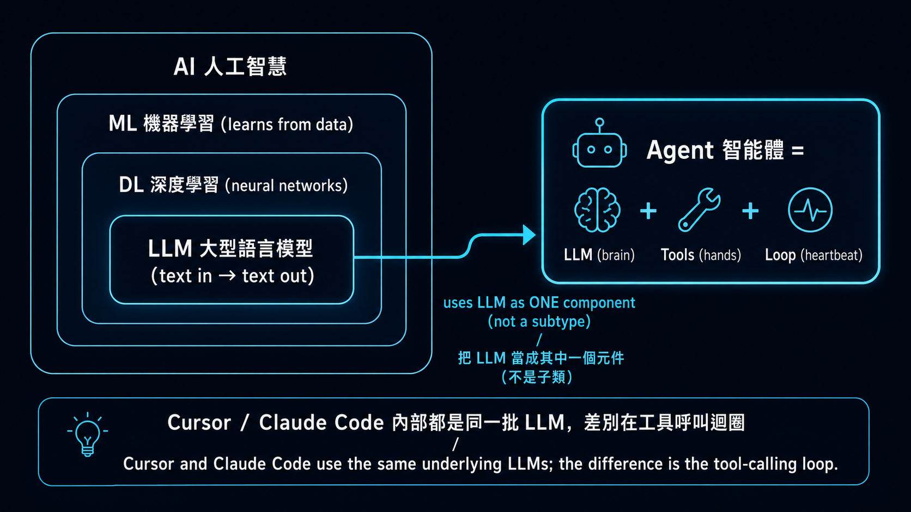

# Stage 3 — 工具使用與第一個 Agent（Tool Use & Hello Agent）⭐

> **繁體中文** | [简体中文](./03-tool-use-and-hello-agent.zh-Hans.md) | [English](./03-tool-use-and-hello-agent.en.md)

⏱ **時間估算**：2-3 週（約 10-20 小時）

> 💡 用語密集（agent / tool use / function calling / ReAct / structured output⋯）→ 翻 [`resources/glossary.md` 2](../resources/glossary.md#2-agent--工具使用)。
> 🗺️ **進 Track A（CLI Power User）還是 Track B（Agent Builder）前**，先看 [`resources/agent-paradigms.md`](../resources/agent-paradigms.md) — 5 種 agent 型態的全景圖，幫你選軌。

> 📋 **本章組成**：〔開場框景：AI/LLM/Agent 三者關係〕→ 學習目標 → 進入條件 → 必修閱讀 →〔可選 · 概念地圖〕→ 動手練習 → 反思（概念 + 路由）→ 精選 Projects → 自我檢查
> 🔑 **關鍵名詞**：見 [`resources/glossary.md` 2](../resources/glossary.md#2-agent--工具使用)

## 🤖 開始前：AI / LLM / Agent — 三者怎麼分？

> **本節是「開場框景」（由大到小 pedagogy）**：先把學習者腦中的 mental hierarchy 建好，再進 學習目標、練習。這節只做**簡短說明 + 對照**，深度入門讀物已經是中英文圈各自的 canonical reference（見下方資源）。**不是重寫 hello-agents Ch1。**

### 一張階層圖先建立認知



→ **「Agent」不是「比 LLM 更厲害的模型」，也不是 LLM 樹狀分類底下的一個分支**。Agent 是個**跨層抽象的系統**，把 LLM 當作其中一個元件來用。Cursor / Claude Code / Hermes Agent 內部都還是同一批 LLM（Claude / GPT / Gemini）—— 差別是怎麼把 LLM 包進工具呼叫迴圈裡。

### 三行對照（最快版）

| 詞 | 是什麼 | 你給它什麼、它回什麼 | 例子 |
|---|---|---|---|
| **AI** | 整個學科 | 太抽象、不能直接「用」 | ML、DL、LLM、RL 都是 AI 子領域 |
| **LLM** | 把文字映射到文字的單一模型 | 給 prompt → 回字 | GPT-5、Claude、Llama 3、Qwen |
| **Agent** | LLM + 工具 + loop 的**系統** | 給任務 → 自己跑多步驟達成 | Cursor、Claude Code、Hermes Agent |

**一句話**：LLM 像是會理解與產生文字的大腦；Agent 則是把這個大腦接上工具、流程與回饋迴圈，讓它能完成多步驟任務的系統。

### Agent 的 3 個**最小必要**部件（這就是 agent vs LLM 的核心差別）

| 部件 | 角色 | 在哪學 |
|---|---|---|
| 🧠 **LLM**（brain） | 推理 / 決策 / 自然語言 | Stage 1 已學 |
| 🔧 **Tools**（hands） | 對世界做事（call API、跑 code、查資料） | **本 stage** |
| 🔁 **Loop**（heartbeat） | 想 → 做 → 看結果 → 再想（ReAct） | **本 stage 練習 3** |

→ **這 3 個合在一起就是 agent 的最低定義**。沒有 tools / loop，那只是「LLM + 你寫 retry」，不算 agent。

### Agent 的經典範式（thinking patterns）

學完最小 3 部件後、下一層是「**LLM 怎麼想**」。hello-agents Ch4「智能體經典範式構建」整章在講這個。簡短對照：

| 範式 | 是什麼 | 在哪學 |
|---|---|---|
| **CoT**（Chain-of-Thought、思維鏈） | LLM 寫出推理過程再給答案、不只給結論——是個 **prompting 技巧**、不是 agent 結構 | **Stage 2** 學習目標 + 動手練習（推理任務 CoT） |
| **ReAct**（Reasoning + Acting） | 在 Loop 裡套 CoT：Thought（想）→ Action（呼叫 tool）→ Observation（看結果）→ Thought ...，是 **Loop 部件最常見的實作** | **本 stage 練習 3** + [ReAct paper (Yao 2022)](https://arxiv.org/abs/2210.03629) |
| **Reflection** | 跑完一輪後讓 LLM 批改自己、根據 feedback 重答 | **本 stage 反思**（concept + 路由） |
| **Planning**（任務分解） | 把大任務拆成子任務、可分給多個 agent 各做 | **Stage 4** 什麼是 multi-agent framework |

→ 這些範式都是「**LLM 自我引導**」的不同變化、堆疊在 3 部件（LLM + Tools + Loop）之上。**「Agent 是什麼」用 3 部件就講完了；「Agent 怎麼想」需要這 4 個範式才講得完整**。

> 💡 **延伸組件**（agent 變強的 infrastructure、但**不是「是不是 agent」的判準**）：
> - **記憶 / RAG**（agent 能跨對話記住東西）→ **Stage 6** 完整教
> - **反思 / self-critique**（agent 看自己答案、發現問題、回頭改）→ 基本版見 **本 stage 反思**（concept + paper routing）；帶持久 memory 的進階版見 **Stage 6 Reflexion with Memory**
> - **Production harness**（telemetry / safety / retry / orchestration）→ **Stage 5 5.6**
>
> 這些都是 advanced pattern——Stage 3 教最小可行 agent、後面 stage 教怎麼變強。

### 📚 深度入門資源（中英文 / 影片優先）

**🀄 中文**：
1. [**李宏毅 — 生成式 AI 導論（2024 春台大課程）**](https://speech.ee.ntu.edu.tw/~hylee/genai/2024-spring.php) ⭐⭐⭐ — 中文圈最高品質的 AI / LLM / agent 學術級導論。每集 30-60 分鐘、台大授課、官方頁含投影片 + YouTube 連結。LLM / agent 概念都涵蓋。最新整合版見 [**GenAI-ML 2025 秋**](https://speech.ee.ntu.edu.tw/~hylee/GenAI-ML/2025-fall.php)、YouTube 主頻道 [**@HungyiLeeNTU**](https://www.youtube.com/@HungyiLeeNTU)
2. [**datawhalechina/hello-agents** Ch1「初識智能體」](https://github.com/datawhalechina/hello-agents) ⭐ — 文字版最完整中文 agent 導論
3. [**datawhalechina/hello-agents** Ch2「智能體發展史」](https://github.com/datawhalechina/hello-agents) — BabyAGI → AutoGPT → Claude Code 演化脈絡
4. [**3Blue1Brown 中文配音版**](https://www.youtube.com/@3Blue1BrownCN) — LLM / Transformer 視覺化解說（中文配音）

**🇺🇸 English**：
1. [**Andrej Karpathy — "Intro to Large Language Models"**](https://www.youtube.com/watch?v=zjkBMFhNj_g) ⭐⭐⭐（1hr）— LLM 從零開始 visual intro（ex-OpenAI / ex-Tesla AI Director、英文圈最重視的 LLM 入門影片）
2. [**Andrej Karpathy — "Let's build GPT from scratch"**](https://www.youtube.com/watch?v=kCc8FmEb1nY) ⭐⭐（2hr）— 想看 LLM 內部到程式碼級的人
3. [**3Blue1Brown — "But what is a Transformer?"**](https://www.youtube.com/watch?v=wjZofJX0v4M) ⭐⭐⭐ — visual 解釋 LLM，英文圈最被推薦的視覺化教材
4. [**Lilian Weng — "LLM Powered Autonomous Agents"**](https://lilianweng.github.io/posts/2023-06-23-agent/) ⭐⭐⭐ — canonical 1-page agent anatomy（Planning / Memory / Tool use / Action）、英文圈被引用最多的 agent 解剖文
5. [**Anthropic — "Building Effective Agents"**](https://www.anthropic.com/research/building-effective-agents) ⭐ — Anthropic 觀點：何時該用 agent、何時 workflow 就夠
6. [**Chip Huyen — "Agents"**](https://huyenchip.com/2025/01/07/agents.html) — practitioner 視角，full chapter 級深度

**選讀 / 進階補充**：
- [**Simon Willison — "I think 'agent' may finally have a widely enough agreed upon definition"**](https://simonwillison.net/2025/Sep/18/agents/) — working definition：「agent runs tools in a loop to achieve a goal」、含對照 OpenAI 等不同定義的爭議（**給已有基礎的人**）
- [**DeepLearning.AI Short Courses**](https://www.deeplearning.ai/short-courses/)：「AI Agents in LangGraph」/「Multi AI Agent Systems with crewAI」/「Functions, Tools and Agents with LangChain」（**API 多數是 2023-2024 舊版**、看概念為主、寫 code 對照官方最新 docs）
- [**liyupi/ai-guide**](https://github.com/liyupi/ai-guide) — 中文圈最大 AI 資源**聚合**型 repo（不是原創教材、適合廣度延伸）

> 📌 **資源清單上限規則**：本 section 是 router 不是 tutorial。主清單合計上限 **10 條**（中 4 + 英 6），要加新資源前**必須先移除一條**。選讀區不計入主清單上限。

> 💡 **推薦學習路徑**：先看 1-2 個影片（中：李宏毅、英：Karpathy / 3Blue1Brown）建立 visual mental model → 再讀 1-2 個 blog（Lilian Weng / Anthropic）拿到 working definition → 再回本 stage 動手練習。**不必全部看完**，這是 reference library 不是 reading list。

---

這是整個學習路線最關鍵的一站。**你建過一個 agent 才算真懂 agent**——本 stage 的基礎練習建議至少實際手寫一次、再依需求往 [hello-agents](https://github.com/datawhalechina/hello-agents) 或本 stage 精選 projects 找深度教材。

## 📌 學習目標

完成這個 stage 後你會：
- 講得出為什麼 LLM 需要 tools（它不是萬能的，而且文字以外的事它都做不了）
- 定義一個 tool schema，並讓 LLM 呼叫它
- 從零（不靠任何 framework）寫出一個單步 ReAct agent
- 寫出多步 ReAct agent，並讓它自己判斷何時該停
- 分得出哪種問題該用 tool use、哪種純 prompt 就夠

## 🚪 進入條件

你應該已經：
- 有可以跑的 Claude / OpenAI / Gemini API 權限（Stage 1）
- 對 prompt engineering 基礎已經上手（Stage 2）
- 能寫一個吃 JSON 進、吐 JSON 出的 Python 函式

## 📚 必修閱讀

1. [**Anthropic — Tool Use**](https://docs.anthropic.com/en/docs/agents-and-tools/tool-use/overview) — 官方指南
2. [**anthropics/courses — Tool Use**](https://github.com/anthropics/courses) ⭐⭐⭐⭐⭐ ★ 21k+ — Anthropic 官方 5 course umbrella、**module 5「Tool Use」對應本 stage**。Jupyter notebook 互動式練習、含 multimodal prompts / streaming / tool 實作 walk-through
3. [**ReAct: Synergizing Reasoning and Acting in Language Models**](https://arxiv.org/abs/2210.03629) — Yao et al. 2022，奠基論文。至少讀 abstract 跟 Section 3。
4. [**OpenAI — Function Calling**](https://platform.openai.com/docs/guides/function-calling) — function calling 格式參考
5. [**Build an agent from scratch**](https://shafiqulai.github.io/blogs/blog_3.html) — 從零打造 agent 的故事式導覽

## 🛠 動手練習（基礎 illustrative 練習）

> 🦙 **本 stage 預設用 Ollama qwen2.5:3b**（成本考量、tool-use 支援穩定）。Stage 3 進到 tool calling / ReAct loop、`gemma4:e4b` 不夠、改用 `qwen2.5:3b`（1.9 GB、`ollama pull qwen2.5:3b` 即裝）。每個練習都有 Path A（Ollama、預設）+ Path B（Anthropic、選擇性、想看 cloud 高品質 tool-use 時用）。
>
> 💰 **Stage 3 預算估算**（全 6 練習、tool use 較重）：**全本機 = $0**、**全 haiku ≈ $0.50**、**全 sonnet ≈ $1.50**。ReAct loop 練習單次 4-6 tool calls × 5 練習 × 5 reps ≈ $0.80 haiku。完整預算見 [`examples/README.md#推薦-llm-清單`](../examples/README.md#推薦-llm-清單)。
>
> 完整 3 路 trade-off 見 [`examples/README.md`](../examples/README.md#三條路徑--預設用-ollama成本考量)。
>
> 🆘 **卡住了？** Tool calling 是整個 curriculum 最陡的學習曲線。裝 [`examples/stage-5/tool-calling-tutor/`](../examples/stage-5/tool-calling-tutor/) skill——當你 prompt Claude Code「為什麼 LLM 不呼叫我的 tool」、「我這 schema 哪裡寫壞」會自動載入、走 4-symptom 診斷流程。
>
> 🪜 **本 stage 是 single-agent 起點**：一個 LLM + ReAct loop。**Multi-agent 概念**（多個 agent 協作）入門看 [Stage 4 什麼是 multi-agent framework](04-agent-frameworks.md#-什麼是-multi-agent-framework)、**Claude 原生 subagent 機制**（`.claude/agents/` + Task tool、不需 framework）看 [Stage 5.5](05-claude-code-ecosystem.md#55--subagentsclaude-code-原生-multi-agent-機制-2025-新功能)。

### 練習 1：Function Calling（一個工具、一次呼叫）
給 Claude 一個工具（假的天氣 API）跟一個問題（「台北現在有下雨嗎？」）。看 Claude 怎麼呼叫工具、拿到結果、再回答你。

<details open>
<summary>📋 <b>起手碼 — Path A（本機 Ollama qwen2.5:3b、預設）</b>（複製到 <code>practice_1.py</code>）</summary>

```python
# 需要：pip install openai
# 前置：ollama pull qwen2.5:3b && ollama serve
# Note: Stage 3+ 用 qwen2.5:3b（tool-use 穩定）、不是 gemma4:e4b
import sys, json
if hasattr(sys.stdout, "reconfigure"):
    sys.stdout.reconfigure(encoding="utf-8", errors="replace")

from openai import OpenAI

client = OpenAI(base_url="http://localhost:11434/v1", api_key="ollama")

# Step 1: 定義 tool schema — OpenAI-compatible 格式包一層 {"type":"function", "function":{...}}
weather_tool = {
    "type": "function",
    "function": {
        "name": "get_weather",
        "description": "查詢城市目前天氣（晴/雨/陰），回傳一個短字串。",
        "parameters": {
            "type": "object",
            "properties": {
                "city": {"type": "string", "description": "城市名稱（如「台北」）"},
            },
            "required": ["city"],
        },
    },
}

# Step 2: 問問題、讓 LLM 自己決定要不要呼叫 tool
resp = client.chat.completions.create(
    model="qwen2.5:3b",
    max_tokens=512,
    tools=[weather_tool],
    messages=[{"role": "user", "content": "台北現在有下雨嗎？"}],
)

# === 自我驗證 ===
msg = resp.choices[0].message
print("finish_reason:", resp.choices[0].finish_reason)
print("tool_calls:", msg.tool_calls)

assert msg.tool_calls, "預期 LLM 會選擇呼叫 tool（而非直接回答）"
tc = msg.tool_calls[0]
assert tc.function.name == "get_weather", f"預期呼叫 get_weather、實際 {tc.function.name}"
args = json.loads(tc.function.arguments)
assert args.get("city"), "預期 city 參數有值"
print(f"✅ 練習 1 通過 — qwen2.5:3b 正確選了 get_weather、帶 city='{args['city']}' 參數")
```

**預期輸出**（樣本）：
```
finish_reason: tool_calls
tool_calls: [ChatCompletionMessageToolCall(id='call_xxx', function=Function(name='get_weather', arguments='{"city": "台北"}'), type='function')]
✅ 練習 1 通過 — qwen2.5:3b 正確選了 get_weather、帶 city='台北' 參數
```

**沒裝 Ollama 也能驗邏輯**：用 `unittest.mock.MagicMock` 取代 client、塞固定 response、assert 一樣 work。完整 mock 範例見 [`examples/stage-3/03-react-from-scratch/test.py`](../examples/stage-3/03-react-from-scratch/test.py)（pattern 跨 backend 通用）。

</details>

<details>
<summary>📋 <b>起手碼 — Path B（Anthropic API、選擇性）</b>（複製到 <code>practice_1_anthropic.py</code>）</summary>

```python
# 需要：pip install anthropic
# 環境變數：export ANTHROPIC_API_KEY=sk-ant-...
import anthropic

client = anthropic.Anthropic()

# Anthropic native tool schema — 不用包 wrapper
weather_tool = {
    "name": "get_weather",
    "description": "查詢城市目前天氣（晴/雨/陰），回傳一個短字串。",
    "input_schema": {
        "type": "object",
        "properties": {
            "city": {"type": "string", "description": "城市名稱（如「台北」）"},
        },
        "required": ["city"],
    },
}

resp = client.messages.create(
    model="claude-haiku-4-5",
    max_tokens=512,
    tools=[weather_tool],
    messages=[{"role": "user", "content": "台北現在有下雨嗎？"}],
)

# === 自我驗證 ===
assert resp.stop_reason == "tool_use", f"非預期 stop_reason: {resp.stop_reason}"
tool_calls = [b for b in resp.content if b.type == "tool_use"]
assert tool_calls[0].name == "get_weather"
assert tool_calls[0].input.get("city")
print(f"✅ 練習 1 通過（Anthropic）— Claude 選了 get_weather、city='{tool_calls[0].input['city']}'")
```

**3 個關鍵 SDK 差異**：
- **Schema wrap**：Anthropic 直接 `tools=[{name, description, input_schema}]`；OpenAI/Ollama 要包 `[{"type":"function", "function":{...}}]`
- **Response 路徑**：Anthropic 從 `resp.content[i].type=="tool_use"` 抓；OpenAI/Ollama 從 `resp.choices[0].message.tool_calls[i]`
- **Args 格式**：Anthropic `.input` 是 dict（自動 parse）；OpenAI/Ollama `.function.arguments` 是 JSON string，要 `json.loads(...)`

**成本**：1 次 ≈ $0.001。**Claude 的 tool-use 比 qwen2.5:3b 更穩**——複雜場景（5+ tools、模糊問題）gap 會明顯。

</details>

### 練習 2：多工具選擇
給 Claude 三個工具（搜尋、計算機、行事曆）跟一個任務。看 Claude 怎麼挑工具，順便注意它什麼時候會挑錯。

<details>
<summary>📋 <b>簡化版核心觀念 — Path A (Ollama)</b></summary>

**NEW vs 練習 1**：tools 從 1 個變 3 個。LLM 看 `description` 邊界決定挑哪個——`description` 寫得越像「給人讀的 docstring」、越容易挑錯。

```python
from openai import OpenAI
import json

client = OpenAI(base_url="http://localhost:11434/v1", api_key="ollama")

TOOLS = [
    {"type": "function", "function": {"name": "web_search",
        "description": "Search current or external info not in the prompt.",
        "parameters": {"type": "object", "properties": {"query": {"type": "string"}}, "required": ["query"]}}},
    {"type": "function", "function": {"name": "calculator",
        "description": "Evaluate basic arithmetic with +, -, *, /, parentheses.",
        "parameters": {"type": "object", "properties": {"expression": {"type": "string"}}, "required": ["expression"]}}},
    {"type": "function", "function": {"name": "calendar_lookup",
        "description": "Look up events for a specific date.",
        "parameters": {"type": "object", "properties": {"date": {"type": "string"}}, "required": ["date"]}}},
]

resp = client.chat.completions.create(model="qwen2.5:3b", tools=TOOLS,
    messages=[{"role": "user", "content": "What is (19 * 42) - 8?"}])

tc = resp.choices[0].message.tool_calls[0]
print(f"LLM 挑了: {tc.function.name}, args: {json.loads(tc.function.arguments)}")
# 預期：calculator, {"expression": "(19 * 42) - 8"}
```

**punchline**：3 個 tool 的 `description` 邊界要互斥——`calendar` 寫「行事曆」太籠統、會跟 `web_search` 撞；寫「特定日期事件」就清楚。小 model 對 description 質量比 Claude 更敏感。

**Path B (Anthropic) 改 3 行**：schema 拿掉 `{"type": "function", "function": {...}}` 外包、`tool_calls` 變 `[b for b in resp.content if b.type == "tool_use"]`、`tc.input` 已經是 dict 不用 `json.loads`。完整版見 folder。

</details>

→ **基礎 starter 範本** → [`examples/stage-3/02-multi-tool-selection/`](../examples/stage-3/02-multi-tool-selection/)（starter.py 含 stub + 簡單 test，illustrative，**不是 chapter-length 完整教學**；深度章節見 stage 開頭 📚 hello-agents callout）

### 練習 3：從零實作 ReAct（不用 framework）
用 50-80 行 Python 把 Thought → Action → Observation 迴圈寫出來。不要 LangChain、不要 LangGraph，就是純 `while not done: thought; action; observation; ...`。

<details>
<summary>📋 <b>簡化版核心觀念 — Path A (Ollama)、ReAct loop 的全部就在這 13 行</b></summary>

**NEW vs 練習 2**：把單次 call 包進迴圈、`messages` 一直長、看 `tool_calls` 在不在來決定收尾。

```python
# 假設 TOOLS + TOOL_IMPL（dict: name → callable）已經像練習 2 一樣定義好
messages = [{"role": "user", "content": "台北人口除以紐約人口？"}]

for step in range(5): # max_iter safety net
    r = client.chat.completions.create(model="qwen2.5:3b", tools=TOOLS, messages=messages)
    msg = r.choices[0].message
    # 把 assistant response 接回 messages（重要！下輪 LLM 才看得到自己上輪講什麼）
    messages.append({"role": "assistant", "content": msg.content, "tool_calls": msg.tool_calls})
    if not msg.tool_calls:
        print(f"✅ 收尾：{msg.content}"); break
    for tc in msg.tool_calls:
        args = json.loads(tc.function.arguments)
        obs = TOOL_IMPL[tc.function.name](args) # 本地執行
        # observation 接回 messages（用 role="tool"、配 tool_call_id）
        messages.append({"role": "tool", "tool_call_id": tc.id, "content": obs})
```

**3 個容易踩坑**：
1. **忘記把 assistant response 加回 messages**——下輪 LLM 看不到自己上輪講什麼、會 loop forever
2. **`tool` message 沒帶 `tool_call_id`**——LLM 無法配對哪個 result 對應哪個 call
3. **沒 `max_iter`**——tool 結果寫不好時、LLM 會無限呼叫，safety net 必須設

**Path B (Anthropic) 差幾行**：迴圈架構一模一樣、`msg.tool_calls` 變 `[b for b in resp.content if b.type == "tool_use"]`、用 `stop_reason == "end_turn"` 判停、tool result 包成 `{"type": "tool_result", "tool_use_id": ..., "content": obs}` 放進 user message。完整版見 folder。

</details>

→ **基礎 starter 範本** → [`examples/stage-3/03-react-from-scratch/`](../examples/stage-3/03-react-from-scratch/)（含 mock-based test.py、不花 API 錢也能驗；illustrative，**不是 chapter-length 完整教學**——深度章節見 stage 開頭 📚 hello-agents callout）

### 練習 4：多步驟推理任務
一個需要連續呼叫 3-5 次 tool 的任務。例如：「找出台北人口，除以紐約人口，再把比例換成百分比。」每一步用不同的工具。

<details>
<summary>📋 <b>簡化版核心觀念 — 跟練習 3 同一個 loop、跑久一點而已</b></summary>

**NEW vs 練習 3**：**完全同一個 loop**——只是 `TOOLS` 換成 4 個（`lookup_population` / `divide` / `to_percentage` / `round_int`）、題目自然走完 4 輪 tool call 才收尾。

```python
# 沒有新 code、純粹是 TOOLS / TOOL_IMPL 換內容
TOOL_IMPL = {
    "lookup_population": lambda i: lookup_population(i["city"]),
    "divide": lambda i: divide(i["a"], i["b"]),
    "to_percentage": lambda i: to_percentage(i["ratio"]),
    "round_int": lambda i: round_int(i["x"]),
}
# loop 完全照 練習 3，只是 max_iter 拉大到 8
```

**punchline**：多步推理不是新 pattern、是**讓 ReAct loop 跑久一點**。**真正的挑戰是「LLM 會不會中間漏一步」**——qwen2.5:3b 可能漏「轉百分比」、Claude haiku 較穩。**這恰好是觀察「model 規模 vs 多步穩定度」的好實驗**。試試 `MODEL=qwen2.5:7b python starter.py` 對照。

</details>

→ **基礎 starter 範本** → [`examples/stage-3/04-multi-step-reasoning/`](../examples/stage-3/04-multi-step-reasoning/)（starter.py 含 stub + 簡單 test，illustrative，**不是 chapter-length 完整教學**；深度章節見 stage 開頭 📚 hello-agents callout）

### 練習 5：錯誤處理
讓某個工具失敗（網路錯誤、輸入無效）。看看 agent 會怎麼處理錯誤、能不能恢復，再加上 retry 機制。

<details>
<summary>📋 <b>簡化版核心觀念 — tool error 是 data、不是 exception</b></summary>

**NEW vs 練習 4**：tool error 回傳**結構化 dict**、不要 `raise`。loop 把 dict 接回 LLM、模型自己決定 retry / 改 query / 放棄。

```python
def fetch_weather(city: str) -> dict:
    if network_failed():
        return {"error": "network timeout", "retry_hint": "try again in 1s"}
    return {"city": city, "forecast": "rain", "temperature_c": 24}

# loop 裡：
obs = fetch_weather(args["city"])
messages.append({"role": "tool", "tool_call_id": tc.id,
                 "content": json.dumps(obs, ensure_ascii=False)}) # error dict 也是 string 化接回去
# 下一輪 LLM 看到 retry_hint、可能會 retry、可能會放棄、可能會改 query
```

**為什麼不 `raise`**：`raise` 直接中斷 loop、LLM 沒機會 recover。**Production 的 retry 不在 Python 層、而在 LLM 層**——這個 mental flip 是 Stage 3 練習 5 的核心。

**Bad vs Good error 回傳**：

| Bad | Good |
|---|---|
| `raise Exception("failed")` | `return {"error": "network timeout", "retry_hint": "try again in 1s"}` |
| `return "failed"` | `return {"error": "...", "category": "transient", "retry_hint": "..."}` |
| 無限 retry | `max_iter` safety + 業務層 retry quota |

**小 model 觀察**：qwen2.5:3b 對 `retry_hint` follow-up 較弱、可能直接放棄；Claude haiku 較穩。完整版（含連續失敗 graceful end 範例）見 folder。

</details>

→ **基礎 starter 範本** → [`examples/stage-3/05-error-handling/`](../examples/stage-3/05-error-handling/)（starter.py 含 stub + 簡單 test，illustrative，**不是 chapter-length 完整教學**；深度章節見 stage 開頭 📚 hello-agents callout）

### 練習 6：Function schema 設計（壞 schema 修到好）
**先給 LLM 一份故意寫爛的 schema**——`description` 模糊（「處理資料」）、參數全用 `type: string`、沒分 required / optional、enum 該用沒用。觀察 LLM 怎麼選錯 tool、傳錯參數。然後逐項修：
- description 寫到 LLM 一眼就懂這個 tool 適用情境（不是寫給人讀的 docstring）
- parameters 用對 type（number / boolean / enum / array），required 列清楚
- 模糊邊界用 enum 強制收斂（例如 `unit: "celsius" | "fahrenheit"` 而不是 `unit: string`）
- error 回傳要包 `{"error": "...", "retry_hint": "..."}` 讓 LLM 能恢復

> 💡 詳細 cheatsheet 看 [`resources/schema-design-cheatsheet.md`](../resources/schema-design-cheatsheet.md)——5 條黃金規則 + 5 個常見 anti-pattern。

<details>
<summary>📋 <b>簡化版核心觀念 — bad vs good schema 對照</b></summary>

**NEW vs 練習 5**：同一個工具（溫度轉換）、兩種 schema 寫法。看 4 個差別。

```python
# ❌ BAD — qwen2.5:3b 幾乎必錯（Claude haiku 還能猜對、但機率明顯下降）
{"name": "convert", "description": "Convert a value.",
 "parameters": {"type": "object", "properties": {
     "value": {"type": "string"}, "unit": {"type": "string"}}}}

# ✅ GOOD — qwen 也能穩定挑對
{"name": "convert_temperature",
 "description": "Use when user asks to convert temperatures between Fahrenheit and Celsius.",
 "parameters": {"type": "object", "properties": {
     "value": {"type": "number", "description": "Temperature value"},
     "unit": {"type": "string", "enum": ["celsius", "fahrenheit"]}},
     "required": ["value", "unit"]}}
```

**4 個改進**：(1) `name` 改具體、(2) `description` 寫「**何時**用」而非「**做什麼**」、(3) `type` 改 `number`、(4) 加 `required` + `enum`。

**punchline**：**寫 schema 的功夫能省下換大 model 的成本**——小 model 對 schema 質量比大 model 敏感，相同 bad schema 在 Claude 上可能還能猜對、在 qwen 上幾乎必錯。Production 想用便宜 model？schema 必須寫到 production-grade。

**搞不定 schema 怎麼辦**：裝 [`examples/stage-5/tool-calling-tutor/`](../examples/stage-5/tool-calling-tutor/) skill，遇到「LLM 不呼叫我的 tool」、「我這 schema 哪裡寫壞」會自動跳出來幫你 debug。

</details>

→ **基礎 starter 範本** → [`examples/stage-3/06-schema-design/`](../examples/stage-3/06-schema-design/)（含 bad schema vs good schema 兩個版本對照；illustrative，**不是 chapter-length 完整教學**——深度章節見 stage 開頭 📚 hello-agents callout）

## 🪞 反思（Reflexion / Self-Refine）— 概念 + 路由

> **本節是 concept + routing、不是練習**。沒有 verified working solution、不掛「練習 N」label、不給 success criteria——遵守本 repo「沒驗證答案不寫練習、頂多 routing」原則。想動手做？直接讀下方 paper / project。

**反思是什麼**：練習 5 的 error handling 是「LLM 出錯 → 你（外部）catch + retry」；**反思**是「LLM 觀察自己出錯 → 自己改」。差別是 agency 在哪一邊——這是 production agent（Cursor / Cline / Claude Code）每天都在跑的迴圈。

**為什麼這節在 Stage 3 而不是 Stage 6**：反思在學術（Reflexion paper Shinn 2023、Self-Refine Madaan 2023）跟 production（Cursor / Claude Code）上都被歸類在 **planning / reasoning loop** 機制——是 ReAct（練習 3）的 sibling pattern，**不是 memory pattern**。同樣是 LLM 自我引導的多輪迴圈，只是「下一輪要做什麼」從「呼叫 tool」換成「批改自己」。

**進階版（帶 persistent memory 的 Reflexion 完整版）→ [Stage 6 進階：Reflexion with Memory](06-memory-rag.md#-進階帶持久記憶的-reflexion-完整版--track-b-選讀)**——當反思要跨 session、把過去失敗存起來當下一輪 context，這個版本才真的需要 memory 層。

### 一張對照圖

| Pattern | 形式 | 需要 memory？ | 在哪學 |
|---|---|---|---|
| **Error handling**（練習 5） | 外部 catch + retry | 不需 | **本 stage 練習 5** |
| **ReAct loop**（練習 3） | LLM → tool → 結果 → LLM | 不需 | **本 stage 練習 3** |
| **基本反思 / Self-Refine** | Actor → Critic → Actor，single session | 不需 | **本節 routing（下方）** |
| **完整 Reflexion**（含 episodic memory） | 上面 + 把失敗反思存起來、跨 session 累積 | **需要** | **Stage 6 進階：Reflexion with Memory** |

### 📚 想動手 / 想深入？直接讀這些

**Paper**：
- [**Reflexion (Shinn et al. 2023)**](https://arxiv.org/abs/2303.11366) ⭐ — 原 paper，定義「verbal reinforcement learning」
- [**Self-Refine (Madaan et al. 2023)**](https://arxiv.org/abs/2303.17651) — single-agent self-critique，是「基本反思」的學術定義

**Reference 實作**：
- [**arunpshankar/react-from-scratch**](https://github.com/arunpshankar/react-from-scratch) — 已在本 stage 精選 Projects 列出，含 Reflection 實作可直接讀
- [**LangChain — Reflection Agents（blog）**](https://blog.langchain.dev/reflection-agents/) — framework 實作參考 + 完整 working notebook
- [**datawhalechina/hello-agents**](https://github.com/datawhalechina/hello-agents) — 對應章節（自我反思 / Self-Refine 段落、中文完整教學）

> 💡 **想看反思怎麼長進 production agent**：[Stage 5 5.6 Harness Internals](05-claude-code-ecosystem.md#56--claude-code-source-解剖reference-harness-implementation-track-b-必看) 解剖 Claude Code source 時可以看到——agent 跑完 tool call 後自我評估 patch、有問題回頭改、修正後再 commit。**這是現代 production agent 的核心 building block 之一**。

## 🎯 精選 Projects

按用途分 4 類、12 個項目一張表搞定。**挑入口看「適合誰」、想深入點連結看 repo README**。

| 分類 | Project | ⭐ | 適合誰 | 為什麼推薦 / 備註 |
|---|---|---|---|---|
| **官方 cookbook**<br>（先看這個） | [Anthropic — Tool Use Cookbook](https://github.com/anthropics/claude-cookbooks/tree/main/tool_use) | ⭐⭐⭐⭐⭐ | 練習 1 / 練習 2 入手 | 單工具 → 多工具 → parallel → structured output 全部 notebook（重點看 `tool_use/customer_service_agent.ipynb`） |
| | [Anthropic — Quickstarts](https://github.com/anthropics/claude-quickstarts) | ⭐⭐⭐⭐⭐ | 練習 1/2 跑完想看「真的應用長什麼樣」 | 3 個 deploy-ready 範本（financial / customer-support / computer-use）、★ 16k+。比社群實作更 canonical |
| | [Anthropic — Building Effective Agents](https://www.anthropic.com/engineering/building-effective-agents) | ⭐⭐⭐⭐⭐ | 練習 3 寫完、進 Stage 4 之前**必讀** | 部落格文章：何時用 agent vs workflow / 常見 pattern / 容易踩的坑——Anthropic 官方觀念框架 |
| **從零實作 ReAct**<br>（理解原理） | [pguso/ai-agents-from-scratch](https://github.com/pguso/ai-agents-from-scratch) | ⭐⭐⭐⭐⭐ | 練習 3（從零寫 ReAct） | 用本機 Ollama 從零打造、zero framework、章節結構好。**最乾淨的「不靠 framework」參考實作** |
| | [arunpshankar/react-from-scratch](https://github.com/arunpshankar/react-from-scratch) | ⭐⭐⭐⭐ | 練習 3 替代（偏好 Gemini）+ 想看反思變體 | ReAct + Reflection + Self-consistency、Gemini 最佳化（⚠️ 2025-05 後更新放緩、Apache-2.0） |
| | [mattambrogi/agent-implementation](https://github.com/mattambrogi/agent-implementation) | ⭐⭐⭐ | 練習 3 卡住時逐行對照 | ~150 行最精簡 ReAct（⚠️ 已停滯 2024-01、留作教學玩具參考） |
| | [lsdefine/GenericAgent](https://github.com/lsdefine/GenericAgent) | ⭐⭐⭐⭐ | 練習 3/4，想看「精簡但完整」framework | 自我演化 framework、~3K 行、★ 9k+、支援 Claude / Gemini / Kimi / MiniMax。介於玩具版與 LangGraph 之間 |
| **CodeAct 路線**<br>（agent 寫程式碼當 action） | [HuggingFace Smolagents](https://github.com/huggingface/smolagents) | ⭐⭐⭐⭐ | 練習 5 替代方案、本地 LLM 實驗 | ≤1000 LOC、CodeAct pattern 代表、★ 27k+。HF 立場：agent 應該要小 |
| | [QuantaLogic/quantalogic](https://github.com/quantalogic/quantalogic) | ⭐⭐⭐ | 練習 3 後想比較 CodeAct vs JSON-tool | 另一條 CodeAct 路線、agent 直接寫 Python 程式碼當 action、Apache-2.0 |
| **中文章節式深度教材**<br>（chapter-length） | [datawhalechina/hello-agents](https://github.com/datawhalechina/hello-agents) ⭐ **本 stage 推薦** | ⭐⭐⭐⭐⭐ | 中文讀者想要結構化教學 + 完整覆蓋 | **16 種能力**含 tool use / ReAct / context engineering / sub-agents / circuit breaker / observability。中文圈最完整章節式（CC BY-NC-SA、非商用） |
| | [HelloAgents (jjyaoao)](https://github.com/jjyaoao/HelloAgents) | ⭐⭐⭐⭐⭐ | 中文讀者、想跑上面教材的 code | 上面教材 code repo、**請切 `learn_version` 分支**對齊章節（`pip install hello-agents`、CC BY-NC-SA） |
| **Framework 對照**<br>（看 framework 怎麼藏掉 ReAct loop） | [LangChain — ReAct Agent Template](https://github.com/langchain-ai/react-agent) | ⭐⭐⭐ | 練習 3 自己寫完後再來 | LangGraph Studio 範本、framework 怎麼把 ReAct 抽象化 |

> 💡 **建議閱讀路徑**：練習 1-2 跑 Anthropic Cookbook → 練習 3 跑 pguso/ai-agents-from-scratch → 練習 3 後讀 Building Effective Agents → 中文章節式教材就 hello-agents + jjyaoao 配對 → 進 Stage 4 前看 LangChain ReAct template 對照 framework 抽象。


## ✅ 進 Stage 4 前的自我檢查

你能不能：
- [ ] 定義一個 tool schema（name + description + JSON schema 輸入/輸出）
- [ ] 用不到 100 行 Python、不靠任何 framework，把 ReAct 迴圈寫出來
- [ ] 解釋為什麼 agent 需要一個「我做完了」的退出條件
- [ ] 比較 CodeAct（程式碼即 action）跟 JSON-tool 兩種路線
- [ ] 看出哪些問題其實不需要 agent

如果可以 → 進 [Stage 4 — Agent Frameworks](04-agent-frameworks.md)。

如果不行 → 把 練習 3 再跑一次，不要跳過。如果你不懂 framework 在幫你抽象什麼，Stage 4 的那些東西看起來會像黑魔法。
