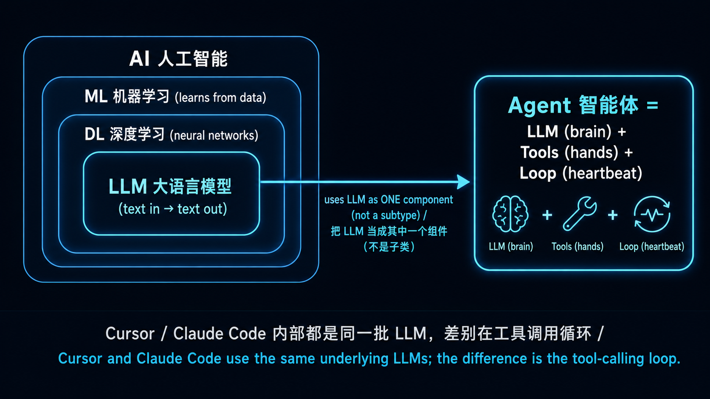

# Stage 3 — 工具使用与第一个 Agent（Tool Use & Hello Agent）⭐

> [繁體中文](./03-tool-use-and-hello-agent.md) | **简体中文** | [English](./03-tool-use-and-hello-agent.en.md)

⏱ **时间估算**：2-3 周（约 10-20 小时）

> 💡 用语密集（agent / tool use / function calling / ReAct / structured output⋯）→ 翻 [`resources/glossary.md` 2](../resources/glossary.md#2-agent--工具使用)。
> 🗺️ **进 Track A（CLI Power User）还是 Track B（Agent Builder）前**，先看 [`resources/agent-paradigms.md`](../resources/agent-paradigms.md) — 5 种 agent 型态的全景图，帮你选轨。

> 📋 **本章组成**：〔开场框景：AI/LLM/Agent 三者关系〕→ 学习目标 → 进入条件 → 必修阅读 →〔可选 · 概念地图〕→ 动手练习 → 反思（概念 + 路由）→ 精选 Projects → 自我检查
> 🔑 **关键名词**：见 [`resources/glossary.md` 2](../resources/glossary.md#2-agent--工具使用)

## 🤖 开始前：AI / LLM / Agent — 三者怎么分？

> **本节是「开场框景」（由大到小 pedagogy）**：先把学习者脑中的 mental hierarchy 建好，再进 学习目标、练习。这节只做**简短说明 + 对照**，深度入门读物已经是中英文圈各自的 canonical reference（即「最公认的标准参考」、见下方资源）。**不是重写 hello-agents Ch1。**

### 一张阶层图先建立认知



→ **「Agent」不是「比 LLM 更厉害的模型」，也不是 LLM 树状分类底下的一个分支**。Agent 是个**跨层抽象的系统**，把 LLM 当作其中一个组件来用。Cursor / Claude Code / Hermes Agent 内部都还是同一批 LLM（Claude / GPT / Gemini）—— 差别是怎么把 LLM 包进工具调用循环里。

### 三行对照（最快版）

| 词 | 是什么 | 你给它什么、它回什么 | 例子 |
|---|---|---|---|
| **AI** | 整个学科 | 太抽象、不能直接「用」 | ML、DL、LLM、RL 都是 AI 子领域 |
| **LLM** | 把文字映射到文字的单一模型 | 给 prompt → 回字 | GPT-5、Claude、Llama 3、Qwen |
| **Agent** | LLM + 工具 + loop 的**系统** | 给任务 → 自己跑多步骤达成 | Cursor、Claude Code、Hermes Agent |

**一句话**：LLM 像一个理解并生成文字的大脑；Agent 则是把这个大脑接上工具、工作流与反馈回路后，能够作为系统完成多步骤任务的东西。

### Agent 的 3 个**最小必要**部件（这就是 agent vs LLM 的核心差别）

| 部件 | 角色 | 在哪学 |
|---|---|---|
| 🧠 **LLM**（brain） | 推理 / 决策 / 自然语言 | Stage 1 已学 |
| 🔧 **Tools**（hands） | 对世界做事（call API、跑 code、查数据） | **本 stage** |
| 🔁 **Loop**（heartbeat） | 想 → 做 → 看结果 → 再想（ReAct） | **本 stage 练习 3** |

→ **这 3 个合在一起就是 agent 的最低定义**。没有 tools / loop，那只是「LLM + 你写 retry」，不算 agent。

### Agent 的经典范式（thinking patterns）

学完最小 3 部件后、下一层是「**LLM 怎么想**」。hello-agents Ch4「智能体经典范式构建」整章在讲这个。简短对照：

| 范式 | 是什么 | 在哪学 |
|---|---|---|
| **CoT**（Chain-of-Thought、思维链） | LLM 写出推理过程再给答案、不只给结论——是个 **prompting 技巧**、不是 agent 结构 | **Stage 2** 学习目标 + 动手练习（推理任务 CoT） |
| **ReAct**（Reasoning + Acting） | 在 Loop 里套 CoT：Thought（想）→ Action（调用 tool）→ Observation（看结果）→ Thought ...，是 **Loop 部件最常见的实现** | **本 stage 练习 3** + [ReAct paper (Yao 2022)](https://arxiv.org/abs/2210.03629) |
| **Reflection** | 跑完一轮后让 LLM 批改自己、根据 feedback 重答 | **本 stage 反思**（concept + 路由） |
| **Planning**（任务分解） | 把大任务拆成子任务、可分给多个 agent 各做 | **Stage 4** 什么是 multi-agent framework |

→ 这些范式都是「**LLM 自我引导**」的不同变化、堆叠在 3 部件（LLM + Tools + Loop）之上。**「Agent 是什么」用 3 部件就讲完了；「Agent 怎么想」需要这 4 个范式才讲得完整**。

> 💡 **延伸组件**（agent 变强的 infrastructure、但**不是「是不是 agent」的判准**）：
> - **记忆 / RAG**（agent 能跨对话记住东西）→ **Stage 6** 完整教
> - **反思 / self-critique**（agent 看自己答案、发现问题、回头改）→ 基本版见 **本 stage 反思**（concept + paper routing）；带持久 memory 的进阶版见 **Stage 6 Reflexion with Memory**
> - **Production harness**（telemetry / safety / retry / orchestration）→ **Stage 5 5.6**
>
> 这些都是 advanced pattern——Stage 3 教最小可行 agent、后面 stage 教怎么变强。

### 📚 深度入门资源（中英文 / 影片优先）

**🀄 中文**：
1. [**李宏毅 — 生成式 AI 导论（2024 春台大课程）**](https://speech.ee.ntu.edu.tw/~hylee/genai/2024-spring.php) ⭐⭐⭐ — 中文圈最高质量的 AI / LLM / agent 学术级导论。每集 30-60 分钟、台大授课、官方页含投影片 + YouTube 链接。LLM / agent 概念都涵盖。最新整合版见 [**GenAI-ML 2025 秋**](https://speech.ee.ntu.edu.tw/~hylee/GenAI-ML/2025-fall.php)、YouTube 主频道 [**@HungyiLeeNTU**](https://www.youtube.com/@HungyiLeeNTU)
2. [**datawhalechina/hello-agents** Ch1「初识智能体」](https://github.com/datawhalechina/hello-agents) ⭐ — 文字版最完整中文 agent 导论
3. [**datawhalechina/hello-agents** Ch2「智能体发展史」](https://github.com/datawhalechina/hello-agents) — BabyAGI → AutoGPT → Claude Code 演化脉络
4. [**3Blue1Brown 中文配音版**](https://www.youtube.com/@3Blue1BrownCN) — LLM / Transformer 视觉化解说（中文配音）

**🇺🇸 English**：
1. [**Andrej Karpathy — "Intro to Large Language Models"**](https://www.youtube.com/watch?v=zjkBMFhNj_g) ⭐⭐⭐（1hr）— LLM 从零开始 visual intro（ex-OpenAI / ex-Tesla AI Director、英文圈最重视的 LLM 入门影片）
2. [**Andrej Karpathy — "Let's build GPT from scratch"**](https://www.youtube.com/watch?v=kCc8FmEb1nY) ⭐⭐（2hr）— 想看 LLM 内部到代码级的人
3. [**3Blue1Brown — "But what is a Transformer?"**](https://www.youtube.com/watch?v=wjZofJX0v4M) ⭐⭐⭐ — visual 解释 LLM，英文圈最被推荐的视觉化教材
4. [**Lilian Weng — "LLM Powered Autonomous Agents"**](https://lilianweng.github.io/posts/2023-06-23-agent/) ⭐⭐⭐ — canonical 1-page agent anatomy（Planning / Memory / Tool use / Action）、英文圈被引用最多的 agent 解剖文
5. [**Anthropic — "Building Effective Agents"**](https://www.anthropic.com/research/building-effective-agents) ⭐ — Anthropic 观点：何时该用 agent、何时 workflow 就够
6. [**Chip Huyen — "Agents"**](https://huyenchip.com/2025/01/07/agents.html) — practitioner 视角，full chapter 级深度

**选读 / 进阶补充**：
- [**Simon Willison — "I think 'agent' may finally have a widely enough agreed upon definition"**](https://simonwillison.net/2025/Sep/18/agents/) — working definition：「agent runs tools in a loop to achieve a goal」、含对照 OpenAI 等不同定义的争议（**给已有基础的人**）
- [**DeepLearning.AI Short Courses**](https://www.deeplearning.ai/short-courses/)：「AI Agents in LangGraph」/「Multi AI Agent Systems with crewAI」/「Functions, Tools and Agents with LangChain」（**API 多数是 2023-2024 旧版**、看概念为主、写 code 对照官方最新 docs）
- [**liyupi/ai-guide**](https://github.com/liyupi/ai-guide) — 中文圈最大 AI 资源**聚合**型 repo（不是原创教材、适合广度延伸）

> 📌 **资源清单上限规则**：本 section 是 router 不是 tutorial。主清单合计上限 **10 条**（中 4 + 英 6），要加新资源前**必须先移除一条**。选读区不计入主清单上限。

> 💡 **推荐学习路径**：先看 1-2 个影片（中：李宏毅、英：Karpathy / 3Blue1Brown）建立 visual mental model → 再读 1-2 个 blog（Lilian Weng / Anthropic）拿到 working definition → 再回本 stage 动手练习。**不必全部看完**，这是 reference library 不是 reading list。

---

这是整个学习路线最关键的一站。**你建过一个 agent 才算真懂 agent**——本 stage 的基础练习建议至少实际手写一次、再依需求往 [hello-agents](https://github.com/datawhalechina/hello-agents) 或本 stage 精选 projects 找深度教材。

## 📌 学习目标

完成这个 stage 后你会：
- 讲得出为什么 LLM 需要 tools（它不是万能的，而且文字以外的事它都做不了）
- 定义一个 tool schema，并让 LLM 调用它
- 从零（不靠任何 framework）写出一个单步 ReAct agent
- 写出多步 ReAct agent，并让它自己判断何时该停
- 分得出哪种问题该用 tool use、哪种纯 prompt 就够

## 🚪 进入条件

你应该已经：
- 有可以跑的 Claude / OpenAI / Gemini API 权限（Stage 1）
- 对 prompt engineering 基础已经上手（Stage 2）
- 能写一个吃 JSON 进、吐 JSON 出的 Python 函数

## 📚 必修阅读

1. [**Anthropic — Tool Use**](https://docs.anthropic.com/en/docs/agents-and-tools/tool-use/overview) — 官方指南
2. [**anthropics/courses — Tool Use**](https://github.com/anthropics/courses) ⭐⭐⭐⭐⭐ ★ 21k+ — Anthropic 官方 5 course umbrella、**module 5「Tool Use」对应本 stage**。Jupyter notebook 互动式练习、含 multimodal prompts / streaming / tool 实作 walk-through。
3. [**ReAct: Synergizing Reasoning and Acting in Language Models**](https://arxiv.org/abs/2210.03629) — Yao et al. 2022，奠基论文。至少读 abstract 跟 Section 3。
4. [**OpenAI — Function Calling**](https://platform.openai.com/docs/guides/function-calling) — function calling 格式参考
5. [**Build an agent from scratch**](https://shafiqulai.github.io/blogs/blog_3.html) — 从零打造 agent 的故事式导览

## 🛠 动手练习（基础 illustrative 练习）

> 🦙 **本 stage 默认用 Ollama qwen2.5:3b**（成本考量、tool-use 支持稳定）。Stage 3 进到 tool calling / ReAct loop、`gemma4:e4b` 不够、改用 `qwen2.5:3b`（1.9 GB、`ollama pull qwen2.5:3b` 即装）。每个练习都有 Path A（Ollama、默认）+ Path B（Anthropic、选择性、想看 cloud 高质量 tool-use 时用）。
>
> 💰 **Stage 3 预算估算**（全 6 练习、tool use 较重）：**全本机 = $0**、**全 haiku ≈ $0.50**、**全 sonnet ≈ $1.50**。ReAct loop 练习单次 4-6 tool calls × 5 练习 × 5 reps ≈ $0.80 haiku。完整预算见 [`examples/README.md#推荐-llm-清单`](../examples/README.zh-Hans.md#推荐-llm-清单)。
>
> 完整 3 路 trade-off 见 [`examples/README.md`](../examples/README.zh-Hans.md#三条路径--默认用-ollama成本考量)。
>
> 🆘 **卡住了？** Tool calling 是整个 curriculum 最陡的学习曲线。装 [`examples/stage-5/tool-calling-tutor/`](../examples/stage-5/tool-calling-tutor/) skill——当你 prompt Claude Code「为什么 LLM 不调用我的 tool」、「我这 schema 哪里写坏」会自动加载、走 4-symptom 诊断流程。
>
> 🪜 **本 stage 是 single-agent 起点**：一个 LLM + ReAct loop。**Multi-agent 概念**（多个 agent 协作）入门看 [Stage 4 什么是 multi-agent framework](04-agent-frameworks.zh-Hans.md#-什么是-multi-agent-framework)、**Claude 原生 subagent 机制**（`.claude/agents/` + Task tool、不需 framework）看 [Stage 5.5](05-claude-code-ecosystem.zh-Hans.md#55--subagentsclaude-code-原生-multi-agent-机制-2025-新功能)。

### 练习 1：Function Calling（一个工具、一次调用）
给 Claude 一个工具（假的天气 API）跟一个问题（「台北现在有下雨吗？」）。看 Claude 怎么调用工具、拿到结果、再回答你。

<details open>
<summary>📋 <b>起手码 — Path A（本机 Ollama qwen2.5:3b、默认）</b>（复制到 <code>practice_1.py</code>）</summary>

```python
# 需要：pip install openai
# 前置：ollama pull qwen2.5:3b && ollama serve
# Note: Stage 3+ 用 qwen2.5:3b（tool-use 稳定）、不是 gemma4:e4b
import sys, json
if hasattr(sys.stdout, "reconfigure"):
    sys.stdout.reconfigure(encoding="utf-8", errors="replace")

from openai import OpenAI

client = OpenAI(base_url="http://localhost:11434/v1", api_key="ollama")

# Step 1: 定义 tool schema — OpenAI-compatible 格式包一层 {"type":"function", "function":{...}}
weather_tool = {
    "type": "function",
    "function": {
        "name": "get_weather",
        "description": "查询城市目前天气（晴/雨/阴），回传一个短字符串。",
        "parameters": {
            "type": "object",
            "properties": {
                "city": {"type": "string", "description": "城市名称（如「台北」）"},
            },
            "required": ["city"],
        },
    },
}

# Step 2: 问问题、让 LLM 自己决定要不要调用 tool
resp = client.chat.completions.create(
    model="qwen2.5:3b",
    max_tokens=512,
    tools=[weather_tool],
    messages=[{"role": "user", "content": "台北现在有下雨吗？"}],
)

# === 自我验证 ===
msg = resp.choices[0].message
print("finish_reason:", resp.choices[0].finish_reason)
print("tool_calls:", msg.tool_calls)

assert msg.tool_calls, "预期 LLM 会选择调用 tool（而非直接回答）"
tc = msg.tool_calls[0]
assert tc.function.name == "get_weather", f"预期调用 get_weather、实际 {tc.function.name}"
args = json.loads(tc.function.arguments)
assert args.get("city"), "预期 city 参数有值"
print(f"✅ 练习 1 通过 — qwen2.5:3b 正确选了 get_weather、带 city='{args['city']}' 参数")
```

**预期输出**（样本）：
```
finish_reason: tool_calls
tool_calls: [ChatCompletionMessageToolCall(id='call_xxx', function=Function(name='get_weather', arguments='{"city": "台北"}'), type='function')]
✅ 练习 1 通过 — qwen2.5:3b 正确选了 get_weather、带 city='台北' 参数
```

**没装 Ollama 也能验逻辑**：用 `unittest.mock.MagicMock` 取代 client、塞固定 response、assert 一样 work。完整 mock 范例见 [`examples/stage-3/03-react-from-scratch/test.py`](../examples/stage-3/03-react-from-scratch/test.py)（pattern 跨 backend 通用）。

</details>

<details>
<summary>📋 <b>起手码 — Path B（Anthropic API、选择性）</b>（复制到 <code>practice_1_anthropic.py</code>）</summary>

```python
# 需要：pip install anthropic
# 环境变量：export ANTHROPIC_API_KEY=sk-ant-...
import anthropic

client = anthropic.Anthropic()

# Anthropic native tool schema — 不用包 wrapper
weather_tool = {
    "name": "get_weather",
    "description": "查询城市目前天气（晴/雨/阴），回传一个短字符串。",
    "input_schema": {
        "type": "object",
        "properties": {
            "city": {"type": "string", "description": "城市名称（如「台北」）"},
        },
        "required": ["city"],
    },
}

resp = client.messages.create(
    model="claude-haiku-4-5",
    max_tokens=512,
    tools=[weather_tool],
    messages=[{"role": "user", "content": "台北现在有下雨吗？"}],
)

# === 自我验证 ===
assert resp.stop_reason == "tool_use", f"非预期 stop_reason: {resp.stop_reason}"
tool_calls = [b for b in resp.content if b.type == "tool_use"]
assert tool_calls[0].name == "get_weather"
assert tool_calls[0].input.get("city")
print(f"✅ 练习 1 通过（Anthropic）— Claude 选了 get_weather、city='{tool_calls[0].input['city']}'")
```

**3 个关键 SDK 差异**：
- **Schema wrap**：Anthropic 直接 `tools=[{name, description, input_schema}]`；OpenAI/Ollama 要包 `[{"type":"function", "function":{...}}]`
- **Response 路径**：Anthropic 从 `resp.content[i].type=="tool_use"` 抓；OpenAI/Ollama 从 `resp.choices[0].message.tool_calls[i]`
- **Args 格式**：Anthropic `.input` 是 dict（自动 parse）；OpenAI/Ollama `.function.arguments` 是 JSON string，要 `json.loads(...)`

**成本**：1 次 ≈ $0.001。**Claude 的 tool-use 比 qwen2.5:3b 更稳**——复杂场景（5+ tools、模糊问题）gap 会明显。

</details>

### 练习 2：多工具选择
给 Claude 三个工具（搜索、计算器、日历）跟一个任务。看 Claude 怎么挑工具，顺便注意它什么时候会挑错。

<details>
<summary>📋 <b>简化版核心观念 — Path A (Ollama)</b></summary>

**NEW vs 练习 1**：tools 从 1 个变 3 个。LLM 看 `description` 边界决定挑哪个——`description` 写得越像「给人读的 docstring」、越容易挑错。

```python
from openai import OpenAI
import json

client = OpenAI(base_url="http://localhost:11434/v1", api_key="ollama")

TOOLS = [
    {"type": "function", "function": {"name": "web_search",
        "description": "Search current or external info not in the prompt.",
        "parameters": {"type": "object", "properties": {"query": {"type": "string"}}, "required": ["query"]}}},
    {"type": "function", "function": {"name": "calculator",
        "description": "Evaluate basic arithmetic with +, -, *, /, parentheses.",
        "parameters": {"type": "object", "properties": {"expression": {"type": "string"}}, "required": ["expression"]}}},
    {"type": "function", "function": {"name": "calendar_lookup",
        "description": "Look up events for a specific date.",
        "parameters": {"type": "object", "properties": {"date": {"type": "string"}}, "required": ["date"]}}},
]

resp = client.chat.completions.create(model="qwen2.5:3b", tools=TOOLS,
    messages=[{"role": "user", "content": "What is (19 * 42) - 8?"}])

tc = resp.choices[0].message.tool_calls[0]
print(f"LLM 挑了: {tc.function.name}, args: {json.loads(tc.function.arguments)}")
# 预期：calculator, {"expression": "(19 * 42) - 8"}
```

**punchline**：3 个 tool 的 `description` 边界要互斥——`calendar` 写「日历」太笼统、会跟 `web_search` 撞；写「特定日期事件」就清楚。小 model 对 description 质量比 Claude 更敏感。

**Path B (Anthropic) 改 3 行**：schema 拿掉 `{"type": "function", "function": {...}}` 外包、`tool_calls` 变 `[b for b in resp.content if b.type == "tool_use"]`、`tc.input` 已经是 dict 不用 `json.loads`。完整版见 folder。

</details>

→ **基础 starter 范本** → [`examples/stage-3/02-multi-tool-selection/`](../examples/stage-3/02-multi-tool-selection/)（starter.py 含 stub + 简单 test，illustrative，**不是 chapter-length 完整教程**；深度章节见 stage 开头 📚 hello-agents callout）

### 练习 3：从零实现 ReAct（不用 framework）
用 50-80 行 Python 把 Thought → Action → Observation 循环写出来。不要 LangChain、不要 LangGraph，就是纯 `while not done: thought; action; observation; ...`。

<details>
<summary>📋 <b>简化版核心观念 — Path A (Ollama)、ReAct loop 的全部就在这 13 行</b></summary>

**NEW vs 练习 2**：把单次 call 包进循环、`messages` 一直长、看 `tool_calls` 在不在来决定收尾。

```python
# 假设 TOOLS + TOOL_IMPL（dict: name → callable）已经像练习 2 一样定义好
messages = [{"role": "user", "content": "台北人口除以纽约人口？"}]

for step in range(5): # max_iter safety net
    r = client.chat.completions.create(model="qwen2.5:3b", tools=TOOLS, messages=messages)
    msg = r.choices[0].message
    # 把 assistant response 接回 messages（重要！下轮 LLM 才看得到自己上轮讲什么）
    messages.append({"role": "assistant", "content": msg.content, "tool_calls": msg.tool_calls})
    if not msg.tool_calls:
        print(f"✅ 收尾：{msg.content}"); break
    for tc in msg.tool_calls:
        args = json.loads(tc.function.arguments)
        obs = TOOL_IMPL[tc.function.name](args) # 本地执行
        # observation 接回 messages（用 role="tool"、配 tool_call_id）
        messages.append({"role": "tool", "tool_call_id": tc.id, "content": obs})
```

**3 个容易踩坑**：
1. **忘记把 assistant response 加回 messages**——下轮 LLM 看不到自己上轮讲什么、会 loop forever
2. **`tool` message 没带 `tool_call_id`**——LLM 无法配对哪个 result 对应哪个 call
3. **没 `max_iter`**——tool 结果写不好时、LLM 会无限调用，safety net 必须设

**Path B (Anthropic) 差几行**：循环架构一模一样、`msg.tool_calls` 变 `[b for b in resp.content if b.type == "tool_use"]`、用 `stop_reason == "end_turn"` 判停、tool result 包成 `{"type": "tool_result", "tool_use_id": ..., "content": obs}` 放进 user message。完整版见 folder。

</details>

→ **基础 starter 范本** → [`examples/stage-3/03-react-from-scratch/`](../examples/stage-3/03-react-from-scratch/)（含 mock-based test.py、不花 API 钱也能验；illustrative，**不是 chapter-length 完整教程**——深度章节见 stage 开头 📚 hello-agents callout）

### 练习 4：多步骤推理任务
一个需要连续调用 3-5 次 tool 的任务。例如：「找出台北人口，除以纽约人口，再把比例换成百分比。」每一步用不同的工具。

<details>
<summary>📋 <b>简化版核心观念 — 跟练习 3 同一个 loop、跑久一点而已</b></summary>

**NEW vs 练习 3**：**完全同一个 loop**——只是 `TOOLS` 换成 4 个（`lookup_population` / `divide` / `to_percentage` / `round_int`）、题目自然走完 4 轮 tool call 才收尾。

```python
# 没有新 code、纯粹是 TOOLS / TOOL_IMPL 换内容
TOOL_IMPL = {
    "lookup_population": lambda i: lookup_population(i["city"]),
    "divide": lambda i: divide(i["a"], i["b"]),
    "to_percentage": lambda i: to_percentage(i["ratio"]),
    "round_int": lambda i: round_int(i["x"]),
}
# loop 完全照 练习 3，只是 max_iter 拉大到 8
```

**punchline**：多步推理不是新 pattern、是**让 ReAct loop 跑久一点**。**真正的挑战是「LLM 会不会中间漏一步」**——qwen2.5:3b 可能漏「转百分比」、Claude haiku 较稳。**这恰好是观察「model 规模 vs 多步稳定度」的好实验**。试试 `MODEL=qwen2.5:7b python starter.py` 对照。

</details>

→ **基础 starter 范本** → [`examples/stage-3/04-multi-step-reasoning/`](../examples/stage-3/04-multi-step-reasoning/)（starter.py 含 stub + 简单 test，illustrative，**不是 chapter-length 完整教程**；深度章节见 stage 开头 📚 hello-agents callout）

### 练习 5：错误处理
让某个工具失败（网络错误、输入无效）。看看 agent 会怎么处理错误、能不能恢复，再加上 retry 机制。

<details>
<summary>📋 <b>简化版核心观念 — tool error 是 data、不是 exception</b></summary>

**NEW vs 练习 4**：tool error 回传**结构化 dict**、不要 `raise`。loop 把 dict 接回 LLM、模型自己决定 retry / 改 query / 放弃。

```python
def fetch_weather(city: str) -> dict:
    if network_failed():
        return {"error": "network timeout", "retry_hint": "try again in 1s"}
    return {"city": city, "forecast": "rain", "temperature_c": 24}

# loop 里：
obs = fetch_weather(args["city"])
messages.append({"role": "tool", "tool_call_id": tc.id,
                 "content": json.dumps(obs, ensure_ascii=False)}) # error dict 也是 string 化接回去
# 下一轮 LLM 看到 retry_hint、可能会 retry、可能会放弃、可能会改 query
```

**为什么不 `raise`**：`raise` 直接中断 loop、LLM 没机会 recover。**Production 的 retry 不在 Python 层、而在 LLM 层**——这个 mental flip 是 Stage 3 练习 5 的核心。

**Bad vs Good error 回传**：

| Bad | Good |
|---|---|
| `raise Exception("failed")` | `return {"error": "network timeout", "retry_hint": "try again in 1s"}` |
| `return "failed"` | `return {"error": "...", "category": "transient", "retry_hint": "..."}` |
| 无限 retry | `max_iter` safety + 业务层 retry quota |

**小 model 观察**：qwen2.5:3b 对 `retry_hint` follow-up 较弱、可能直接放弃；Claude haiku 较稳。完整版（含连续失败 graceful end 范例）见 folder。

</details>

→ **基础 starter 范本** → [`examples/stage-3/05-error-handling/`](../examples/stage-3/05-error-handling/)（starter.py 含 stub + 简单 test，illustrative，**不是 chapter-length 完整教程**；深度章节见 stage 开头 📚 hello-agents callout）

### 练习 6：Function schema 设计（坏 schema 修到好）
**先给 LLM 一份故意写烂的 schema**——`description` 模糊（「处理数据」）、参数全用 `type: string`、没分 required / optional、enum 该用没用。观察 LLM 怎么选错 tool、传错参数。然后逐项修：
- description 写到 LLM 一眼就懂这个 tool 适用情境（不是写给人读的 docstring）
- parameters 用对 type（number / boolean / enum / array），required 列清楚
- 模糊边界用 enum 强制收敛（例如 `unit: "celsius" | "fahrenheit"` 而不是 `unit: string`）
- error 回传要包 `{"error": "...", "retry_hint": "..."}` 让 LLM 能恢复

> 💡 详细 cheatsheet 看 [`resources/schema-design-cheatsheet.md`](../resources/schema-design-cheatsheet.md)——5 条黄金规则 + 5 个常见 anti-pattern。

<details>
<summary>📋 <b>简化版核心观念 — bad vs good schema 对照</b></summary>

**NEW vs 练习 5**：同一个工具（温度转换）、两种 schema 写法。看 4 个差别。

```python
# ❌ BAD — qwen2.5:3b 几乎必错（Claude haiku 还能猜对、但几率明显下降）
{"name": "convert", "description": "Convert a value.",
 "parameters": {"type": "object", "properties": {
     "value": {"type": "string"}, "unit": {"type": "string"}}}}

# ✅ GOOD — qwen 也能稳定挑对
{"name": "convert_temperature",
 "description": "Use when user asks to convert temperatures between Fahrenheit and Celsius.",
 "parameters": {"type": "object", "properties": {
     "value": {"type": "number", "description": "Temperature value"},
     "unit": {"type": "string", "enum": ["celsius", "fahrenheit"]}},
     "required": ["value", "unit"]}}
```

**4 个改进**：(1) `name` 改具体、(2) `description` 写「**何时**用」而非「**做什么**」、(3) `type` 改 `number`、(4) 加 `required` + `enum`。

**punchline**：**写 schema 的功夫能省下换大 model 的成本**——小 model 对 schema 质量比大 model 敏感，相同 bad schema 在 Claude 上可能还能猜对、在 qwen 上几乎必错。Production 想用便宜 model？schema 必须写到 production-grade。

**搞不定 schema 怎么办**：装 [`examples/stage-5/tool-calling-tutor/`](../examples/stage-5/tool-calling-tutor/) skill，遇到「LLM 不调用我的 tool」、「我这 schema 哪里写坏」会自动跳出来帮你 debug。

</details>

→ **基础 starter 范本** → [`examples/stage-3/06-schema-design/`](../examples/stage-3/06-schema-design/)（含 bad schema vs good schema 两个版本对照；illustrative，**不是 chapter-length 完整教程**——深度章节见 stage 开头 📚 hello-agents callout）

## 🪞 反思（Reflexion / Self-Refine）— 概念 + 路由

> **本节是 concept + routing、不是练习**。没有 verified working solution、不挂「练习 N」label、不给 success criteria——遵守本 repo「没验证答案不写练习、顶多 routing」原则。想动手做？直接读下方 paper / project。

**反思是什么**：练习 5 的 error handling 是「LLM 出错 → 你（外部）catch + retry」；**反思**是「LLM 观察自己出错 → 自己改」。差别是 agency 在哪一边——这是 production agent（Cursor / Cline / Claude Code）每天都在跑的循环。

**为什么这节在 Stage 3 而不是 Stage 6**：反思在学术（Reflexion paper Shinn 2023、Self-Refine Madaan 2023）跟 production（Cursor / Claude Code）上都被归类在 **planning / reasoning loop** 机制——是 ReAct（练习 3）的 sibling pattern，**不是 memory pattern**。同样是 LLM 自我引导的多轮循环，只是「下一轮要做什么」从「调用 tool」换成「批改自己」。

**进阶版（带 persistent memory 的 Reflexion 完整版）→ [Stage 6 进阶：带持久记忆的 Reflexion 完整版](06-memory-rag.zh-Hans.md#-进阶带持久记忆的-reflexion-完整版--track-b-选读)**——当反思要跨 session、把过去失败存起来当下一轮 context，这个版本才真的需要 memory 层。

### 一张对照图

| Pattern | 形式 | 需要 memory？ | 在哪学 |
|---|---|---|---|
| **Error handling**（练习 5） | 外部 catch + retry | 不需 | **本 stage 练习 5** |
| **ReAct loop**（练习 3） | LLM → tool → 结果 → LLM | 不需 | **本 stage 练习 3** |
| **基本反思 / Self-Refine** | Actor → Critic → Actor，single session | 不需 | **本节 routing（下方）** |
| **完整 Reflexion**（含 episodic memory） | 上面 + 把失败反思存起来、跨 session 累积 | **需要** | **Stage 6 进阶：Reflexion with Memory** |

### 📚 想动手 / 想深入？直接读这些

**Paper**：
- [**Reflexion (Shinn et al. 2023)**](https://arxiv.org/abs/2303.11366) ⭐ — 原 paper，定义「verbal reinforcement learning」
- [**Self-Refine (Madaan et al. 2023)**](https://arxiv.org/abs/2303.17651) — single-agent self-critique，是「基本反思」的学术定义

**Reference 实现**：
- [**arunpshankar/react-from-scratch**](https://github.com/arunpshankar/react-from-scratch) — 已在本 stage 精选 Projects 列出，含 Reflection 实现可直接读
- [**LangChain — Reflection Agents（blog）**](https://blog.langchain.dev/reflection-agents/) — framework 实现参考 + 完整 working notebook
- [**datawhalechina/hello-agents**](https://github.com/datawhalechina/hello-agents) — 对应章节（自我反思 / Self-Refine 段落、中文完整教学）

> 💡 **想看反思怎么长进 production agent**：[Stage 5 5.6 Harness Internals](05-claude-code-ecosystem.md#56--claude-code-source-解剖reference-harness-implementation-track-b-必看) 解剖 Claude Code source 时可以看到——agent 跑完 tool call 后自我评估 patch、有问题回头改、修正后再 commit。**这是现代 production agent 的核心 building block 之一**。

## 🎯 精选 Projects

按用途分 4 类、12 个项目一张表搞定。**挑入口看「适合谁」、想深入点链接看 repo README**。

| 分类 | Project | ⭐ | 适合谁 | 为什么推荐 / 备注 |
|---|---|---|---|---|
| **官方 cookbook**<br>（先看这个） | [Anthropic — Tool Use Cookbook](https://github.com/anthropics/claude-cookbooks/tree/main/tool_use) | ⭐⭐⭐⭐⭐ | 练习 1 / 练习 2 入手 | 单工具 → 多工具 → parallel → structured output 全部 notebook（重点看 `tool_use/customer_service_agent.ipynb`） |
| | [Anthropic — Quickstarts](https://github.com/anthropics/claude-quickstarts) | ⭐⭐⭐⭐⭐ | 练习 1/2 跑完想看「真的应用长什么样」 | 3 个 deploy-ready 范本（financial / customer-support / computer-use）、★ 16k+。比社群实现更 canonical |
| | [Anthropic — Building Effective Agents](https://www.anthropic.com/engineering/building-effective-agents) | ⭐⭐⭐⭐⭐ | 练习 3 写完、进 Stage 4 之前**必读** | 部落格文章：何时用 agent vs workflow / 常见 pattern / 容易踩的坑——Anthropic 官方观念框架 |
| **从零实现 ReAct**<br>（理解原理） | [pguso/ai-agents-from-scratch](https://github.com/pguso/ai-agents-from-scratch) | ⭐⭐⭐⭐⭐ | 练习 3（从零写 ReAct） | 用本机 Ollama 从零打造、zero framework、章节结构好。**最干净的「不靠 framework」参考实现** |
| | [arunpshankar/react-from-scratch](https://github.com/arunpshankar/react-from-scratch) | ⭐⭐⭐⭐ | 练习 3 替代（偏好 Gemini）+ 想看反思变体 | ReAct + Reflection + Self-consistency、Gemini 最佳化（⚠️ 2025-05 后更新放缓、Apache-2.0） |
| | [mattambrogi/agent-implementation](https://github.com/mattambrogi/agent-implementation) | ⭐⭐⭐ | 练习 3 卡住时逐行对照 | ~150 行最精简 ReAct（⚠️ 已停滞 2024-01、留作教学玩具参考） |
| | [lsdefine/GenericAgent](https://github.com/lsdefine/GenericAgent) | ⭐⭐⭐⭐ | 练习 3/4，想看「精简但完整」framework | 自我演化 framework、~3K 行、★ 9k+、支持 Claude / Gemini / Kimi / MiniMax。介于玩具版与 LangGraph 之间 |
| **CodeAct 路线**<br>（agent 写代码当 action） | [HuggingFace Smolagents](https://github.com/huggingface/smolagents) | ⭐⭐⭐⭐ | 练习 5 替代方案、本地 LLM 实验 | ≤1000 LOC、CodeAct pattern 代表、★ 27k+。HF 立场：agent 应该要小 |
| | [QuantaLogic/quantalogic](https://github.com/quantalogic/quantalogic) | ⭐⭐⭐ | 练习 3 后想比较 CodeAct vs JSON-tool | 另一条 CodeAct 路线、agent 直接写 Python 代码当 action、Apache-2.0 |
| **中文章节式深度教材**<br>（chapter-length） | [datawhalechina/hello-agents](https://github.com/datawhalechina/hello-agents) ⭐ **本 stage 推荐** | ⭐⭐⭐⭐⭐ | 中文读者想要结构化教学 + 完整覆盖 | **16 种能力**含 tool use / ReAct / context engineering / sub-agents / circuit breaker / observability。中文圈最完整章节式（CC BY-NC-SA、非商用） |
| | [HelloAgents (jjyaoao)](https://github.com/jjyaoao/HelloAgents) | ⭐⭐⭐⭐⭐ | 中文读者、想跑上面教材的 code | 上面教材 code repo、**请切 `learn_version` 分支**对齐章节（`pip install hello-agents`、CC BY-NC-SA） |
| **Framework 对照**<br>（看 framework 怎么藏掉 ReAct loop） | [LangChain — ReAct Agent Template](https://github.com/langchain-ai/react-agent) | ⭐⭐⭐ | 练习 3 自己写完后在来 | LangGraph Studio 范本、framework 怎么把 ReAct 抽象化 |

> 💡 **建议阅读路径**：练习 1-2 跑 Anthropic Cookbook → 练习 3 跑 pguso/ai-agents-from-scratch → 练习 3 后读 Building Effective Agents → 中文章节式教材就 hello-agents + jjyaoao 配对 → 进 Stage 4 前看 LangChain ReAct template 对照 framework 抽象。


## ✅ 进 Stage 4 前的自我检查

你能不能：
- [ ] 定义一个 tool schema（name + description + JSON schema 输入/输出）
- [ ] 用不到 100 行 Python、不靠任何 framework，把 ReAct 循环写出来
- [ ] 解释为什么 agent 需要一个「我做完了」的退出条件
- [ ] 比较 CodeAct（代码即 action）跟 JSON-tool 两种路线
- [ ] 看出哪些问题其实不需要 agent

如果可以 → 进 [Stage 4 — Agent Frameworks](04-agent-frameworks.md)。

如果不行 → 把 练习 3 再跑一次，不要跳过。如果你不懂 framework 在帮你抽象什么，Stage 4 的那些东西看起来会像黑魔法。
