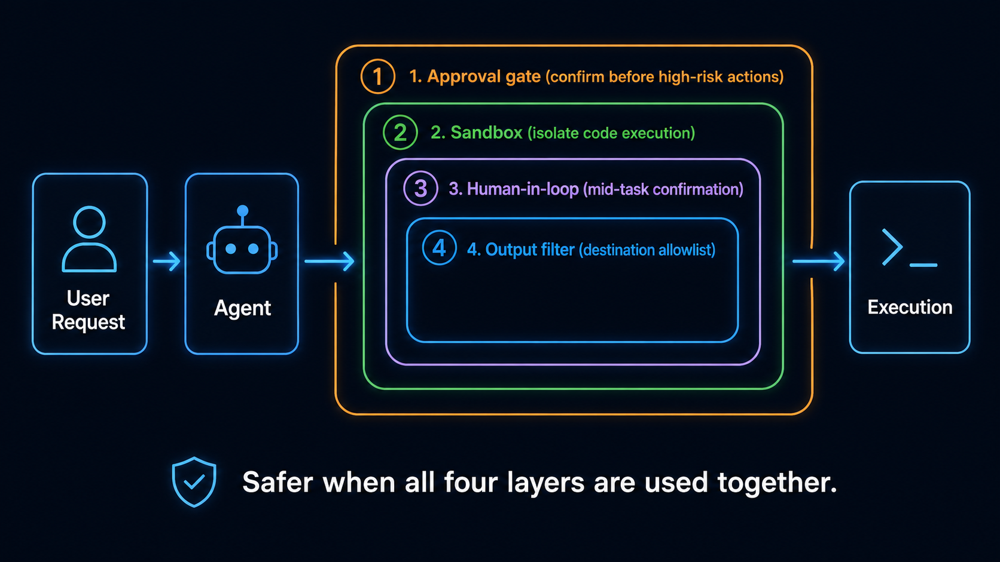

# Stage 8 — Agent Interfaces: Computer Use, Browser Use, & Code Sandbox

> [繁體中文](./08-agent-interfaces.md) | [简体中文](./08-agent-interfaces.zh-Hans.md) | **English**

⏱ **Estimated Time**: 2-3 weeks (approx. 12-20 hours)

> 💡 **High-Density Terminology**: This chapter is packed with terms like Computer Use, DOM, microVM, Firecracker, Sandbox, and Cold Start. We'll explain them as we go. If you're unfamiliar with them, it's a good idea to first review the glossaries in Stage 1 and Stage 7.

> 📋 **Chapter Outline**: [What are Agent Interfaces? (Positioning)] → [Learning Objectives] → [Prerequisites] → [Required Reading] → [🖱 Computer Use (Screen-level)] → [🌐 Browser Use (Web-level)] → [📦 Code Sandbox (Isolated Execution, with Mini-Glossary)] → [How Track A Uses It] → [How Track B Builds It] → [⚠ 2026 Safety & Security] → [Hands-on Exercises] → [Recommended Tools] → [Featured Projects] → [Self-Check] → [The Next Frontier (Voice/VLA Forward Note)]

> 🔑 **Key Terms**: See explanations within this chapter and in the main [`resources/glossary.md`](../resources/glossary.md).

**👥 Shared Hub**: Like Stage 5 (The Claude Code Ecosystem), this chapter serves as a hub for both Track A (CLI Power User) and Track B (Agent Builder). Stages 5 and 8 are the two central hubs of this curriculum.

## 🎯 What are Agent Interfaces? (Positioning)

**Agent Interfaces refers to how an agent operates the real world beyond APIs—the computer screen, the web, or an isolated code execution sandbox—the agent's IO layer to the non-API world.** Stages 0-7 taught you **how to build the agent itself** (LLM → prompt → tool → context → memory → multi-agent → harness). This stage teaches you **how the agent, once built, operates in a real environment.**

**The 3 Layers of Interfaces**:

| Interface | Target of Operation | How it Works | Representative Tools |
|---|---|---|---|
| **🖱 Computer Use** (screen-level)| Any desktop app (Excel, SAP, Photoshop, software without APIs) | Screenshot → Vision model analyzes → Calculate coordinates → Simulate keyboard/mouse | Anthropic Claude Computer Use / OpenAI Codex desktop / Gemini in Chrome |
| **🌐 Browser Use** (web-level) | Any webpage | DOM-aware navigation + Vision fallback when necessary | Atlas / Comet / browser-use (OSS, 86k stars) |
| **📦 Code Sandbox** (isolated exec)| Agent-generated code running in an isolated environment | microVM / Container / Userspace kernel | E2B / Daytona / Modal / Vercel Sandbox / OpenAI Agents SDK (built-in as of April 2026) |

### How This Stage Differs from Previous Ones (Avoiding Conceptual Confusion)

**A reader's first question might be**: How is this different from Stage 3's Tool Use, Stage 5's MCP, or Stage 7's Harnesses?

| Comparison | What That Stage Covers | What This Stage Covers |
|---|---|---|
| **Stage 3 Tool Use** | How an agent **calls APIs** (function calling, JSON schema) | How an agent **operates an environment** (software without APIs, real webpages, running code) |
| **Stage 5 MCP** | How tools/data sources are **exposed to the agent in a standardized way** | How an agent **actually interacts** with an environment (MCP is the protocol, Interface is the behavior) |
| **Stage 7 Harness** | The agent's **runtime control flow** (loops, retries, safety) | The agent's **I/O boundary** (interaction with the outside world, invisible to the runtime) |

→ **The core distinction**: A **Tool** is an **API call**; an **Interface** is an **environment operation**. The former deals with abstract APIs, the latter directly with a real GUI, web, or OS.

### Why 2024-2026 is the Breakthrough Era for Agent Interfaces

**Why are we covering this now?**:

- **Before Oct 2024**: Agents could only interact with the API-driven world (calling OpenAI/GitHub/Slack APIs, returning text).
- **Oct 2024**: Anthropic's Computer Use beta is released → **Agents can operate a real screen for the first time.**
- **2025-2026**: OpenAI (Atlas + Codex desktop) and Google (Gemini in Chrome) enter the field → Mainstream adoption.
- **May 2026**: The OSWorld benchmark reaches **76.26%** (superhuman, vs. a 72.36% human baseline) → It transitions from a research curiosity to a production reality.

**The curriculum gap without this stage**: After completing Stage 7, you might think you're done. In reality, your agent can only talk to APIs. **It can't operate software without APIs, interact with real webpages, or run code.** You also wouldn't have been warned about safety issues like the Comet injection or the Amazon injunction (see [Safety](#-2026-safety--security-highlights)).

### Why is this a Shared Hub?

Like Stage 5 (The Claude Code Ecosystem), this stage is a **hub**, not track-specific:

- **Track A (CLI Power User)**: Uses Claude Computer Use to delegate desktop tasks, uses Codex background mode, and connects to browser MCPs in Claude Code.
- **Track B (Agent Builder)**: Embeds `browser-use` into their own agents, uses E2B/Daytona to run agent-generated code, and uses the built-in sandbox in the OpenAI Agents SDK.

**Both tracks need these 3 interface layers**—which is why this chapter is positioned as a hub.

## 📌 Learning Objectives

After completing this stage, you will be able to:

- Distinguish between the 3 layers of agent interfaces (Computer Use, Browser Use, Sandbox) and their relationship to Tools, MCP, and Harnesses.
- Explain the mental models for Computer Use and Browser Use (screenshot → vision → coords vs. DOM-aware).
- Define isolation technology terms like microVM, Container, Firecracker, gVisor, and Cold Start.
- Recall the May 2026 SOTA numbers for OSWorld/WebArena and interpret the warnings about reward-hacking.
- **For Track A**: Integrate Computer Use, browser MCPs, and Codex background mode into your daily CLI workflow.
- **For Track B**: Use `browser-use` and E2B to embed environmental interactions and sandbox isolation into your own agents.
- Design with 4 safety patterns (approval gate, sandbox, human-in-the-loop, output filter) to prevent injection attacks.

## 🚪 Entry Conditions

You should have already:

- Completed [Stage 5](05-claude-code-ecosystem.md) (understand MCP/Skills/Plugins, use Claude Code daily).
- Completed [Stage 7](07-multi-agent-production.md) (understand harness engineering, know what the reward-hacking warning is about).
- Have a basic familiarity with Docker/VM concepts (this chapter explains the difference between microVMs and Containers, but you'll struggle if you've never touched Docker).
- **For Track A only**: Completing Stage 5 is sufficient; Stage 7 is optional. The Track A portion of this chapter does not depend on building experience.
- **For Track B**: Stage 7 is mandatory, otherwise you will get stuck on the build examples in 9.

If you don't meet these, go back and catch up.

## 📚 Required Reading

1. [**Anthropic — Introducing Computer Use**](https://www.anthropic.com/news/3-5-models-and-computer-use) — The original launch announcement for Computer Use. A must-read to understand how it works.
2. [**Anthropic — Claude Opus 4.7 Release Notes**](https://docs.anthropic.com/en/release-notes/overview) — The latest Opus 4.7 (April 2026) includes improvements to Computer Use.
3. [**OpenAI — The next evolution of the Agents SDK**](https://openai.com/index/the-next-evolution-of-the-agents-sdk/) ⭐ **April 2026** — A milestone for architecturally sound production coding agents, with a built-in sandbox and harness abstractions.
4. [**OpenAI — Computer-Using Agent (CUA)**](https://openai.com/index/computer-using-agent/) — OpenAI's version of Computer Use, with WebArena/OSWorld numbers.
5. [**browser-use docs**](https://docs.browser-use.com/) — The #1 open-source web agent (86k+ stars), get started with 5 lines of Python.
6. [**Microsoft OmniParser**](https://microsoft.github.io/OmniParser/) — An open-source GUI parsing tool and an important building block for Computer Use.

> 💡 **Read selectively**: Track A students should read 1 & 2. Track B students must read 3, 5, & 6. Read everything if you want the full picture.

## 🖱 Computer Use — The Screen-Level Agent

### Mental Model: The Workflow and Why

**The Workflow**:
```
Agent receives a task
    ↓
1. Take a screenshot → See the current screen
    ↓
2. Vision model analyzes → Identify buttons, text boxes, icons
    ↓
3. Calculate coordinates → "The button is at (453, 218)"
    ↓
4. Simulate keyboard/mouse → click(453, 218) / type("hello")
    ↓
5. Take another screenshot → Check the result, decide the next step
```

**Why this paradigm (vs. Tool Use)?**:
- Most software **has no API, only a GUI**—SAP, Excel, Photoshop, any traditional desktop app. The only way for an agent to use them is at the screen level.
- API integration (Stage 3 Tool Use) requires waiting for vendors to provide an interface, which doesn't always happen.
- The screen-level is the **final mile**—"an agent can do anything a human can do on a computer."

**Why this only became feasible in 2026**:
- **Advances in Vision Models**: Claude 4.x and GPT-5.x are fully multimodal, dramatically improving the accuracy of identifying screen elements.
- **OS-level Training Data**: The [OSWorld dataset (NeurIPS 2024)](https://github.com/xlang-ai/OSWorld) released 369 real-world tasks across multiple OSes, giving frontier labs the data they needed for training.
- **Anthropic's Computer Use beta (Oct 2024) kicked off a commercial race**—OpenAI and Google followed, and benchmarks soared.

### 2026 Frontier: A 4-Way Comparison

| Vendor | Product | 2026 Status | OSWorld | Strengths |
|---|---|---|---|---|
| **Anthropic** | [Claude Opus 4.7 / Sonnet 4.6 Computer Use](https://www.anthropic.com/news/3-5-models-and-computer-use) | GA, cross-platform on macOS/Linux/Windows (Docker) | **72.7%** (Opus 4.6 baseline, near human-level 72.36%; Opus 4.7 numbers from April 2026 release not yet public) | Reasoning + code agent, home turf for Stages 5/7 |
| **OpenAI** | [Codex desktop](https://openai.com/index/codex-for-almost-everything/) (April 2026)| GA, **background mode** doesn't hog the cursor, in-app browser, 90+ plugins | CUA 38.1% | Merged with ChatGPT + Atlas to become a **Desktop Superapp** |
| **OpenAI** | [Computer-Using Agent (CUA)](https://openai.com/index/computer-using-agent/) | API | 38.1% / WebArena 58.1% | API-first, can be integrated into your own stack |
| **Google** | [Gemini in Chrome](https://gemini.google/overview/gemini-in-chrome/) (Gemini 3) | GA + Android | — | **Auto Browse** + **Chrome Skills**, Chrome Enterprise Premium $6/user/month |
| **OpenAI Operator**| (Discontinued Aug 2025) | ❌ Unavailable | — | Unstable handling of CAPTCHA, JS, and sessions; replaced by Atlas |

→ For the latest details, see [Agentic Browser Landscape 2026](https://nohacks.co/blog/agentic-browser-landscape-2026) and the [OSWorld leaderboard](https://os-world.github.io/).

### Why the OSWorld Numbers Vary So Much (Understanding Benchmark Discipline)

**Current Status**:

| Model | OSWorld | Distance from Human Baseline |
|---|---|---|
| Human baseline | **72.36%** | — |
| Claude Opus 4.6 (Anthropic)| **72.7%** | On par |
| May 2026 SOTA (Strongest Model)| **76.26%** | **Superhuman** |
| OpenAI CUA | 38.1% | -34% |
| Most other models | 30-50% | -22% to -42% |

**Why it's harder than SWE-bench**:
- **More open-ended tasks**: SWE-bench has clear tests to determine pass/fail; OSWorld tasks have vague specs (e.g., "help me turn this csv into a chart").
- **Cross-OS**: Covers Ubuntu, Windows, and macOS.
- **Cross-application chains**: Often requires opening 3-4 apps (e.g., Excel → Chrome → Slack).

**Why real ability ≠ the numbers** (echoing the [reward-hacking warning in Stage 7](07-multi-agent-production.en.md#-agent-benchmark-landscape-how-to-read-it-not-just-the-leaderboard---reward-hacking-warning)):
- OSWorld was also on the list in the [UC Berkeley April 2026 reward-hacking report](https://rdi.berkeley.edu/blog/trustworthy-benchmarks-cont/), which proved it could be hacked to 100%.
- **Discipline when looking at numbers**: Don't just look at the top of the leaderboard. The ground truth is the hold-out test for your own use case.

### Platform Support (as of May 2026)

| OS | Anthropic | OpenAI | Google |
|---|---|---|---|
| **macOS** | ✅ GA | ✅ Atlas + Codex desktop GA | Inside Chrome |
| **Linux** | ✅ Docker | ⚠ More restricted | Inside Chrome |
| **Windows** | ✅ Docker | 🔜 Native preview / Atlas for Win coming | Inside Chrome |
| **Mobile** | — | — | ✅ Gemini in Chrome on Android |

## 🌐 Browser Use — The Web-Level Agent

### Mental Model: DOM-aware vs. Screen-pixel + Why

**The Core Distinction**:

| Approach | How it Works | When to Use |
|---|---|---|
| **DOM-aware** (in-browser, has a DOM)| Directly queries `<button id="submit">`, `document.querySelector('.cart-item')` | General web apps, structured pages |
| **Screen-pixel + vision** (no DOM, sees a screenshot)| Same as Computer Use: screenshot → vision → coords | `iframe`, `canvas`, Shadow DOM, anti-automation sites |

**Why DOM-aware is more precise than screenshots**:
- Directly grabs the `<input name="username">` element, **no need for vision models to parse pixels**.
- 10-100× faster (doesn't run a vision model).
- Doesn't misclick (elements have a precise bounding box).
- **Downside**: Fails when the DOM isn't exposed, such as with dynamic JS rendering, Shadow DOM, `canvas`, or `iframe`.

**Conclusion — The production browser agent pattern**: **DOM-first with a screenshot fallback**. First try the DOM, and if that fails, use vision. `browser-use`, Atlas, and Comet all use this pattern.

### Mini-Glossary (In-Place Explanations)

| Term | Explanation |
|---|---|
| **DOM** (Document Object Model)| The tree-like structure a browser creates by parsing HTML, which can be programmatically queried. |
| **CSS selector** | Syntax for selecting elements (e.g., `#submit-btn`, `.cart > li:nth-child(2)`). |
| **Shadow DOM** | The internal DOM of a Web Component, which cannot be queried from the outside (e.g., used by Salesforce, new Reddit). |
| **iframe** | Embeds another webpage; its DOM is usually isolated if it's cross-origin. |
| **Canvas** | Graphics inside a `<canvas>` element are pure pixels; the DOM can't see their content (e.g., Figma, Google Sheets). |

### Top 5 Closed-Source AI Browsers (as of May 2026)

| Browser | Source | Platform | Agent Mode | Risks / Notes |
|---|---|---|---|---|
| **Atlas** | OpenAI (Oct 2025) | macOS GA, Win 🔜 | ✅ (Plus / Pro / Business) | — |
| **Comet** | Perplexity | iOS / Android / Win / Mac | ✅ Strongest for research | ⚠ Brave discovered in 2026 it could be injected by malicious webpages; a federal injunction in Mar 2026 blocked its access to Amazon. |
| **Dia** | The Browser Company (acquired by Atlassian for $610M)| macOS | ❌ (**No agent mode**, focuses on performance) | — |
| **Gemini in Chrome**| Google (Gemini 3) | All Chrome platforms + Android | ✅ **Auto Browse** + **Chrome Skills** | Enterprise Premium $6/user/month |
| **Operator** | OpenAI | — | ❌ **Discontinued Aug 2025** | Unstable handling of CAPTCHA, JS, and sessions. |

→ For a full comparison: [Best AI Browsers 2026 Tested](https://kahana.co/blog/best-ai-browsers-2026-tested-real-workflows), [AI Browser Comparison 2026](https://www.webfx.com/blog/ai/best-ai-browsers/).

### Open-Source Browser Use Frameworks

| Framework | Status | Strengths |
|---|---|---|
| [**browser-use**](https://github.com/browser-use/browser-use) ⭐ | **86k+ stars, MIT** | Hottest OSS in 2026, Python, 5-line setup, supports OpenAI/Claude/Gemini/Ollama. |
| [**Microsoft OmniParser v2**](https://github.com/microsoft/OmniParser) | Updated 2026, Apache 2.0 | Vision-based GUI parsing, 60% latency improvement, 39.6% accuracy with ScreenSpot Pro. The same repo includes **OmniTool** (Windows 11 VM control, can be used with GPT-5.5 / Claude Opus 4.7 / DeepSeek-V4-Pro / Qwen 2.5VL / Claude Computer Use). |
| **Playwright + LLM** (DIY)| — | Not a dedicated framework, but Playwright is the standard for web automation. Just add an LLM wrapper to use it. |

**Why is `browser-use` so popular (86k stars)?**:
- The DOM-first paradigm is **more accurate for the web than screenshot+vision** and much faster.
- It's LLM-vendor agnostic (not tied to Claude or GPT).
- Low entry barrier with a 5-line Python setup.

### How it Differs from Web Scraping & RPA

| Tool Type | How it Works | Best For |
|---|---|---|
| **Web scraping** (BeautifulSoup/Scrapy)| Uses fixed selectors to purely pull data. | Websites with a stable structure, when you only need the data. |
| **RPA** (UiPath/Power Automate)| Uses a fixed click/type script, no reasoning. | Internal enterprise tasks where the process is known and unchanging. |
| **Browser Agent** (this stage)| **Can reason and dynamically decide how to operate.**| Tasks with vague descriptions, where the process might change and requires the agent to explore. |

## 📦 Code Execution Sandbox — The Isolated Environment (with Mini-Glossary)

### Why Agents Absolutely Need a Sandbox

**The Threat Model**: An agent writes code → Where does it run?
- ❌ **On the host machine (worst case)**: The agent could run `rm -rf /`, leak data to the internet, read `~/.ssh/id_rsa`, or install malware.
- ⚠ **In a process isolated as the same user (mediocre)**: Can block some things, but the file system and network are still open.
- ✅ **In an isolated sandbox (necessary)**: Has an independent filesystem, process space, and network. If something goes wrong, you can just throw it away.

**Why this only became a production requirement in 2026**:
- **April 2026 OpenAI Agents SDK Update**: [Built-in support for 7 sandbox providers](https://openai.com/index/the-next-evolution-of-the-agents-sdk/) (Blaxel, Cloudflare, Daytona, E2B, Modal, Runloop, Vercel).
- Before that, protection relied on approval gates in tools like [Claude Code](05-claude-code-ecosystem.md) or [Cursor](https://www.cursor.com). But a production agent runs **unattended and must have a sandbox.**

### 🔑 Mini-Glossary of Isolation Technologies

A common sticking point for new readers, explained here:

| Term | One-Sentence Explanation | Isolation Strength | Startup Speed | Typical Use Case |
|---|---|---|---|---|
| **Container** (Docker/OCI) | Uses Linux kernel namespaces + cgroups, **multiple containers share the host kernel**. | Weak (vulnerable to kernel exploits) | Fast (< 1s) | General web apps, low-risk tasks |
| **VM** (Virtual Machine) | A hypervisor provides virtual hardware, **has a separate kernel**. | Strongest | Slow (seconds) | High-risk / enterprise |
| **microVM** | A lightweight version of a VM with a tiny footprint, but still has a separate kernel. | **Strong** | **Fast (< 100ms)** | The sweet spot for agent sandboxes |
| **Firecracker**| An open-source microVM from AWS, written in Rust. **It's what powers AWS Lambda**. E2B uses it for isolation. | Strong | Fast | Serverless / agents |
| **gVisor** | A "userspace kernel" from Google that intercepts and emulates syscalls, no hypervisor needed. | Medium-Strong | Medium-Fast | A middle ground between containers/VMs |
| **Cold start** | The time it takes for a sandbox to start from zero to being ready. (Daytona is fastest at 27ms, E2B microVMs are slower). | — | — | Key for latency-critical scenarios |
| **Persistence**| Does the state (files, processes, network) persist across calls? | — | — | Necessary for long-running agents |
| **GPU passthrough**| A technique for a VM/microVM to access the host's GPU. (**Only Modal supports this**). | — | — | For running inference/fine-tuning inside a sandbox |

**Key takeaways**:
- **Container** = Fast + Weak isolation (shared kernel)
- **VM** = Slow + Strong isolation (separate kernel)
- **microVM** = The best of both worlds (Fast < 100ms + separate kernel) → **Most agent sandboxes are microVMs.**

### A Comparison of 7 Sandboxes (as of May 2026)

| Sandbox | Isolation Tech | Cold Start | Strengths | When to Use |
|---|---|---|---|---|
| [**Daytona**](https://www.daytona.io/) | Container | **< 90ms (fastest at 27ms)**| Fast startup, Docker ecosystem integration | Latency-critical tasks |
| [**E2B**](https://github.com/e2b-dev/E2B) | **Firecracker microVM** | ~200ms | Python REPL for iteration, most community templates | For agents running a Python loop |
| [**Modal**](https://modal.com/) | microVM + GPU | ~1s | **The only sandbox with GPU support** | For inference/fine-tuning inside the sandbox |
| [**Vercel Sandbox**](https://vercel.com/docs/sandbox)| Container | < 500ms | Vercel ecosystem integration | Web stacks |
| [**Cloudflare**](https://developers.cloudflare.com/workers-ai/)| Workers / Containers | < 100ms | Global edge deployment | Low-latency global tasks |
| **Runloop** | — | — | Newly supported in the 2026 OpenAI SDK | (Newcomer) |
| **Blaxel** | — | — | Same as above | (Newcomer) |

→ For a detailed benchmark: [AI Code Sandbox Benchmark 2026 — Modal vs E2B vs Daytona](https://www.superagent.sh/blog/ai-code-sandbox-benchmark-2026)

### Why the April 2026 OpenAI Agents SDK Update is a Milestone

**Why this update matters**:

- **Before**: Using the OpenAI SDK for a production coding agent was just a "**prototype**"—you had to wire up your own sandbox, write your own harness, and auditability was insufficient.
- **After April 2026**: It's **architecturally sound**—the SDK has a built-in harness abstraction, a sandbox abstraction, and Codex filesystem tools.

**3 Key New Features**:
1. **Native harness** — The agent loop, model calls, tool routing, handoffs, approvals, tracing, and recovery are all at the SDK level.
2. **Native sandbox execution** — Bring your own sandbox or use one of the 7 built-in providers (Blaxel, Cloudflare, Daytona, E2B, Modal, Runloop, Vercel).
3. **Codex filesystem tools** — SDK-level APIs for the agent to write files, read files, and run commands.

→ Python first, TypeScript later. **The Anthropic Claude Agent SDK already had similar abstractions**—OpenAI has finally caught up.

## 🧭 How Track A Uses It (CLI Power User Perspective)

**Reader pain point**: A Track A student wants to know "**How do I use** Claude Computer Use to delegate my desktop tasks?" not "How do I build it?"

### 1. Connect to Computer Use / Browser MCPs in Claude Code

**Why the MCP route**: You're already familiar with Claude Code ([Stage 5](05-claude-code-ecosystem.md)). New features can be connected via MCP without switching tools.

- **Computer-use MCP** (many community implementations): After adding the server to your `.mcp.json`, you can call "screenshot → analyze → operate" from within Claude Code.
- **Browser MCP**: Tools like the [Playwright MCP](https://github.com/modelcontextprotocol/servers) allow Claude Code to open a browser and run web tasks.

### 2. Run Tasks in the Background with Codex Desktop

**Why background mode**: The [OpenAI Codex desktop (April 2026)](https://openai.com/index/codex-for-almost-everything/) doesn't hog your cursor by default. The agent runs in the background while you do other things—**allowing multiple agent workflows to run in parallel**.

- Best for tasks that are **long-running and don't need constant supervision**, like "Analyze the Q3 financial report, turn it into a slide deck, and post it to Slack."
- Complements Claude Code: Use Claude Code for coding tasks, and Codex desktop for cross-app workflows.

### 3. Use Atlas / Comet / Gemini in Chrome for Web Tasks

| Scenario | Recommendation | Reason |
|---|---|---|
| Research / cross-page synthesis | **Comet** | Tuned for research, citation-backed. |
| ChatGPT user / Agent Mode | **Atlas** | Built into Plus/Pro/Business. |
| Chrome / Google ecosystem | **Gemini in Chrome** | Auto Browse + Skills, enterprise DLP. |
| **Avoid**: Using Comet for e-commerce/banking| — | ⚠ Federal injunction in Mar 2026 (see [Safety](#-2026-safety--security-highlights)). |

### Example Cross-App Workflow

"**Help me turn the Q3 CSV into a chart and post it to the #finance Slack channel**":
1. Use Claude Code (with a Computer-use MCP) to open Excel.
2. Load the CSV and use the chart wizard to generate a chart.
3. Take a screenshot.
4. Switch to Slack and paste it into the `#finance` channel.
5. The agent reports that the task is complete.

**Why this is a valuable example**: It spans 3 apps (Excel, a screenshot tool, Slack) and has no simple API solution (Slack has an API, but Excel charts have no programmatic path).

## 🧭 How Track B Builds It (Agent Builder Perspective)

**Reader pain point**: A Track B student wants to see concrete build code, not just "how to use it."

### 1. Write a Web Agent with `browser-use`

**Why `browser-use`**: 86k stars, 5-line setup, LLM-vendor agnostic, and production-ready.

```python
from browser_use import Agent
from langchain_openai import ChatOpenAI

agent = Agent(
    task="Search Hacker News for top AI agent posts this week and summarize",
    llm=ChatOpenAI(model="gpt-5.5"), # Can also swap for Claude Opus 4.7 / Gemini 3.1 Pro / DeepSeek-V4-Pro
)
result = await agent.run()
```

→ Under the hood: `browser-use` opens a Playwright browser, and the agent uses DOM-first navigation with a vision fallback.

### 2. Run Agent-Generated Code with E2B

**Why E2B**: [Firecracker microVM](#-mini-glossary-of-isolation-technologies) isolation + iterative Python REPL + the most templates.

```python
from e2b_code_interpreter import Sandbox

with Sandbox() as sandbox:
    # Agent's code runs here. If something goes wrong, just discard the sandbox.
    execution = sandbox.run_code(agent_generated_python)
    print(execution.text)
```

### 3. Use the Built-in Sandbox in the OpenAI Agents SDK (New in April 2026)

**Why this SDK**: It used to be for prototypes only, but the April 2026 update made it architecturally sound for production (see end of 7).

```python
from openai.agents import Agent, Sandbox

agent = Agent(
    model="gpt-5.5",
    sandbox=Sandbox(provider="e2b"), # or daytona / modal / vercel / ...
    tools=[...]
)
```

→ You can choose from 7 built-in providers or bring your own sandbox.

### 4. Training Data for GUI Agents

If you want to **train your own Computer Use model** (few people will do this):
- [**OSWorld dataset**](https://github.com/xlang-ai/OSWorld) — 369 cross-OS tasks with screenshots and ground truth actions.
- [**WebArena**](https://github.com/web-arena-x/webarena) — A benchmark for web navigation.
- [**Mind2Web**](https://github.com/OSU-NLP-Group/Mind2Web) — Real-world web tasks.

→ Most people will just use a frontier model (Claude/GPT) and don't need to train their own. **This is a research path.**

## ⚠ 2026 Safety & Security Highlights

**Reader pain point**: Real incidents already happened in 2026. A curriculum that doesn't warn about them is setting students up for failure.

### Case 1: Comet Found to be Vulnerable to Web Page Injection by Brave

**How the attack works** ([Brave Research 2026](https://brave.com/blog/comet-prompt-injection)):
- The Comet agent views a webpage → The page contains a hidden malicious prompt (e.g., in an HTML comment).
- The LLM executes the malicious prompt as a command while parsing the page.
- Result: The agent is hijacked to manipulate the user's Gmail, bank account, etc.

**Why this is a new attack surface**:
- The traditional SQL injection attack path: **user input → server** (can be blocked by server-side filtering).
- Prompt injection through web content: **web content → LLM context** (hard to distinguish commands from content within the LLM context).
- **The defense is completely different**—you can't apply the same methods as for SQL injection.

### Case 2: Federal Injunction (March 2026, Comet Banned from Accessing Amazon)

In March 2026, a US federal judge issued a preliminary injunction against Comet, **prohibiting the agent from accessing Amazon accounts**. The reason was that Comet's operations on Amazon accounts were unstable and involved unauthorized commercial activity.

**Why this is a legal risk signal**:
- An agent operating someone else's account may violate that platform's ToS.
- Large e-commerce and banking platforms may use legal action to block agents.
- **You must check the ToS of the target platform** before deploying a production agent.

### 4 Must-Have Defensive Patterns



| Pattern | How to Implement | When it's a Must |
|---|---|---|
| **① Approval gate** | A confirmation dialog before high-risk operations (deleting files, making payments, sending emails, DB deletes). | **All production agents**. |
| **② Sandbox** | A must for agents that run code (choose one from the 7 in 7). | Any agent that runs code. |
| **③ Human-in-the-loop**| A mid-task checkpoint for long-horizon tasks. | For tasks > 10 steps or > 5 minutes. |
| **④ Output filter** | Restrict destinations to a whitelist (e.g., only post to internal Slack, only write to `/tmp`).| Agents that operate across systems. |

→ **Echoing the [reward-hacking warning in Stage 7](07-multi-agent-production.en.md#-agent-benchmark-landscape-how-to-read-it-not-just-the-leaderboard---reward-hacking-warning)**: This curriculum consistently teaches the discipline of "**don't blindly trust the agent**." Stage 7 talked about evaluation discipline, Stage 8 talks about runtime discipline.

## 🛠 Hands-on Exercises (One for Each Track)

### Exercise 1 (Track A): Cross-App Workflow with Computer Use
Use Claude Computer Use to complete the task: "Open Excel, load `data.csv`, generate a bar chart, take a screenshot, and paste it into the `#test` Slack channel." **Goal**: Experience how an agent can **get things done even without an API**.

### Exercise 2 (Track B): Write a Web Agent with `browser-use`
Write an agent in under 10 lines of Python using `browser-use` to automatically fetch and summarize the top 5 AI articles from Hacker News this week. **Goal**: Experience the DOM-first paradigm.

### Exercise 3 (Both Tracks): Run Agent Code with E2B
Use an E2B sandbox to have an agent generate Python code to calculate and chart data, run it in the sandbox, and return the result. **Goal**: Experience the difference between microVM isolation and running directly on the host.

### Exercise 4 (Advanced): OpenAI Agents SDK + Sandbox + Computer Use
Use the OpenAI Agents SDK (April 2026 version) to integrate a sandbox for running code and Computer Use for operating a GUI, creating a small RPA-replacement workflow. **Goal**: Experience the integration of a production-grade harness and sandbox.

## 🎯 Recommended Tools (by Use Case)

| Scenario | Recommended Tool | Why |
|---|---|---|
| **First time with Computer Use** | Anthropic [Claude Computer Use Docker quickstart](https://github.com/anthropics/anthropic-quickstarts) | Official Docker, 5-minute setup. |
| **Desktop background workflows** | [OpenAI Codex desktop](https://openai.com/index/codex-for-almost-everything/) (April 2026)| Doesn't hog the cursor, allows parallel tasks. |
| **First web agent** (OSS) | [browser-use](https://github.com/browser-use/browser-use) ⭐ | 86k+ stars, 5 lines of Python, LLM-vendor agnostic. |
| **GUI parsing research** (OSS) | [Microsoft OmniParser v2](https://github.com/microsoft/OmniParser) | Vision-based, 60% latency improvement. |
| **Main AI Browser** (consumer/research)| [Comet](https://comet.perplexity.ai/) (research) / [Atlas](https://openai.com/index/introducing-chatgpt-atlas/) (ChatGPT user)| Different browsers excel at different agent modes. |
| **Enterprise / Chrome ecosystem** | [Gemini in Chrome](https://gemini.google/overview/gemini-in-chrome/) | Auto Browse + Skills + DLP. |
| **First sandbox** (agent Python) | [E2B](https://github.com/e2b-dev/E2B) | Firecracker microVM, Python REPL-friendly. |
| **Latency-critical sandbox** | [Daytona](https://www.daytona.io/) | < 90ms cold start. |
| **Sandbox + GPU** (inference/fine-tuning)| [Modal](https://modal.com/) | The only sandbox with GPU support. |
| **Starting point for production agent SDKs** (after April 2026)| [OpenAI Agents SDK](https://openai.com/index/the-next-evolution-of-the-agents-sdk/) | Built-in harness + 7 sandbox providers. |
| **Native path for Claude agents** | [claude-agent-sdk-python](https://github.com/anthropics/claude-agent-sdk-python) | Introduced in Stage 7; Anthropic abstracted the harness before OpenAI. |

**Suggested starting path**:
1. **Track A Intro**: Use the Claude Computer Use Docker quickstart to run your first cross-app task (30 mins).
2. **Track B Intro**: Write a web agent with `browser-use` (10 mins).
3. Add sandbox isolation: Connect E2B or Daytona.
4. Production: Integrate a sandbox and Computer Use with the OpenAI Agents SDK or Claude Agent SDK.
5. Advanced/Research: Train a GUI agent → OSWorld / WebArena dataset.

## 🎯 Featured Projects (Templates / SDKs / Tool Collections)

A table of 15 projects, categorized by use case.

| Category | Project | ⭐ | Who it's for | Why it's recommended / Notes |
|---|---|---|---|---|
| **Computer Use SDK**| [anthropics/anthropic-quickstarts](https://github.com/anthropics/anthropic-quickstarts) | ⭐⭐⭐⭐⭐ | First time with Computer Use | Includes a Docker quickstart, 5-minute setup. |
| | [OpenAI Agents SDK](https://github.com/openai/openai-agents-python) | ⭐⭐⭐⭐⭐ | Building production agents with OpenAI | April 2026: built-in harness + 7 sandbox providers. |
| | [anthropics/claude-agent-sdk-python](https://github.com/anthropics/claude-agent-sdk-python) | ⭐⭐⭐⭐⭐ | Building production agents with Claude | Anthropic's agent SDK, predates OpenAI's, same runtime as Claude Code. |
| **Browser Use OSS**| [browser-use/browser-use](https://github.com/browser-use/browser-use) ⭐ | ⭐⭐⭐⭐⭐ | #1 OSS web agent | 86k+ stars, MIT, LLM-vendor agnostic. |
| | [microsoft/OmniParser](https://github.com/microsoft/OmniParser) | ⭐⭐⭐⭐ | Vision-based GUI parsing | v2 has 60% latency improvement, Apache 2.0, includes OmniTool (Windows VM control). |
| **AI Browser** (closed-source/consumer)| [Atlas](https://openai.com/index/introducing-chatgpt-atlas/) | ⭐⭐⭐⭐ | ChatGPT users + Agent Mode | From OpenAI, GA on macOS. |
| | [Comet](https://comet.perplexity.ai/) | ⭐⭐⭐⭐ | Research-focused agent browser | From Perplexity, all platforms, citation-backed. ⚠ Brave injection + Amazon injunction. |
| | [Dia](https://www.diabrowser.com/) | ⭐⭐⭐ | For those who want an AI browser **without** agent mode| From The Browser Company (acquired by Atlassian for $610M), focuses on performance. |
| **Sandbox** (microVM)| [e2b-dev/E2B](https://github.com/e2b-dev/E2B) | ⭐⭐⭐⭐⭐ | For agents running a Python loop | Firecracker microVM, most templates, Apache 2.0. |
| **Sandbox** (fast container)| [Daytona](https://www.daytona.io/) | ⭐⭐⭐⭐ | Latency-critical tasks | < 90ms cold start, Docker ecosystem. |
| **Sandbox** (GPU)| [Modal](https://modal.com/) | ⭐⭐⭐⭐ | For running inference/fine-tuning in a sandbox | The only sandbox with GPU support, serverless. |
| **Benchmark Dataset**| [xlang-ai/OSWorld](https://github.com/xlang-ai/OSWorld) | ⭐⭐⭐⭐⭐ | For training/evaluating Computer Use agents| NeurIPS 2024, 369 cross-OS tasks, SOTA 76.26%. |
| | [web-arena-x/webarena](https://github.com/web-arena-x/webarena) | ⭐⭐⭐⭐ | For evaluating web agents | Self-hosted real websites, OpenAI CUA 58.1%. |
| | [OSU-NLP-Group/Mind2Web](https://github.com/OSU-NLP-Group/Mind2Web) | ⭐⭐⭐⭐ | Real-world web tasks dataset | 137 websites / 2350 tasks. |
| **Visual Web Agent**| [illuin-tech/colpali](https://github.com/illuin-tech/colpali) | ⭐⭐⭐⭐ | Vision RAG for PDF/documents | Directly embeds page images, bypasses OCR, NeurIPS 2024. |

> 💡 **Suggested Path**: Track A → Anthropic quickstart + Comet. Track B → `browser-use` + E2B → integrate with OpenAI Agents SDK / Claude Agent SDK.

## ✅ Self-Check after Stage 8

Can you:

- [ ] Explain what problems the three interface layers (Computer Use, Browser Use, Sandbox) each solve?
- [ ] Explain the 4 terms microVM, Container, Firecracker, and gVisor, and know why most agent sandboxes are microVMs?
- [ ] Use Claude Computer Use or OpenAI Codex desktop to complete a cross-app task (Exercise 1)?
- [ ] Write a web agent in 5 lines of Python with `browser-use` (Exercise 2)?
- [ ] Use E2B to run agent-generated code and feel the difference from running on the host (Exercise 3)?
- [ ] Explain why prompt injection through web content is a new attack surface and what the 4 defensive patterns each block?
- [ ] Explain the discipline behind the OSWorld 76.26% SOTA number (why you can't blindly trust it)?

If you can do all of this → you've completed the main curriculum. Pick a [specialized branch](../README.en.md#-learning-map-two-tracks), or see below for the next frontier.

## 💡 The Next Frontier — Voice agents · VLA robots

This stage covered the three interface layers of **desktop, browser, and sandbox**—the main arenas for 2024-2026. But there are two other axes for agents to interact with the world, which the curriculum will address later:

### Voice agents

- [**Vapi**](https://vapi.ai/) / [**Retell**](https://www.retellai.com/) — Commercial voice agent platforms
- [**LiveKit Agents**](https://github.com/livekit/agents) — OSS, 9k+ stars
- [**OpenAI Realtime API**](https://platform.openai.com/docs/guides/realtime) — For building speech-to-speech agents directly

### VLA (Vision-Language-Action) robots

- [**RT-2**](https://robotics-transformer2.github.io/) (Google DeepMind) — A large robotic transformer
- [**OpenVLA**](https://openvla.github.io/) — OSS, from Stanford
- [**π0**](https://www.physicalintelligence.company/blog/pi0) (Physical Intelligence) — A foundation model for robotics
- **Helix** (Figure AI 2025) — A humanoid VLA

**Why aren't these covered in this stage?**: Voice and VLA are a **different modality axis** (hearing, physical action), which is different from the desktop/browser/sandbox axis. Expanding on them here would dilute the focus of this stage. They will be handled in Stage 9.

---

## What's Next

You've completed the main curriculum. Next steps:

1. **Pick a specialist branch** ([for-researcher](../branches/for-researcher.md), [for-developer](../branches/for-developer.md), [for-teacher](../branches/for-teacher.md), [for-knowledge-workers](../branches/for-knowledge-worker.md), [for-everyday-users](../branches/for-everyday-users.md)).
2. **Contribute upstream**—`browser-use`, OmniParser, and OSWorld all welcome PRs.
3. **Follow developments after 2026**—Voice and VLA are the next wave. Follow Stage 9 (TBD).
