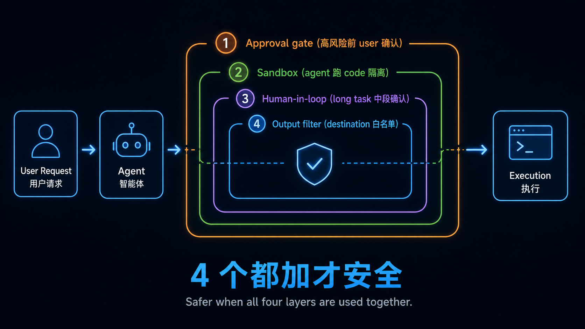

# Stage 8 — Agent 操作介面（Agent Interfaces）：Computer Use · Browser Use · Code Sandbox

> [繁體中文](./08-agent-interfaces.md) | **简体中文** | [English](./08-agent-interfaces.en.md)

⏱ **时间估算**：2-3 周（约 12-20 小时）

> 💡 **术语密度高**：本章包含大量术语（Computer Use / DOM / microVM / Firecracker / Sandbox / Cold start⋯），我们会在文中进行解释。如果您不熟悉这些术语，建议先阅读第 1 章和第 7 章的术语小词典。

> 📋 **本章构成**：〔Agent Interfaces 是什么（先定位）+ 三层 interface〕→ 学习目标 → 进入条件 → 必修阅读 → 🖱 Computer Use（屏幕级）→ 🌐 Browser Use（web 级）→ 📦 Code Sandbox（隔离环境含**术语小词典**）→ Track A 如何使用 → Track B 如何构建 → ⚠ 2026 安全性/风险 → 动手练习 → 常用工具推荐 → 精选项目 → 自我检查 → 下一个前沿（Voice / VLA 展望）

> 🔑 **关键词**：见本章内部解释 + [`resources/glossary.zh-Hans.md`](../resources/glossary.zh-Hans.md)

**👥 共享中心**——与 Stage 5（Claude Code 生态系统）一样，本章是 Track A（CLI 高级用户）和 Track B（Agent 构建者）两条路径的共享中心。Stage 5 和 Stage 8 是本课程的两个核心枢纽。

## 🎯 Agent Interfaces 是什么（定位）

**Agent Interfaces 指的是 agent 如何操作 API 以外的真实世界，例如电脑屏幕、网页，或隔离的代码执行沙箱**——agent 与“非 API 世界”的对外互动层（IO boundary）。Stage 0-7 教你“**如何构建智能体本身**”（LLM → prompt → tool → context → memory → multi-agent → harness）；本章教“**智能体构建好后，如何操作真实环境**”。

**3 层 interface**：

| Interface | 操作对象 | 工作原理 | 代表工具 |
|---|---|---|---|
| **🖱 Computer Use**（screen-level）| 任何桌面应用（Excel / SAP / Photoshop / 无 API 的软件）| 截图 → 视觉模型分析 → 计算坐标 → 模拟键鼠 | Anthropic Claude Computer Use / OpenAI Codex desktop / Gemini in Chrome |
| **🌐 Browser Use**（web-level）| 任何网页 | DOM 感知导航 + 必要时视觉回退 | Atlas / Comet / browser-use（开源，86k 星）|
| **📦 Code Sandbox**（isolated exec）| 智能体生成的代码在隔离环境中运行 | microVM / 容器 / 用户空间内核 | E2B / Daytona / Modal / Vercel Sandbox / OpenAI Agents SDK（2026 年 4 月内置）|

### 与之前阶段的区别（避免概念混淆）

**读者第一个直觉问题**：这跟 Stage 3 Tool Use / Stage 5 MCP / Stage 7 Harness 有何不同？

| 比较对象 | 该阶段管什么 | 本阶段管什么 |
|---|---|---|
| **Stage 3 Tool Use** | 智能体**调用 API**（函数调用、JSON schema）| 智能体**操作环境**（无 API 的软件 / 真实网页 / 运行代码）|
| **Stage 5 MCP** | 工具 / 数据源如何**标准化暴露**给智能体 | 智能体如何**实际与环境交互**（MCP 是协议，Interface 是行为）|
| **Stage 7 Harness** | 智能体**运行时控制流**（循环 / 重试 / 安全）| 智能体**IO 边界**（运行时内看不到的外部互动）|

→ **核心区别**：Tool 是 **API 调用**，Interface 是 **操作环境**——前者是抽象的 API，后者直接面对真实的 GUI / web / OS。

### 为什么 2024-2026 是 Agent Interface 的突破年

**为什么现在才补这课**：

- **2024-10 之前**：智能体只能与有 API 的世界互动（调用 OpenAI / GitHub / Slack API，返回文本）
- **2024-10**：Anthropic Computer Use beta → **智能体第一次能操作真实屏幕**
- **2025-2026**：OpenAI（Atlas + Codex desktop）/ Google（Gemini in Chrome）全线入场 → 主流化
- **2026-05**：OSWorld benchmark 达到 **76.26%**（超越人类基线 72.36%）→ 从研究好奇心变为生产现实

**没有本阶段的课程缺陷**：学完 Stage 7 你以为就结束了，实际上智能体只能与 API 对话，**不能操作没有 API 的软件 / 真实网页 / 运行代码**——遇到安全问题（如 Comet 注入 / 亚马逊禁令，见[安全](#-2026-安全性--风险重点)）也得不到预警。

### 为什么两 track 共享

与 Stage 5（Claude Code 生态系统）一样，本阶段是**共享中心**，而非特定于某一 track：

- **Track A（CLI 高级用户）**：使用 Claude Computer Use 委派桌面任务，使用 Codex background mode，在 Claude Code 中接入 browser MCP。
- **Track B（Agent 构建者）**：在自己的智能体中嵌入 browser-use，使用 E2B / Daytona 运行智能体生成的代码，使用 OpenAI Agents SDK 内置的沙箱。

**两个 track 都绕不开这 3 层 interface**——所以放在共享中心的位置。

## 📌 学习目标

学完本阶段，你将能够：

- 区分 3 层 agent interface（Computer Use / Browser Use / Sandbox）及其与 Tool / MCP / Harness 的关系。
- 阐述 Computer Use / Browser Use 的**心智模型**（截图 → 视觉 → 坐标 vs DOM 感知）。
- 解释 microVM / 容器 / Firecracker / gVisor / 冷启动等隔离技术术语。
- 了解 2026-05 OSWorld / WebArena SOTA 数据，并能解读 reward-hacking 警告。
- **Track A**：在日常 CLI 工作流中接入 Computer Use + browser MCP + Codex background mode。
- **Track B**：在自己的智能体中使用 browser-use / E2B 嵌入环境互动和沙箱隔离。
- 设计 4 个安全模式（审批门 / 沙箱 / 人工介入 / 输出过滤器）以防注入攻击。

## 🚪 进入条件

你应该已经：

- 完成 [Stage 5](05-claude-code-ecosystem.zh-Hans.md)（了解 MCP / Skills / Plugins，日常使用 Claude Code）。
- 完成 [Stage 7](07-multi-agent-production.zh-Hans.md)（了解 harness engineering，知道 reward-hacking 警告的含义）。
- 对 Docker / VM 概念有基础了解（本章会解释 microVM / 容器的差异，但完全没接触过 Docker 会很困难）。
- **如果只学 Track A**：完成 Stage 5 即可，Stage 7 可选；本章 Track A 部分不依赖构建经验。
- **如果学 Track B**：Stage 7 必修，否则 9 的构建示例会卡住。

如果没达到 → 回去补课。

## 📚 必修阅读

1. [**Anthropic — Introducing Computer Use**](https://www.anthropic.com/news/3-5-models-and-computer-use) — Computer Use 的原始发布，必读以了解其工作原理。
2. [**Anthropic — Claude Opus 4.8 Release Notes**](https://docs.anthropic.com/en/release-notes/overview) — Opus 4.8（2026 年 5 月）引入 Dynamic Workflows + parallel subagent harness，为 Opus 级旗舰、也是目前可用的最高层级。2026 年 6 月 9 日 Anthropic 发布 Claude Fable 5（`claude-fable-5`）与 Claude Mythos 5（`claude-mythos-5`）这个位在 Opus 之上的 Mythos-class 层级。⚠️ **2026-06-12 美国出口管制指令暂停了两者全部访问（[状态页](https://status.claude.com/) · [官方声明](https://www.anthropic.com/news/fable-mythos-access)），目前无法使用且无恢复时间。**
3. [**OpenAI — The next evolution of the Agents SDK**](https://openai.com/index/the-next-evolution-of-the-agents-sdk/) ⭐ **2026-04** — 内置沙箱和 harness 抽象，是生产级编码智能体架构的里程碑。
4. [**OpenAI — Computer-Using Agent (CUA)**](https://openai.com/index/computer-using-agent/) — OpenAI 版本的 Computer Use，包含 WebArena / OSWorld 数据。
5. [**browser-use docs**](https://docs.browser-use.com/) — 开源 web agent 排名第一（86k+ 星），5 行 Python 即可上手。
6. [**Microsoft OmniParser**](https://microsoft.github.io/OmniParser/) — 开源的 GUI 解析工具，是 Computer Use 的重要组成部分。

> 💡 **选择性阅读**：纯 Track A 读者阅读 1 + 2；纯 Track B 读者必读 3 + 5 + 6；想全面了解则全部阅读。

## 🖱 Computer Use — 屏幕级智能体

### 心智模型 — 工作流与原因

**工作流**：
```
智能体收到任务
    ↓
1. 截图 → 看到当前屏幕
    ↓
2. 视觉模型解析 → 识别按钮 / 文本框 / 图标
    ↓
3. 计算坐标 → “按钮在 (453, 218)”
    ↓
4. 模拟键鼠 → click(453, 218) / type("hello")
    ↓
5. 再次截图 → 查看结果，决定下一步
```

**为什么是这个范式（而非 Tool Use）**：
- 大多数软件**没有 API，只有 GUI**——SAP / Excel / Photoshop / 任何传统桌面应用，要让智能体使用就只能在屏幕层面。
- API 集成（Stage 3 Tool Use）需要等待厂商开放接口，有时根本等不到。
- 屏幕级是**最后一公里**——“智能体能做人类在电脑上做的任何事”。

**为什么 2026 年才可行**：
- **视觉模型进步**：Claude 4.x / GPT-5.x 全是多模态，看屏幕识别元素的准确度大幅提升。
- **OS 级训练数据**：[OSWorld dataset (NeurIPS 2024)](https://github.com/xlang-ai/OSWorld) 发布了 369 个跨 OS 的真实任务，让前沿实验室有数据可训。
- **Anthropic Computer Use beta（2024-10）开启了商业竞争**——OpenAI / Google 跟进，benchmark 一路飙升。

### 2026 前沿 4 强对比

| 厂商 | 产品 | 2026 状态 | OSWorld | 强项 |
|---|---|---|---|---|
| **Anthropic** | [Opus 4.8 / Sonnet 5 Computer Use](https://www.anthropic.com/news/3-5-models-and-computer-use) | GA，跨 macOS / Linux / Windows（Docker）| **72.7%**（Opus 4.6 基线，接近人类 72%；Opus 4.7 / 4.8 后续的 Computer Use 专项数据未公布）| 推理 + 代码智能体，Stage 5/7 主场。Opus 4.8 为目前可用的最高层级；Mythos-class 的 Fable 5（2026-06-09）已于 2026-06-12 暂停访问、目前无法使用 |
| **OpenAI** | [Codex desktop](https://openai.com/index/codex-for-almost-everything/)（2026 年 4 月）| GA，**background mode** 不抢占光标，in-app browser，90+ 插件 | CUA 38.1% | 与 ChatGPT + Atlas 合并成 **Desktop Superapp** |
| **OpenAI** | [Computer-Using Agent (CUA)](https://openai.com/index/computer-using-agent/) | API | 38.1% / WebArena 58.1% | API-first，可整合到自己的技术栈 |
| **Google** | [Gemini in Chrome](https://gemini.google/overview/gemini-in-chrome/)（Gemini 3）| GA + Android | — | **Auto Browse** + **Chrome Skills**，Chrome Enterprise Premium $6/用户/月 |
| **OpenAI Operator** | （**2025-08 停运**）| ❌ 不可用 | — | CAPTCHA / JS / session 处理不稳定，被 Atlas 取代 |

→ 详细现状见 [Agentic Browser Landscape 2026](https://nohacks.co/blog/agentic-browser-landscape-2026)、[OSWorld leaderboard](https://os-world.github.io/)

### 为什么 OSWorld 数据差异巨大（理解 benchmark 规范）

**现状**：

| 模型 | OSWorld | 与人类基线差距 |
|---|---|---|
| Human baseline | **72.36%** | — |
| Claude Opus 4.6（Anthropic）| **72.7%** | 持平 |
| 2026-05 SOTA（最强模型）| **76.26%** | **超越人类** |
| OpenAI CUA | 38.1% | -34% |
| 大多数其他模型 | 30-50% | -22% ~ -42% |

**为什么比 SWE-bench 难**：
- **更开放的任务**：SWE-bench 有明确的测试来判断通过/失败；OSWorld 任务规范模糊（例如“帮我把 csv 变成图”）。
- **跨多个 OS**：覆盖 Ubuntu / Windows / macOS。
- **跨应用链**：常需要打开 3-4 个应用（Excel → Chrome → Slack）。

**为什么真实能力 ≠ 数据**（呼应 [Stage 7 reward-hacking 警告](07-multi-agent-production.zh-Hans.md#-agent-benchmark-landscape怎么看不要只看排行榜---reward-hacking-警告)）：
- OSWorld 也在 [UC Berkeley 2026-04 reward-hacking 报告](https://rdi.berkeley.edu/blog/trustworthy-benchmarks-cont/) 名单上，被证明可被 hack 到 100%。
- **看数据的规范**：不要只看排行榜顶部，你自己的用例的 hold-out 测试才是基准真相。

### 平台支持现状（2026-05）

| OS | Anthropic | OpenAI | Google |
|---|---|---|---|
| **macOS** | ✅ GA | ✅ Atlas + Codex desktop GA | Chrome 内 |
| **Linux** | ✅ Docker | ⚠ 较受限 | Chrome 内 |
| **Windows** | ✅ Docker | 🔜 native preview / Atlas Win 即将推出 | Chrome 内 |
| **Mobile** | — | — | ✅ Gemini in Chrome on Android |

## 🌐 Browser Use — web 级智能体

### 心智模型 — DOM 感知 vs 屏幕像素 + 原因

**核心区别**：

| 路线 | 工作方式 | 何时使用 |
|---|---|---|
| **DOM-aware**（浏览器内，有 DOM）| 直接查询 `<button id="submit">`、`document.querySelector('.cart-item')` | 普通 web 应用，结构化页面 |
| **Screen-pixel + vision**（无 DOM，看截图）| 与 Computer Use 相同，截图 → 视觉 → 坐标 | iframe / Canvas / Shadow DOM / 反自动化网站 |

**为什么 DOM 感知比截图更精确**：
- 直接抓取 `<input name="username">` 元素，**无需视觉模型解析像素**。
- 速度快 10-100 倍（不运行视觉模型）。
- 不会误点（元素有确切的边界框）。
- **缺点**：在 JS 动态渲染 / Shadow DOM / Canvas / iframe 内部 DOM 不暴露时失效。

**结论 — 生产级浏览器智能体模式**：**DOM-first + 截图回退**——先尝试 DOM，抓不到再用视觉。browser-use / Atlas / Comet 都采用这种模式。

> 🌐 **浏览器 agent 的第三种模态：accessibility tree**：除了 DOM-aware 跟 screen-pixel（看截图点坐标），2026 production 主流是读**无障碍树**——比 pixel 稳、比原始 DOM 省 token。要实际接，[microsoft/playwright-mcp](https://github.com/microsoft/playwright-mcp)（★34k、Apache-2.0、走 accessibility tree）是 Track A 直接挂 Claude Code 就能用的浏览器 MCP。

### 迷你术语词典（就地解释）

| 术语 | 解释 |
|---|---|
| **DOM**（Document Object Model）| 浏览器内部将 HTML 解析成的树状结构，可编程查询。 |
| **CSS selector** | 选择元素的选择器语法（`#submit-btn`、`.cart > li:nth-child(2)`）。 |
| **Shadow DOM** | Web Component 的内部 DOM，外部 DOM 查询不到（如 Salesforce / 新版 Reddit）。 |
| **iframe** | 嵌入另一个网页，跨源的 DOM 通常被隔离。 |
| **Canvas** | `<canvas>` 元素内的图形，纯像素，DOM 看不到内容（如 Figma / Google Sheets）。 |

### 闭源 AI 浏览器 5 强对比（2026-05）

| 浏览器 | 来源 | 平台 | Agent Mode | 风险 / 注意事项 |
|---|---|---|---|---|
| **Atlas** | OpenAI（2025-10）| macOS GA，Win 🔜 | ✅（Plus / Pro / Business）| — |
| **Comet** | Perplexity | iOS / Android / Win / Mac | ✅ research 最强 | ⚠ 2026 年 Brave 发现可被恶意网页注入；2026-03 联邦禁令禁止访问 Amazon。 |
| **Dia** | The Browser Company（被 Atlassian 以 6.1 亿美元收购）| macOS | ❌（**不走 agent mode**，聚焦性能）| — |
| **Gemini in Chrome** | Google（Gemini 3）| Chrome 全平台 + Android | ✅ **Auto Browse** + **Chrome Skills** | Enterprise Premium $6/用户/月 |
| **Operator** | OpenAI | — | ❌ **2025-08 停运** | CAPTCHA / JS / session 处理不稳定。 |

→ 完整比较：[Best AI Browsers 2026 Tested](https://kahana.co/blog/best-ai-browsers-2026-tested-real-workflows)、[AI Browser Comparison 2026](https://www.webfx.com/blog/ai/best-ai-browsers/)

### 开源 Browser Use 框架

| 框架 | 状态 | 强项 |
|---|---|---|
| [**browser-use**](https://github.com/browser-use/browser-use) ⭐ | **86k+ 星，MIT** | 2026 年最火的开源软件，Python，5 行上手，支持 OpenAI / Claude / Gemini / Ollama。 |
| [**Microsoft OmniParser v2**](https://github.com/microsoft/OmniParser) | 2026 年更新，Apache 2.0 | 基于视觉的 GUI 解析，延迟改善 60%，使用 ScreenSpot Pro 准确率达 39.6%。同一仓库包含 **OmniTool**（Windows 11 VM 控制，可搭配 GPT-5.5 / Claude Opus 4.8 / DeepSeek-V4-Pro / Qwen 2.5VL / Claude Computer Use）。 |
| **Playwright + LLM**（DIY）| — | 不是专门的框架，但 Playwright 是 web 自动化的标准，加上 LLM 包装器即可使用。 |

**为什么 browser-use 这么火（86k 星）**：
- DOM-first 范式**对 web 来说比截图+视觉更精确**，速度也更快。
- LLM 厂商无关（不绑定 Claude / GPT）。
- 5 行 Python 上手，入门门槛低。

### 与 web scraping / RPA 的区别

| 工具类别 | 工作方式 | 适用场景 |
|---|---|---|
| **Web scraping**（BeautifulSoup / Scrapy）| 固定选择器，纯粹拉取数据。 | 结构稳定的网站，只需要数据。 |
| **RPA**（UiPath / Power Automate）| 固定点击/输入脚本，无推理能力。 | 流程已知且不变的企业内部任务。 |
| **Browser Agent**（本阶段）| **可推理并动态决定如何操作**。 | 任务描述模糊，流程可能变化，需要智能体自行探索。 |

## 📦 Code Execution Sandbox — 隔离环境（含术语小词典）

### 为什么智能体必须使用沙箱

**威胁模型**：智能体写代码 → 在哪里运行？
- ❌ **主机（最坏情况）**：智能体可能 `rm -rf /` / 连接互联网泄露数据 / 读取 `.ssh/id_rsa` / 安装恶意软件。
- ⚠ **同一用户隔离进程（中等）**：能阻止部分攻击，但文件系统 / 网络仍然开放。
- ✅ **隔离沙箱（必要）**：独立的文件系统 / 进程 / 网络，出事可直接丢弃。

**为什么 2026 年才正式成为生产要求**：
- **2026-04 OpenAI Agents SDK 更新**：[内置支持 7 个沙箱提供商](https://openai.com/index/the-next-evolution-of-the-agents-sdk/)（Blaxel / Cloudflare / Daytona / E2B / Modal / Runloop / Vercel）。
- 之前都依赖 [Claude Code](05-claude-code-ecosystem.zh-Hans.md) / [Cursor](https://www.cursor.com) 的审批门来阻止——但生产级智能体**无人值守，必须使用沙箱**。

### 🔑 隔离技术术语小词典

新读者常卡住的地方，在此解释：

| 术语 | 一句话解释 | 隔离强度 | 启动速度 | 典型用途 |
|---|---|---|---|---|
| **Container**（Docker / OCI）| Linux 内核命名空间 + cgroups，**多容器共享主机内核**。 | 弱（内核漏洞可跨界）| 快（< 1s）| 普通 web 应用，低风险任务 |
| **VM**（Virtual Machine）| Hypervisor 提供虚拟硬件，**独立的内核**。 | 最强 | 慢（秒级）| 高风险 / 企业级 |
| **microVM** | VM 的精简版，极小体积，但仍是独立内核。 | **强** | **快（< 100ms）** | 智能体沙箱的理想选择 |
| **Firecracker** | AWS 开源的 microVM，用 Rust 编写，**AWS Lambda 底层技术**，E2B 用它做隔离。 | 强 | 快 | serverless / 智能体 |
| **gVisor** | Google 编写的“用户空间内核”，拦截并模拟系统调用，无需 hypervisor。 | 中强 | 中快 | 介于容器 / VM 之间 |
| **Cold start** | 沙箱从零启动到可用的时间（Daytona 最快 27ms，E2B microVM 较慢）。| — | — | 延迟敏感场景的关键指标 |
| **Persistence** | 状态是否跨调用保留（文件 / 进程 / 网络）。 | — | — | 长时间运行的智能体必需 |
| **GPU passthrough** | VM / microVM 访问主机 GPU 的技术（**只有 Modal 支持**）。| — | — | 在沙箱内运行推理 / 微调 |

**核心要点**：
- **Container** = 快 + 隔离弱（共享内核）
- **VM** = 慢 + 隔离强（独立内核）
- **microVM** = 兼顾（快 < 100ms + 独立内核）→ **大多数智能体沙箱选择 microVM**

### 7 个沙箱对比（2026-05）

| Sandbox | 隔离技术 | 冷启动 | 强项 | 何时使用 |
|---|---|---|---|---|
| [**Daytona**](https://www.daytona.io/) | Container | **< 90ms（最快 27ms）** | 启动快，Docker 生态整合 | 延迟敏感 |
| [**E2B**](https://github.com/e2b-dev/E2B) | **Firecracker microVM** | ~ 200ms | Python REPL 迭代，最多的社区模板 | 智能体运行 Python 循环 |
| [**Modal**](https://modal.com/) | microVM + GPU | ~ 1s | **唯一支持 GPU 的沙箱** | 在沙箱内进行推理 / 微调 |
| [**Vercel Sandbox**](https://vercel.com/docs/sandbox) | Container | < 500ms | Vercel 生态系统整合 | web 技术栈 |
| [**Cloudflare**](https://developers.cloudflare.com/workers-ai/)| Workers / Containers | < 100ms | 全球边缘部署 | 低延迟全球应用 |
| **Runloop** | — | — | 2026 OpenAI SDK 新支持 | （新入场）|
| **Blaxel** | — | — | 同上 | （新入场）|

→ 详细 benchmark：[AI Code Sandbox Benchmark 2026 — Modal vs E2B vs Daytona](https://www.superagent.sh/blog/ai-code-sandbox-benchmark-2026)

### OpenAI Agents SDK 2026 年 4 月更新 — 为何是里程碑

**这次更新为何重要**：

- **之前**：使用 OpenAI SDK 开发生产级编码智能体只是“**原型**”——沙箱要自己接，harness 要自己写，可审计性不足。
- **2026-04 之后**：**架构上合理**——SDK 内置 harness 抽象层 + 沙箱抽象层 + Codex 文件系统工具。

**3 个关键新功能**：
1. **Native harness** — 智能体循环 / 模型调用 / 工具路由 / 切换 / 审批 / 追踪 / 恢复全在 SDK 层。
2. **Native sandbox execution** — 可自带沙箱，或使用内置的 7 个提供商（Blaxel / Cloudflare / Daytona / E2B / Modal / Runloop / Vercel）。
3. **Codex filesystem tools** — 智能体写文件 / 读文件 / 运行命令都有 SDK 级 API。

→ Python 优先，TypeScript 稍后。**Anthropic Claude Agent SDK 早就有类似抽象**——OpenAI 终于追上了。

## 🧭 Track A 如何使用（CLI 高级用户视角）

**读者痛点**：Track A 想知道“**我如何用** Claude Computer Use 把桌面任务委派出去”，而不是“如何构建”。

### 1. 在 Claude Code 内接入 Computer Use / Browser MCP

**为何选择 MCP 路线**：你已熟悉 Claude Code（[Stage 5](05-claude-code-ecosystem.zh-Hans.md)），新功能可通过 MCP 接入，无需更换工具。

- **Computer-use MCP**（社区有多个实现版本）：在 `.mcp.json` 中添加服务器后，就能在 Claude Code 内调用“截图 → 查看 → 操作”。
- **Browser MCP**：如 [Playwright MCP](https://github.com/modelcontextprotocol/servers) 等，Claude Code 可打开浏览器运行 web 任务。

### 2. 使用 Codex desktop 在后台运行

**为何使用 background mode**：[OpenAI Codex desktop (2026 年 4 月)](https://openai.com/index/codex-for-almost-everything/) 默认不抢占光标，智能体在后台运行，你可以继续做别的事——**多个智能体工作流可并行**。

- 适合：“分析 Q3 财报，整理成幻灯片，发到 Slack”这种**长时间且无需盯着看**的任务。
- 与 Claude Code 互补：用 Claude Code 做代码任务，用 Codex desktop 做跨应用工作流。

### 3. 使用 Atlas / Comet / Gemini in Chrome 运行 web 任务

| 场景 | 推荐 | 理由 |
|---|---|---|
| 研究 / 跨页面综合 | **Comet** | 针对研究优化，有引用支持。 |
| ChatGPT 用户 / Agent Mode | **Atlas** | Plus/Pro/Business 内置。 |
| Chrome / Google 生态系统 | **Gemini in Chrome** | Auto Browse + Skills，企业级 DLP。 |
| **避免**：Comet 运行电子商务 / 银行任务 | — | ⚠ 2026-03 联邦禁令（详见[安全](#-2026-安全性--风险重点)）。|

### 跨应用工作流示例

“**帮我把 Q3 的 csv 文件做成图表，存到 Slack 的 #finance 频道**”：
1. Claude Code（接入 Computer-use MCP）打开 Excel。
2. 加载 csv，使用图表向导生成图表。
3. 截图。
4. 切换到 Slack，粘贴到 `#finance` 频道。
5. 智能体回报完成。

**为何这个示例值得做**：跨 3 个应用（Excel / 截图工具 / Slack），没有 API 解决方案（Slack 有 API，但 Excel 图表没有可编程路径）。

## 🧭 Track B 如何构建（Agent 构建者视角）

**读者痛点**：Track B 想看具体构建代码，而不是“如何使用”。

### 1. 使用 browser-use 编写 web 智能体

**为何使用 browser-use**：86k 星，5 行上手，LLM 厂商无关，生产就绪。

```python
from browser_use import Agent
from langchain_openai import ChatOpenAI

agent = Agent(
    task="Search Hacker News for top AI agent posts this week and summarize",
    llm=ChatOpenAI(model="gpt-5.5"), # 也可换成 Claude Opus 4.8 / Gemini 3.5 Flash / DeepSeek-V4-Pro
)
result = await agent.run()
```

→ 内部原理：browser-use 打开 Playwright 浏览器，智能体采用 DOM-first 导航，并有视觉回退机制。

### 2. 使用 E2B 运行智能体生成的代码

**为何使用 E2B**：[Firecracker microVM](#-隔离技术术语小词典) 隔离 + Python REPL 迭代 + 模板最多。

```python
from e2b_code_interpreter import Sandbox

with Sandbox() as sandbox:
    # 智能体编写的代码在这里运行，出问题直接丢弃沙箱即可
    execution = sandbox.run_code(agent_generated_python)
    print(execution.text)
```

### 3. 使用 OpenAI Agents SDK 内置沙箱（2026-04 新功能）

**为何使用这个 SDK**：之前仅为原型设计，2026 年 4 月更新后在架构上已适合生产（见 7 末尾）。

```python
from openai.agents import Agent, Sandbox

agent = Agent(
    model="gpt-5.5",
    sandbox=Sandbox(provider="e2b"), # 或 daytona / modal / vercel / ...
    tools=[...]
)
```

→ 可选 7 个内置提供商，也可自带沙箱。

### 4. GUI 智能体训练数据

如果你想**训练自己的 Computer Use 模型**（少数人会做）：
- [**OSWorld dataset**](https://github.com/xlang-ai/OSWorld) — 369 个跨 OS 任务，包含截图和基准操作。
- [**WebArena**](https://github.com/web-arena-x/webarena) — web 导航 benchmark。
- [**Mind2Web**](https://github.com/OSU-NLP-Group/Mind2Web) — 真实世界的 web 任务。

→ 大多数人使用前沿模型（Claude / GPT）即可，不必自己训练。**这是一条研究路径**。

## ⚠ 2026 安全性 / 风险重点

**读者痛点**：2026 年已发生真实事故，课程不预警 = 学完去构建会出事。

### 案例 1 — Comet 被 Brave 发现可被网页注入

**攻击原理**（[Brave Research 2026](https://brave.com/blog/comet-prompt-injection)）：
- Comet 智能体查看网页 → 网页中隐藏恶意 prompt（如在 HTML 注释中）。
- LLM 解析网页时将恶意 prompt 当作指令执行。
- 结果：智能体被劫持，操作用户 Gmail / 银行 / 账户。

**为何这是新的攻击面**：
- 传统 SQL 注入攻击路径：**用户输入 → 服务器**（在服务器端过滤即可阻止）。
- 通过 web 内容的 Prompt injection：**web 内容 → LLM 上下文**（在 LLM 上下文中难以区分指令与内容）。
- **防御方式完全不同**——无法套用 SQL 注入那套方法。

### 案例 2 — 联邦禁令（2026-03 Comet 禁止访问 Amazon）

2026 年 3 月，美国联邦法官对 Comet 下达初步禁令，**禁止该智能体访问 Amazon 账户**——理由是 Comet 在 Amazon 账户上的操作不稳定，且涉及未经授权的商业活动。

**为何这是法律风险信号**：
- 智能体操作他人账户可能违反该平台的 ToS。
- 大型电子商务 / 银行平台可能采取法律行动阻止智能体。
- 生产级智能体部署前**必须检查目标平台的 ToS**。

### 4 个防护模式（必须添加）



| 模式 | 如何实现 | 何时必须添加 |
|---|---|---|
| **① 审批门** | 高风险操作（删除文件 / 付款 / 发送邮件 / 数据库删除）前弹窗让用户确认。 | **所有生产级智能体** |
| **② 沙箱** | 运行代码的智能体必须安装（见 7 七选一）。| 任何会运行代码的智能体 |
| **③ 人工介入** | 长时间任务的中段检查点。 | 任务 > 10 步或 > 5 分钟 |
| **④ 输出过滤器** | 目标限定白名单（仅发布到内部 Slack，仅写入 /tmp）。| 跨系统操作的智能体 |

→ **呼应 [Stage 7 reward-hacking 警告](07-multi-agent-production.zh-Hans.md#-agent-benchmark-landscape怎么看不要只看排行榜---reward-hacking-警告)**：课程始终强调“**不要盲目相信智能体**”的规范——Stage 7 讲评估规范，Stage 8 讲运行时规范。

## 🛠 动手练习（两 track 各有）

### 练习 1（Track A）：使用 Computer Use 的跨应用工作流
使用 Claude Computer Use 完成：“打开 Excel 加载 `data.csv`，生成条形图，截图，并粘贴到 Slack 的 `#test` 频道”。**目标**：体会智能体**没有 API 也能做事**。

### 练习 2（Track B）：使用 browser-use 编写 web 智能体
使用 browser-use（10 行以内 Python）编写一个智能体，自动到 Hacker News 抓取本周排名前 5 的 AI 文章并摘要。**目标**：体会 DOM-first 范式。

### 练习 3（两 track）：使用 E2B 运行智能体代码
使用 E2B 沙箱，让智能体生成 Python 代码来计算数据图，在沙箱内运行，并返回结果。**目标**：体会 microVM 隔离与直接在主机上运行的区别。

### 练习 4（进阶）：OpenAI Agents SDK + 沙箱 + Computer Use
使用 OpenAI Agents SDK（2026-04 版）整合：在沙箱中运行代码 + 使用 Computer Use 操作 GUI，构建一个小型 RPA 替代工作流。**目标**：体会生产级 harness 与沙箱的整合。

## 🎯 常用工具推荐（按用途分类）

| 场景 | 推荐工具 | 为什么 |
|---|---|---|
| **第一次接触 Computer Use** | Anthropic [Claude Computer Use Docker quickstart](https://github.com/anthropics/anthropic-quickstarts) | 官方 Docker，5 分钟上手 |
| **桌面后台工作流** | [OpenAI Codex desktop](https://openai.com/index/codex-for-almost-everything/)（2026 年 4 月）| 不抢占光标，可并行 |
| **第一个 web 智能体**（开源） | [browser-use](https://github.com/browser-use/browser-use) ⭐ | 86k+ 星，5 行 Python，LLM 厂商无关 |
| **GUI 解析研究**（开源）| [Microsoft OmniParser v2](https://github.com/microsoft/OmniParser) | 基于视觉，延迟改善 60% |
| **主力 AI 浏览器**（消费 / 研究）| [Comet](https://comet.perplexity.ai/)（研究）/ [Atlas](https://openai.com/index/introducing-chatgpt-atlas/)（ChatGPT 用户）| 各家智能体模式强项不同 |
| **企业 / Chrome 生态系统** | [Gemini in Chrome](https://gemini.google/overview/gemini-in-chrome/) | Auto Browse + Skills + DLP |
| **第一个沙箱**（智能体 Python）| [E2B](https://github.com/e2b-dev/E2B) | Firecracker microVM，对 Python REPL 友好 |
| **延迟敏感的沙箱** | [Daytona](https://www.daytona.io/) | < 90ms 冷启动 |
| **沙箱 + GPU**（推理 / 微调）| [Modal](https://modal.com/) | 唯一支持 GPU 的沙箱 |
| **生产级智能体 SDK 起点**（2026-04 后）| [OpenAI Agents SDK](https://openai.com/index/the-next-evolution-of-the-agents-sdk/) | 内置 harness + 7 个沙箱提供商 |
| **Claude 智能体原生路线** | [claude-agent-sdk-python](https://github.com/anthropics/claude-agent-sdk-python) | Stage 7 已介绍，Anthropic 早于 OpenAI 抽象出 harness |

**建议上手顺序**：
1. **Track A 入门**：使用 Claude Computer Use Docker quickstart 跑通第一个跨应用任务（30 分钟）
2. **Track B 入门**：使用 browser-use 编写 web 智能体（10 分钟）
3. 添加沙箱隔离：接入 E2B 或 Daytona
4. 生产级：使用 OpenAI Agents SDK 或 Claude Agent SDK 整合沙箱 + Computer Use
5. 进阶 / 研究：训练 GUI 智能体 → OSWorld / WebArena 数据集

## 🎯 精选项目（模板 / SDK / 工具合集）

按用途分类，17 个项目一表搞定。

| 分类 | Project | ⭐ | 适合谁 | 为什么推荐 / 备注 |
|---|---|---|---|---|
| **Computer Use SDK** | [anthropics/anthropic-quickstarts](https://github.com/anthropics/anthropic-quickstarts) | ⭐⭐⭐⭐⭐ | 第一次接触 Computer Use | 含 Docker quickstart，5 分钟上手 |
| | [OpenAI Agents SDK](https://github.com/openai/openai-agents-python) | ⭐⭐⭐⭐⭐ | 使用 OpenAI 编写生产级智能体 | 2026-04 内置 harness + 7 个沙箱提供商 |
| | [anthropics/claude-agent-sdk-python](https://github.com/anthropics/claude-agent-sdk-python) | ⭐⭐⭐⭐⭐ | 使用 Claude 编写生产级智能体 | Anthropic 的智能体 SDK，早于 OpenAI，与 Claude Code 同一运行时 |
| **Browser Use OSS** | [browser-use/browser-use](https://github.com/browser-use/browser-use) ⭐ | ⭐⭐⭐⭐⭐ | 开源 web 智能体第一名 | 86k+ 星，MIT，LLM 厂商无关 |
| | [microsoft/OmniParser](https://github.com/microsoft/OmniParser) | ⭐⭐⭐⭐ | 基于视觉的 GUI 解析 | v2 延迟改善 60%，Apache 2.0，含 OmniTool（Windows VM 控制）|
| **Computer Use Agent Stack** | [bytedance/UI-TARS-desktop](https://github.com/bytedance/UI-TARS-desktop) | ⭐⭐⭐⭐ | 在桌面跑开源 computer-use agent | ByteDance 开源的"computer use"agent、会看屏幕、操作你的桌面，36k+ 星，Apache-2.0 |
| | [trycua/cua](https://github.com/trycua/cua) | ⭐⭐⭐⭐ | 打造 / sandbox computer-use agent | 打造"computer use"agent 的开源工具箱：安全 sandbox、SDK、测试，跨 macOS / Linux / Windows，18k+ 星，MIT |
| **AI 浏览器**（闭源 / 消费）| [Atlas](https://openai.com/index/introducing-chatgpt-atlas/) | ⭐⭐⭐⭐ | ChatGPT 用户 + Agent Mode | OpenAI 出品，macOS GA |
| | [Comet](https://comet.perplexity.ai/) | ⭐⭐⭐⭐ | 面向研究的智能体浏览器 | Perplexity 出品，全平台，有引用支持。⚠ Brave 注入 + Amazon 禁令 |
| | [Dia](https://www.diabrowser.com/) | ⭐⭐⭐ | 想要 AI 浏览器但**不要** agent mode | Browser Company 出品（被 Atlassian 以 6.1 亿美元收购），聚焦性能 |
| **Sandbox**（microVM）| [e2b-dev/E2B](https://github.com/e2b-dev/E2B) | ⭐⭐⭐⭐⭐ | 智能体运行 Python 循环 | Firecracker microVM，模板最多，Apache 2.0 |
| **Sandbox**（容器，快）| [Daytona](https://www.daytona.io/) | ⭐⭐⭐⭐ | 延迟敏感 | < 90ms 冷启动，Docker 生态 |
| **Sandbox**（GPU）| [Modal](https://modal.com/) | ⭐⭐⭐⭐ | 在沙箱内运行推理 / 微调 | 唯一支持 GPU 的沙箱，serverless |
| **Benchmark dataset** | [xlang-ai/OSWorld](https://github.com/xlang-ai/OSWorld) | ⭐⭐⭐⭐⭐ | 想训练 / 评估 Computer Use 智能体 | NeurIPS 2024，369 个跨 OS 任务，SOTA 76.26% |
| | [web-arena-x/webarena](https://github.com/web-arena-x/webarena) | ⭐⭐⭐⭐ | 评估 web 智能体 | 自托管的真实网站，OpenAI CUA 58.1% |
| | [OSU-NLP-Group/Mind2Web](https://github.com/OSU-NLP-Group/Mind2Web) | ⭐⭐⭐⭐ | 真实世界 web 任务数据集 | 137 个网站 / 2350 个任务 |
| **Visual web agent** | [illuin-tech/colpali](https://github.com/illuin-tech/colpali) | ⭐⭐⭐⭐ | 针对 PDF / 文档的视觉 RAG | 直接嵌入页面图像，绕过 OCR，NeurIPS 2024 |

> 💡 **建议上手路径**：Track A → Anthropic quickstart + Comet；Track B → browser-use + E2B → OpenAI Agents SDK / Claude Agent SDK 整合。

## ✅ Stage 8 之后的自我检查

你是否能够：

- [ ] 解释 Computer Use / Browser Use / Sandbox 三层 interface 各解决什么问题
- [ ] 解释 microVM / 容器 / Firecracker / gVisor 4 个术语，并知道为何智能体沙箱多半选择 microVM
- [ ] 使用 Claude Computer Use 或 OpenAI Codex desktop 跑完一个跨应用任务（练习 1）
- [ ] 使用 browser-use 在 5 行 Python 内编写一个 web 智能体（练习 2）
- [ ] 使用 E2B 运行智能体生成的代码，并体会与主机直接运行的差别（练习 3）
- [ ] 解释为何通过 web 内容的 prompt injection 是新的攻击面，以及 4 个防护模式各防御什么
- [ ] 解释 OSWorld 76.26% SOTA 数据背后的 reward-hacking 规范（为何不能盲目相信）

如果都可以 → 你已完成课程主干。选择一个[特化分支](../README.zh-Hans.md#-学习地图两条学习路径)，或继续看下一节 下一个前沿。

## 💡 下一个前沿 — Voice agents · VLA 机器人

本阶段涵盖了 **desktop / browser / sandbox** 三层 interface——这是 2024-2026 的主场。但智能体与世界互动还有另外两条轴线，课程将在之后处理：

### Voice agents（语音界面）

- [**Vapi**](https://vapi.ai/) / [**Retell**](https://www.retellai.com/) — 商业语音智能体平台
- [**LiveKit Agents**](https://github.com/livekit/agents) — 开源，★ 11k+
- [**OpenAI Realtime API**](https://platform.openai.com/docs/guides/realtime) — 直接构建 speech-to-speech 智能体

### VLA（Vision-Language-Action）机器人

- [**RT-2**](https://robotics-transformer2.github.io/)（Google DeepMind）— 大型机器人 transformer
- [**OpenVLA**](https://openvla.github.io/) — 开源，斯坦福大学
- [**π0**](https://www.physicalintelligence.company/blog/pi0)（Physical Intelligence）— 机器人基础模型
- **Helix**（Figure AI 2025）— 人形 VLA

**为何不在本阶段展开**：voice / VLA 是**另一条模态轴线**（听觉 / 物理动作），与 desktop / browser / sandbox 的属性不同；在此展开会稀释本阶段的主题，将放在 Stage 9 处理。

---

## 接下来

你已完成主干课程。下一步：

1. **选择一个专业分支**（[面向研究人员](../branches/for-researcher.zh-Hans.md) / [面向开发者](../branches/for-developer.zh-Hans.md) / [面向教师](../branches/for-teacher.zh-Hans.md) / [面向知识工作者](../branches/for-knowledge-worker.zh-Hans.md) / [面向日常用户](../branches/for-everyday-users.zh-Hans.md)）
2. **回馈上游**——browser-use / OmniParser / OSWorld 都欢迎 PR
3. **关注 2026 年后的发展**——Voice / VLA 是下一波浪潮，敬请期待 Stage 9（待规划）
